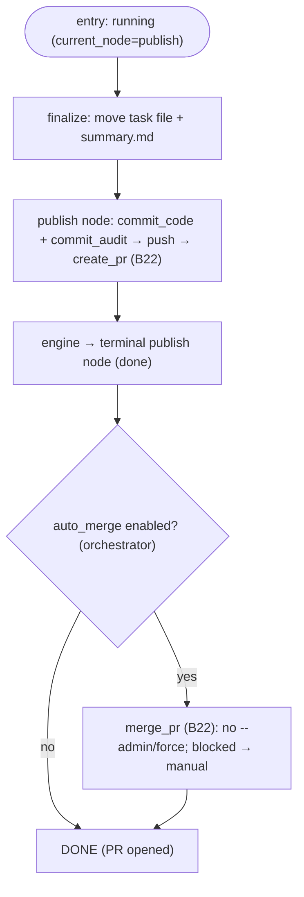

# S08 — publishing stage

## Purpose

The system's exit point to Git/GitHub: commit, push, and open a Pull Request (optionally with auto-merge). This is **not an agent** stage — everything is done by the Git Manager; agents never perform commit/push/PR operations. publishing is never skipped.

- The `publish` node runs the `commit_code → commit_audit → push → create_pr` chain idempotently — the `PublishNodeRunner` ([nodes/publish.py:32](../../../../src/wastech_orchestrator/core/flow/nodes/publish.py#L32), `run()` at [nodes/publish.py:39](../../../../src/wastech_orchestrator/core/flow/nodes/publish.py#L39)); finalize (move task file + write the committed summary) runs via the injected hook `_engine_finalize` ([orchestrator.py:972-975](../../../../src/wastech_orchestrator/core/orchestrator.py#L972)).
- After the engine reaches this terminal node, the orchestrator applies auto-merge and terminal cleanup ([orchestrator.py:1098-1115](../../../../src/wastech_orchestrator/core/orchestrator.py#L1098)).

## Step boundaries

- The publish node's `commit_code + commit_audit → push → create_pr` chain; finalize before the audit commit; the auto-merge decision and terminal completion (orchestrator-level, after the engine finishes).

### Outside this step's responsibility

- **The git/gh operations themselves, idempotency, scoped staging** — [B22](../../blocks/B22-git-manager.md).
- **Idempotency strings `publish_operations`** — [B07](../../blocks/B07-state-machine-and-store.md); **ledger writes** — [B08](../../blocks/B08-ledger-and-failure-reports.md).

## Entry points

- `PublishNodeRunner.run` for the `publish` node ([nodes/publish.py:39](../../../../src/wastech_orchestrator/core/flow/nodes/publish.py#L39)) — the `commit_code + commit_audit → push → create_pr` chain ([nodes/publish.py:61-90](../../../../src/wastech_orchestrator/core/flow/nodes/publish.py#L61)).
- `_finish_engine_run` / `_auto_merge` ([orchestrator.py:1098](../../../../src/wastech_orchestrator/core/orchestrator.py#L1098), [orchestrator.py:1352](../../../../src/wastech_orchestrator/core/orchestrator.py#L1352)) — applied by the orchestrator after the engine reaches the terminal node.

## Input data and state

Branch `agent/<id>-<slug>`, `summary.md` (PR body), flags `git.auto_merge*`. The task status stays `running` until the engine reaches the terminal `publish` node → `done` (the orchestrator then runs auto-merge + cleanup). Idempotency is managed via `publish_operations` ([B07](../../blocks/B07-state-machine-and-store.md)).

## Main scenario

1. Finalize artifacts (move task file + `summary.md`) **before** committing — the publish node's `finalize` hook ([nodes/publish.py:71-80](../../../../src/wastech_orchestrator/core/flow/nodes/publish.py#L71)).
2. `commit_code` (scoped staging of code) + `commit_audit` (`tasks/`) ([B22](../../blocks/B22-git-manager.md)).
3. `push` branch to `origin` (refuses to push to base) ([B22](../../blocks/B22-git-manager.md)).
4. `create_pr` (body from `summary.md`) ([B22](../../blocks/B22-git-manager.md)); the node returns `done` and the engine reaches the terminal node.
5. (optional) after the engine finishes, if `auto_merge` — `_auto_merge` → `merge_pr`; otherwise → `_go_terminal(DONE)` (PR opened).

## Checks and constraints

- publishing is not in `SKIPPABLE_STAGES` ([schema.py:66-74](../../../../src/wastech_orchestrator/config/schema.py#L66)) — the `publish` node has no `when:` condition; it is the system's exit point.
- Only the orchestrator (the publish node / GitManager) performs commit/push/PR; providers and flows never touch git; everything goes through argv without shell ([B22](../../blocks/B22-git-manager.md)).
- Each step is idempotent (a retry after restart does not duplicate the operation, [B22](../../blocks/B22-git-manager.md)/[B07](../../blocks/B07-state-machine-and-store.md)).
- `review` skipped **and** `auto_merge` enabled — warning "merge without review"; blocked merge → `manual_action_required` (PR stays open; never `--admin`/force) ([orchestrator.py:1100-1109](../../../../src/wastech_orchestrator/core/orchestrator.py#L1100), [orchestrator.py:1352-1383](../../../../src/wastech_orchestrator/core/orchestrator.py#L1352)).

## Result / transition

The engine reaches the terminal `publish` node → `DONE`; the orchestrator then sets terminal `done` (via `_go_terminal`) with PR URL; if auto-merge is blocked — `manual_action_required`. Then terminal cleanup and write to [B08](../../blocks/B08-ledger-and-failure-reports.md) (in [B06](../../blocks/B06-orchestrator-pipeline.md)).

## Side effects

- Git mutations (commits/branch), network (`push`/PR/merge via `gh`); `publish_operations` strings ([B07](../../blocks/B07-state-machine-and-store.md)); heartbeat ([B27](../../blocks/B27-observability.md)).

## Errors and edge cases

- Required git/gh failure → `GitCommandError` → terminal `failed` (best-effort publication of the failed attempt, [B06](../../blocks/B06-orchestrator-pipeline.md)/[B22](../../blocks/B22-git-manager.md)).
- Blocked merge (branch protection/conflict) → `manual_action_required`, PR stays open.
- Unsafe terminal cleanup on success → result `manual_action_required` ([B06](../../blocks/B06-orchestrator-pipeline.md)).

## Relationships

### Uses

- [B22](../../blocks/B22-git-manager.md) (commit/push/PR/merge), [B07](../../blocks/B07-state-machine-and-store.md) (idempotency), [B27](../../blocks/B27-observability.md) (heartbeat).

### Used by

- [B06](../../blocks/B06-orchestrator-pipeline.md) — driver; after publishing — terminal cleanup and [B08](../../blocks/B08-ledger-and-failure-reports.md).

## Position in the flow

Final stage: turns the work result into a PR. The only place where the system writes to Git. See [flow overview](./index.md).

## Code confirmation

- [nodes/publish.py:32](../../../../src/wastech_orchestrator/core/flow/nodes/publish.py#L32) — `PublishNodeRunner`; `run()` at [nodes/publish.py:39](../../../../src/wastech_orchestrator/core/flow/nodes/publish.py#L39); the `commit/push/PR` chain at [nodes/publish.py:61-90](../../../../src/wastech_orchestrator/core/flow/nodes/publish.py#L61).
- [orchestrator.py:972-975](../../../../src/wastech_orchestrator/core/orchestrator.py#L972) — `_engine_finalize` (the finalize hook the node calls).
- [orchestrator.py:1098-1115](../../../../src/wastech_orchestrator/core/orchestrator.py#L1098) — `_finish_engine_run` (post-engine auto-merge + terminal).
- [orchestrator.py:1352-1383](../../../../src/wastech_orchestrator/core/orchestrator.py#L1352) — `_auto_merge` (idempotent, no `--admin`).
- Tests: [tests/git/test_git_manager.py](../../../../tests/git/test_git_manager.py), [tests/core/test_flow_node_runners.py](../../../../tests/core/test_flow_node_runners.py), [tests/core/test_orchestrator.py](../../../../tests/core/test_orchestrator.py).
