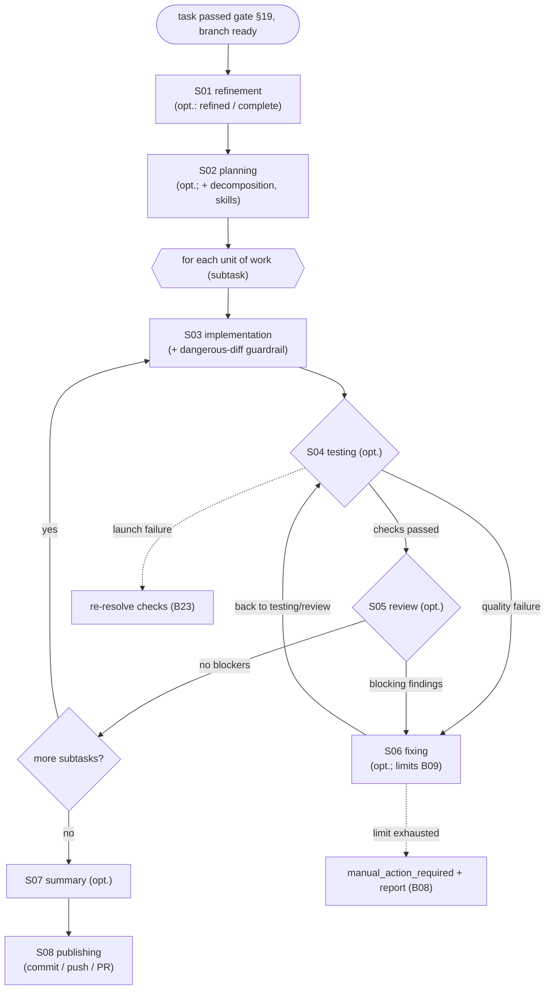

# Implementation flow

This is a more detailed layer on top of [B06 Pipeline](../../blocks/B06-orchestrator-pipeline.md): a frame-by-frame walkthrough of how a single task moves through the pipeline — one document per stage (S01–S08). B**-blocks answer "what exists in the system"; this layer answers "what happens at each execution step": who runs the stage, whether it is optional, how stages are connected, and how the **ping-pong\*\* mechanism works.

Stage documents describe the **flow** and reference the B\*\* blocks that implement the mechanics (without duplication). The same rules apply as for B\*\* blocks (see [CONVENTIONS.md](../../CONVENTIONS.md)): only what is confirmed by code, references in `file:line` format, English language.

## Pipeline stages (overview)

## Who runs each stage and what is optional

| Stage | Who runs it | Optional? | Document |
| --- | --- | --- | --- |
| refinement | agent (B17→B18) | yes — skipped when `refined: true` or `COMPLETE` (via the `refined`/completeness flag, not a stage-skip) | [S01](./S01-refinement.md) |
| planning | agent | yes — `SKIPPABLE` (stub plan is used, decomposition is disabled) | [S02](./S02-planning.md) |
| implementation | agent | **no** — core of the work, cannot be skipped | [S03](./S03-implementation.md) |
| testing | Check Runner (B24), **not an agent** | yes — `SKIPPABLE` | [S04](./S04-testing.md) |
| review | agent | yes — `SKIPPABLE` (requires `agents.allow_review_skip`) | [S05](./S05-review.md) |
| fixing | agent | yes — entered only on failure; `SKIPPABLE` | [S06](./S06-fixing.md) |
| summary | agent (or stub / minimal) | yes — `SKIPPABLE`; best-effort | [S07](./S07-summary.md) |
| publishing | Git Manager (B22), **not an agent** | **no** — exit stage, cannot be skipped | [S08](./S08-publishing.md) |

Each stage is a flow **node**; the engine runs it through its `NodeRunner` ([nodes/](../../../../src/wastech_orchestrator/core/flow/nodes)) and takes the node's outcome. Skip is now a node `when:` condition in the flow graph (e.g. `when: config.testing_enabled`, `when: derived.needs_refinement`); a skipped node yields its pass-through edge ([engine.py:291-312](../../../../src/wastech_orchestrator/core/flow/engine.py#L291)). Classification confirmed by `ROUTABLE_STAGES`/`SKIPPABLE_STAGES` ([schema.py:50-74](../../../../src/wastech_orchestrator/config/schema.py#L50)).

## Ping-pong (testing/review → fixing)

On a **quality** check failure ([S04](./S04-testing.md)) or **blocking** review findings ([S05](./S05-review.md)), the engine takes a `fail`/`rework` edge into the `fixing` node ([S06](./S06-fixing.md)): the agent edits the code and the engine routes the `fixing` node's forward edge back to `testing` (or to `review` when testing is skipped). The engine resets a loop counter when a forward edge leaves the node ([engine.py `_reset_loops_at`](../../../../src/wastech_orchestrator/core/flow/engine.py#L363)). Two limits (`max_fix_cycles` per-loop and `max_total_fix_iterations` global) prevent infinite loops; the engine enforces them generically over the run's loop counters and on exhaustion ends the run at `manual_action_required` + failure report ([engine.py:342-382](../../../../src/wastech_orchestrator/core/flow/engine.py#L342), [B08](../../blocks/B08-ledger-and-failure-reports.md)). A check launch failure is **not** a ping-pong event: it is an infrastructure issue → single re-resolve attempt ([S04](./S04-testing.md)/[B23](../../blocks/B23-check-discovery.md)).

With decomposition, each subtask is a separate unit `implementation → testing → review → fixing` with its own local commit ([B11](../../blocks/B11-task-decomposition.md)); the global `fix_iterations` counter accumulates across all subtasks so that decomposition cannot bypass the hard stop ([B09](../../blocks/B09-fix-loop-control.md)).

## Flow documents

- [S01 — refinement stage](./S01-refinement.md)
- [S02 — planning stage](./S02-planning.md)
- [S03 — implementation stage](./S03-implementation.md)
- [S04 — testing stage](./S04-testing.md)
- [S05 — review stage](./S05-review.md)
- [S06 — fixing stage](./S06-fixing.md)
- [S07 — summary stage](./S07-summary.md)
- [S08 — publishing stage](./S08-publishing.md)

## Connections

- Block-level detail and status transitions — [B06 Pipeline](../../blocks/B06-orchestrator-pipeline.md); state machine — [B07](../../blocks/B07-state-machine-and-store.md).
- Cross-cutting scenarios (multiple flows) — [system-flows.md](../../system-flows.md); block map — [index.md](../../index.md).
- C4: dynamic view `implementationFlow` in [docs/likec4/](../../../likec4/README.md).

## Code confirmation

- [engine.py:217-265](../../../../src/wastech_orchestrator/core/flow/engine.py#L217) — `FlowEngine.run`: run each node → take its outcome → `_select_edge` → transition (the single execution model; the hardcoded dispatch-on-`Status` loop is gone).
- [engine_driver.py:94-136](../../../../src/wastech_orchestrator/core/flow/engine_driver.py#L94) — `build_node_runners` / `drive_flow`: assemble the per-kind runners and run one unit to a terminal result.
- [orchestrator.py:821-938](../../../../src/wastech_orchestrator/core/orchestrator.py#L821) — `_engine_run` / `_run_phases`: build node services + inputs, drive the flow (whole graph, or pre → per-subtask region → post when decomposed).
- [implementation.yaml](../../../../src/wastech_orchestrator/core/flow/packaged/implementation.yaml) — the flow graph + edges the engine drives (nodes refinement…publish, the two fix loops, decomposition).
- Node runners: [nodes/agent.py](../../../../src/wastech_orchestrator/core/flow/nodes/agent.py), [nodes/evaluator.py](../../../../src/wastech_orchestrator/core/flow/nodes/evaluator.py), [nodes/checks.py](../../../../src/wastech_orchestrator/core/flow/nodes/checks.py), [nodes/publish.py](../../../../src/wastech_orchestrator/core/flow/nodes/publish.py).
- [schema.py:50-74](../../../../src/wastech_orchestrator/config/schema.py#L50) — `ROUTABLE_STAGES` / `SKIPPABLE_STAGES`.
- Tests: [tests/core/test_flow_engine.py](../../../../tests/core/test_flow_engine.py), [tests/core/test_flow_node_runners.py](../../../../tests/core/test_flow_node_runners.py), [tests/core/test_orchestrator.py](../../../../tests/core/test_orchestrator.py), [tests/core/test_cli_pipeline.py](../../../../tests/core/test_cli_pipeline.py).
