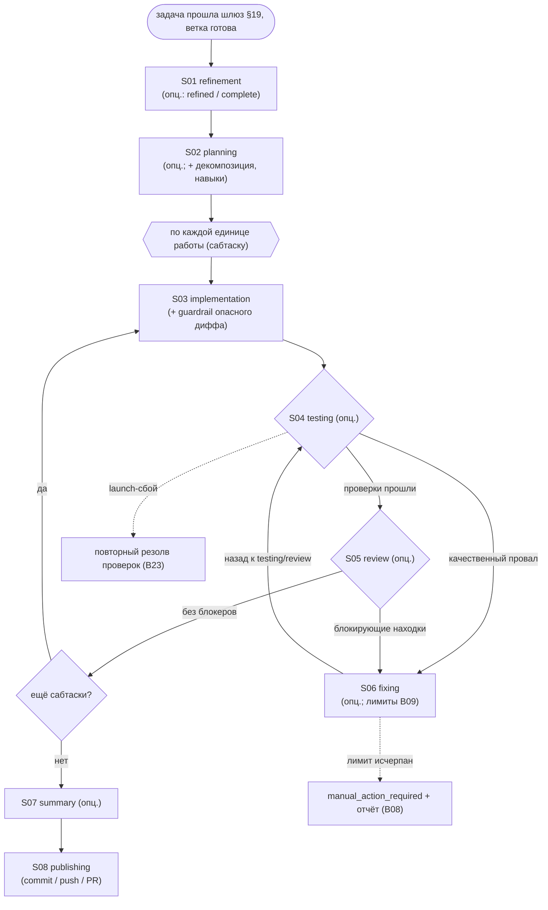

# Поток исполнения (implementation flow)

Это более детальный слой над [B06 Конвейер](../../blocks/B06-orchestrator-pipeline.md): «покадровый»
разбор того, как одна задача проходит конвейер — по одному документу на каждую стадию (S01–S08).
B**-блоки отвечают на вопрос «что есть в системе»; этот слой — «что происходит на каждом шаге
исполнения»: кто выполняет стадию, опциональна ли она, как стадии связаны и как работает **ping-pong**.

Документы-стадии описывают **поток** и ссылаются на блоки B**, реализующие механику (без
дублирования). Правила те же, что для B** (см. [CONVENTIONS.md](../../CONVENTIONS.md)): только
подтверждённое кодом, ссылки `файл:строка`, русский язык.

## Стадии конвейера (обзор)

## Кто выполняет и что опционально

| Стадия | Кто выполняет | Опциональна? | Документ |
| --- | --- | --- | --- |
| refinement | агент (B17→B18) | да — пропуск при `refined: true` или `COMPLETE` (не через `skip_stages`) | [S01](./S01-refinement.md) |
| planning | агент | да — `SKIPPABLE` (тогда stub-план, декомпозиция выключена) | [S02](./S02-planning.md) |
| implementation | агент | **нет** — ядро работы, не пропускается | [S03](./S03-implementation.md) |
| testing | Check Runner (B24), **не агент** | да — `SKIPPABLE` | [S04](./S04-testing.md) |
| review | агент | да — `SKIPPABLE` (требует `agents.allow_review_skip`) | [S05](./S05-review.md) |
| fixing | агент | да — входится только при провале; `SKIPPABLE` | [S06](./S06-fixing.md) |
| summary | агент (или stub / минимальный) | да — `SKIPPABLE`; best-effort | [S07](./S07-summary.md) |
| publishing | Git Manager (B22), **не агент** | **нет** — выход, не пропускается | [S08](./S08-publishing.md) |

Классификация подтверждена `ROUTABLE_STAGES`/`SKIPPABLE_STAGES`
([schema.py:39-63](../../../../src/wastech_orchestrator/config/schema.py#L39)).

## Ping-pong (testing/review → fixing)

При **качественном** провале проверок ([S04](./S04-testing.md)) или **блокирующих** находках ревью
([S05](./S05-review.md)) единица входит в [S06 fixing](./S06-fixing.md): агент правит код и возвращается
к testing (или сразу к review, если testing пропущен — `_after_edit_target`). Прохождение сбрасывает
счётчики (B09: `on_check_pass` сбрасывает test-цикл, `on_review_pass` — оба). Два лимита
(`max_fix_cycles` per-loop и `max_total_fix_iterations` глобальный) не дают зациклиться; при исчерпании
— `manual_action_required` + отчёт о провале ([B08](../../blocks/B08-ledger-and-failure-reports.md)).
Launch-сбой проверок — **не** ping-pong: это инфраструктура → однократный повторный резолв
([S04](./S04-testing.md)/[B23](../../blocks/B23-check-discovery.md)).

При декомпозиции каждый сабтаск — отдельная единица `implementation → testing → review → fixing` со
своим локальным коммитом ([B11](../../blocks/B11-task-decomposition.md)); глобальный `fix_iterations`
копится через все сабтаски, чтобы декомпозиция не обходила жёсткий стоп
([B09](../../blocks/B09-fix-loop-control.md)).

## Документы потока

- [S01 — Стадия refinement](./S01-refinement.md)
- [S02 — Стадия planning](./S02-planning.md)
- [S03 — Стадия implementation](./S03-implementation.md)
- [S04 — Стадия testing](./S04-testing.md)
- [S05 — Стадия review](./S05-review.md)
- [S06 — Стадия fixing](./S06-fixing.md)
- [S07 — Стадия summary](./S07-summary.md)
- [S08 — Стадия publishing](./S08-publishing.md)

## Связи

- Блок-уровень и переходы статусов — [B06 Конвейер](../../blocks/B06-orchestrator-pipeline.md); машина
  состояний — [B07](../../blocks/B07-state-machine-and-store.md).
- Сквозные сценарии (несколько потоков) — [system-flows.md](../../system-flows.md); карта блоков —
  [index.md](../../index.md).
- C4: динамический вид `implementationFlow` в [docs/architecture/](../../../architecture/README.md).

## Подтверждение в коде

- [orchestrator.py:1033-1047](../../../../src/wastech_orchestrator/core/orchestrator.py#L1033) —
  `_run_units_and_finish`: цикл по единицам → summary → publish.
- [orchestrator.py:1196-1296](../../../../src/wastech_orchestrator/core/orchestrator.py#L1196) —
  `_run_unit`: цикл `implementing → testing → reviewing → fixing` (ping-pong) и переход к summary.
- [schema.py:39-63](../../../../src/wastech_orchestrator/config/schema.py#L39) — `ROUTABLE_STAGES` /
  `SKIPPABLE_STAGES`.
- Тесты: [tests/core/test_orchestrator.py](../../../../tests/core/test_orchestrator.py),
  [tests/core/test_cli_pipeline.py](../../../../tests/core/test_cli_pipeline.py).
