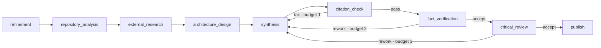

# Flow: `deep_research`

> Reconstructed from code (`src/wastech_orchestrator/packaged/flows/deep_research.yaml` and the node runners). The code is the only source of truth. Significant claims carry a `file:line` reference.

A research-synthesis flow ([deep_research.yaml](../../../src/wastech_orchestrator/packaged/flows/deep_research.yaml), `task_type: deep_research`). Flow-wide ceilings: `permission_ceiling: workspace-write`, `output_policy: repository_document` (the deliverable is `docs/research/<task-id>/{report.md,sources.json}`), `publishing: documentation_pull_request`, and crucially `network_policy: research` — declaring `network_policy` is what grants every node network access and enables the optional external-research node ([B25](../blocks/B25-security-policy.md), [B30](../blocks/B30-flow-node-runners.md)).

## The graph

| Node | Kind | Profile / session | Notes |
| --- | --- | --- | --- |
| `refinement` | agent | read-only · fresh_disposable · network off | HITL question; `when: derived.needs_refinement` |
| `repository_analysis` | agent | read-only · fresh_disposable · network off |  |
| `external_research` | agent | read-only · fresh_disposable · network on | `when: config.external_research` (true iff network granted) |
| `architecture_design` | agent | workspace-write · fresh_disposable · network off | writes into the report dir |
| `synthesis` | agent | workspace-write · fresh_disposable · network off | writes `report.md` + `sources.json` |
| `citation_check` | checks | `citation` | a hallucinated citation → `fail` ([B32](../blocks/B32-flow-checkers.md)) |
| `fact_verification` | evaluator | read-only · fresh_disposable · network on · **non-blocking**, `max_rework_per_stage: 1` | self-caps then accepts |
| `critical_review` | evaluator | read-only · **`resume_own_lineage`** · network on · non-blocking, `max_rework_per_stage: 3` | remembers prior rounds via its own durable session ([B30](../blocks/B30-flow-node-runners.md)) |
| `publish` | publish | `documentation_pull_request` | the after-stage output guard already confined writes to the report dir |

(Verified against [deep_research.yaml:14-77](../../../src/wastech_orchestrator/packaged/flows/deep_research.yaml#L14).)

## Loops and budgets

All three feedback edges point back to `synthesis` with **inline** budgets (not named loops): `citation_check → synthesis` (`fail`, budget 1), `fact_verification → synthesis` (`rework`, budget 2), `critical_review → synthesis` (`rework`, budget 3). The two evaluators are **non-blocking**: each reworks up to its own `max_rework_per_stage` (counted from the immutable `in_flow_verdict` rows) then takes `accept` — never `manual` ([B30](../blocks/B30-flow-node-runners.md)). When an evaluator accepts only because that budget ran out (a finding still open), the orchestrator emits a console warning + a ⚠️ Telegram trace (`accept (rework budget exhausted)`) so the operator knows the report shipped with open questions that may need follow-up.

The flow declares `budgets.global_fix_iterations: 12` ([deep_research.yaml:79-80](../../../src/wastech_orchestrator/packaged/flows/deep_research.yaml#L79)) — the reserved key the engine's global cap reads (`run_state.GLOBAL_FIX_KEY`). The effective ceiling is `min(12, agents.max_total_fix_iterations)`, so cumulative rework across all feedback edges stops at 12 (tighter than the config default).

The supervisor layer still writes the task summary; the deliverable PR body is the committed summary. See [flows/index.md](index.md) and [B31](../blocks/B31-supervisor.md).
