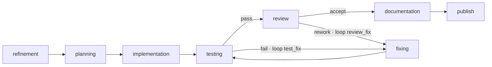

# Flow: `implementation` (the default coding pipeline)

> Reconstructed from code (`src/wastech_orchestrator/packaged/flows/implementation.yaml` and the node runners). The code is the only source of truth. Significant claims carry a `file:line` reference.

The packaged default flow ([implementation.yaml](../../../src/wastech_orchestrator/packaged/flows/implementation.yaml)) — resolved when a task has no `task_type` (or `task_type: implementation`). Flow-wide ceilings: `permission_ceiling: workspace-write`, `output_policy: code_change`, `publishing: pull_request`.

## The graph

| Node | Kind | Profile / session | Notes |
| --- | --- | --- | --- |
| `refinement` | agent | read-only · fresh_disposable | HITL question; `output_artifact: enriched_spec`; `when: derived.needs_refinement` |
| `planning` | agent | read-only · fresh_disposable | HITL question + approval; `output_artifact: plan`; `when: config.planning_enabled`; the decomposition `proposed_by` |
| `implementation` | agent | workspace-write · editing_lineage | the author |
| `testing` | checks | `command_profile` | `when: config.testing_enabled`; diff-selects the operator's `command_sets` and runs them all (no fail-fast) |
| `review` | evaluator | read-only · fresh_disposable · blocking | `when: config.review_enabled` |
| `fixing` | agent | workspace-write · editing_lineage | `lineage_affinity: implementation`; `when: config.fixing_enabled` |
| `documentation` | agent | workspace-write · editing_lineage | `lineage_affinity: implementation`; updates the target project's docs to match the accepted change — its edits join the same diff the orchestrator commits; no `output_artifact`, no `hitl`/`when` (disable per task via `nodes.documentation.enabled: false`) |
| `publish` | publish | `pull_request` | commit code + audit, push, open PR (idempotent) |

(Node fields verified against [implementation.yaml:33-80](../../../src/wastech_orchestrator/packaged/flows/implementation.yaml#L33); the `testing` checks node is just `{id, kind, checker}` — the former `discovery` field was removed with the checks-monorepo change.)

## Loops and budgets

Two fix loops feed back into `fixing`, plus the global cap ([implementation.yaml:82-96](../../../src/wastech_orchestrator/packaged/flows/implementation.yaml#L82)):

- `testing → fixing` (`fail`, loop **`test_fix`**, budget 15), `fixing → testing` forward.
- `review → fixing` (`rework`, loop **`review_fix`**, budget 15).
- `budgets.global_fix_iterations: 30` — the single global counter.

Each cap is clamped to `min(flow, config)` by the engine ([B28](../blocks/B28-flow-engine.md), [B09](../blocks/B09-fix-loop-control.md)): `test_fix`/`review_fix` to `agents.max_fix_cycles`, the global to `agents.max_total_fix_iterations`. Exhaustion → `manual_action_required` + failure report. There is **no `summary` node**: the [supervisor layer](../blocks/B31-supervisor.md) writes the summary at close, before `publish`.

## Checks (the `testing` node)

The `testing` node is a `command_profile` checks node ([B30](../blocks/B30-flow-node-runners.md)). The flow never supplies the commands (security ceiling): the gate is the operator's `checks.command_sets` (config), normalized at preflight ([B23](../blocks/B23-check-discovery.md) `CheckResolver`) and **diff-selected** per task — the node computes the changed paths via the Git Manager and calls `select_check_sets`, so only the command sets whose `paths` match the diff run (with the conservative fallbacks: an unknown diff or an unattributable path runs all sets; an empty diff runs none → vacuous pass). The Check Runner ([B24](../blocks/B24-check-execution.md)) runs **all** selected checks (no fail-fast) and aggregates. The node maps the aggregate outcome:

- any **quality** failure → `fail` → `fixing` (the loop above);
- an **incomplete gate** — a _required_ toolchain's binary absent (launch failure), or every selected check skipped (`skip_if_unavailable` sets with absent toolchains) — → `NodeManualRequired` (node-run status `incomplete`); changed code is never handed on unchecked, and this precedence wins over a co-occurring quality failure;
- otherwise the **mutation guard** runs (a green-but-dirtying check → manual), then `pass`.

A partial skip (some checks ran and passed, others skipped) still **passes** the node, but the orchestrator's auto-merge is then blocked: `git.auto_merge` is skipped when `store.task_had_skipped_checks(task_id)` is true (an incomplete gate is never auto-merged — the open PR is handed to a human, see [B06](../blocks/B06-orchestrator-pipeline.md)).

## Decomposition

A `decomposition` block ([implementation.yaml:98-101](../../../src/wastech_orchestrator/packaged/flows/implementation.yaml#L98)) lets planning propose a split: `proposed_by: planning`, `sub_flow: [implementation, testing, review, fixing]`, `shared_budget: global_fix_iterations`. The orchestrator decides the split deterministically ([B11](../blocks/B11-task-decomposition.md)) and runs the region once per subtask (committing each — subtask commit is unconditional), with per-loop budgets reset between subtasks and the global counter accumulating. See [B06](../blocks/B06-orchestrator-pipeline.md) `_run_phases`/`_fan_out_subtasks`. `documentation` is deliberately kept **out** of `sub_flow`: it is the post-region phase entry (`review --accept-->` leaves the region), so it runs **once** after the last subtask's code is accepted — a whole-task docs update, not a per-subtask one. The accept gate uses `agents.decomposition.max_subtasks` and always enforces a 2..n linear DAG (the decorative `decomposition.gate` + `commit_each_subtask` fields were removed — audit #4/#5).

## HITL

`refinement` and `planning` are the HITL-capable nodes ([B12](../blocks/B12-hitl-and-typed-output.md)): a typed question/approval triggers one durable round-trip. A `workspace-write` edit by `implementation`/`fixing`/`documentation` is guarded by the dangerous-diff classifier ([B14](../blocks/B14-dangerous-diff-guardrail.md)). A planning-time approval can pre-clear a matching dangerous diff, and any prior in-task approval of the **identical** dangerous diff (same risk + exact path set) is honored — so a later workspace-write node (e.g. `documentation` seeing `implementation`'s still-uncommitted deletion/dependency change) does not re-prompt for an already-cleared change; a new or expanded dangerous set still prompts.
