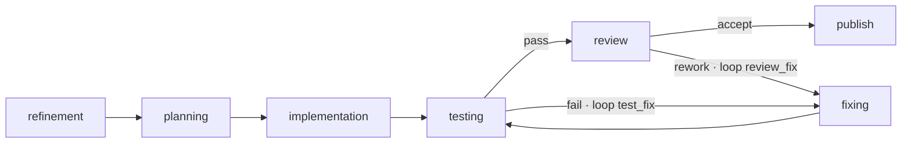

# Flow: `implementation` (the default coding pipeline)

> Reconstructed from code (`src/wastech_orchestrator/core/flow/packaged/implementation.yaml` and the node runners). The code is the only source of truth. Significant claims carry a `file:line` reference.

The packaged default flow ([implementation.yaml](../../../src/wastech_orchestrator/core/flow/packaged/implementation.yaml)) — resolved when a task has no `task_type` (or `task_type: implementation`). Flow-wide ceilings: `permission_ceiling: workspace-write`, `output_policy: code_change`, `publishing: pull_request`.

## The graph

| Node | Kind | Profile / session | Notes |
| --- | --- | --- | --- |
| `refinement` | agent | read-only · fresh_disposable | HITL question; `output_artifact: enriched_spec`; `when: derived.needs_refinement` |
| `planning` | agent | read-only · fresh_disposable | HITL question + approval; `output_artifact: plan`; `when: config.planning_enabled`; the decomposition `proposed_by` |
| `implementation` | agent | workspace-write · editing_lineage | the author |
| `testing` | checks | `command_profile`, discovery auto | `when: config.testing_enabled`; `approve_command_changes: true` |
| `review` | evaluator | read-only · fresh_disposable · blocking | `when: config.review_enabled` |
| `fixing` | agent | workspace-write · editing_lineage | `lineage_affinity: implementation`; `when: config.fixing_enabled` |
| `publish` | publish | `pull_request` | commit code + audit, push, open PR (idempotent) |

(Node fields verified against [implementation.yaml:27-71](../../../src/wastech_orchestrator/core/flow/packaged/implementation.yaml#L27).)

## Loops and budgets

Two fix loops feed back into `fixing`, plus the global cap ([implementation.yaml:72-85](../../../src/wastech_orchestrator/core/flow/packaged/implementation.yaml#L72)):

- `testing → fixing` (`fail`, loop **`test_fix`**, budget 15), `fixing → testing` forward.
- `review → fixing` (`rework`, loop **`review_fix`**, budget 15).
- `budgets.global_fix_iterations: 30` — the single global counter.

Each cap is clamped to `min(flow, config)` by the engine ([B28](../blocks/B28-flow-engine.md), [B09](../blocks/B09-fix-loop-control.md)): `test_fix`/`review_fix` to `agents.max_fix_cycles`, the global to `agents.max_total_fix_iterations`. Exhaustion → `manual_action_required` + failure report. There is **no `summary` node**: the [supervisor layer](../blocks/B31-supervisor.md) writes the summary at close, before `publish`.

## Decomposition

A `decomposition` block ([implementation.yaml:87-92](../../../src/wastech_orchestrator/core/flow/packaged/implementation.yaml#L87)) lets planning propose a split: `proposed_by: planning`, `sub_flow: [implementation, testing, review, fixing]`, `commit_each_subtask: true`, `shared_budget: global_fix_iterations`. The orchestrator decides the split deterministically ([B11](../blocks/B11-task-decomposition.md)) and runs the region once per subtask (committing each), with per-loop budgets reset between subtasks and the global counter accumulating. See [B06](../blocks/B06-orchestrator-pipeline.md) `_run_phases`/`_fan_out_subtasks`.

> Audit note: the `decomposition.gate` block (`min`/`max`/`linear_depends_on`) is set here but is **not consumed** at runtime — the accept gate uses `agents.decomposition.max_subtasks` and always enforces a 2..n linear DAG; likewise `commit_each_subtask` is never read (commit is unconditional). See [the audit](../../backlog/2026-06-21-audit.md).

## HITL

`refinement` and `planning` are the HITL-capable nodes ([B12](../blocks/B12-hitl-and-typed-output.md)): a typed question/approval triggers one durable round-trip. A `workspace-write` edit by `implementation`/`fixing` is guarded by the dangerous-diff classifier ([B14](../blocks/B14-dangerous-diff-guardrail.md)), and a planning-time approval can pre-clear a matching dangerous diff.
