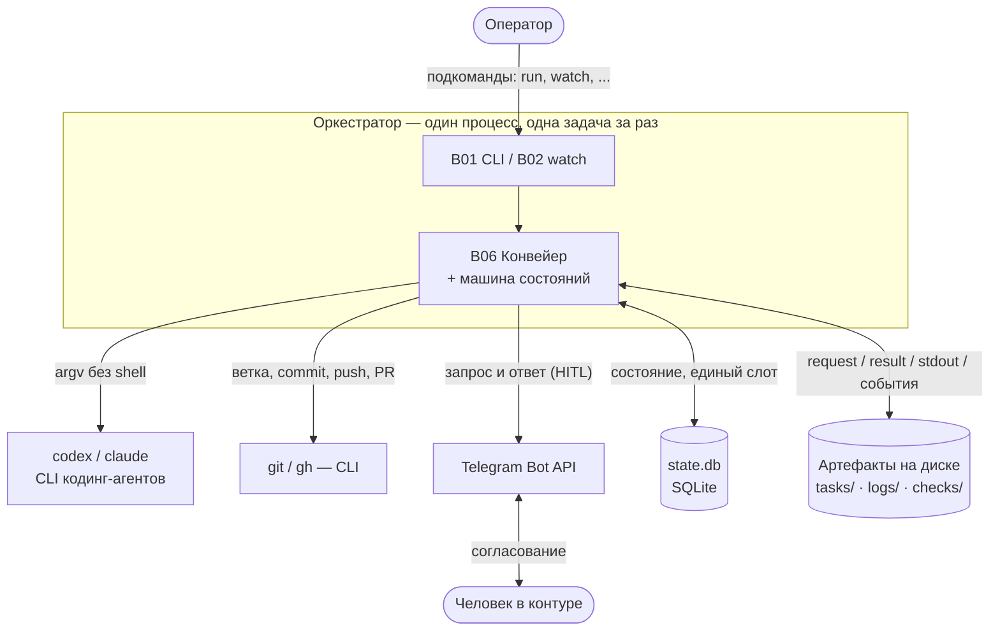
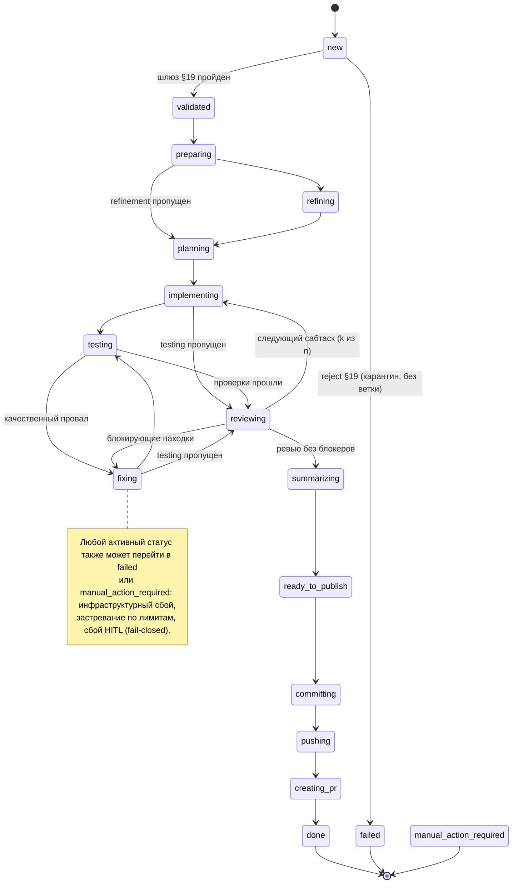

# Функциональная карта системы

> Эта документация восстановлена по исполняемому коду и тестам (`src/wastech_orchestrator/`,
> `tests/`). Источником истины является только код; README, спецификации, комментарии и docstring
> в качестве источника не использовались. Каждое существенное утверждение в документах блоков
> сопровождается ссылкой на подтверждающий участок кода (`файл:строка`).

## Назначение системы (подтверждено кодом)

Система — это оркестратор, который проводит **одну задачу за раз** через детерминированный конвейер,
запуская внешние CLI кодинг-агентов (`codex`, `claude`) как дочерние процессы и публикуя результат в
Git (ветка → коммит → push → Pull Request через `gh`).

Подтверждается:

- точкой входа CLI и набором подкоманд ([cli.py:114-376](../../src/wastech_orchestrator/cli.py#L114));
- классом-конвейером [Orchestrator](../../src/wastech_orchestrator/core/orchestrator.py#L294) и его
  методом `run_task` ([orchestrator.py:350](../../src/wastech_orchestrator/core/orchestrator.py#L350));
- контрактом провайдера [AgentProvider](../../src/wastech_orchestrator/providers/base.py#L155) с двумя
  адаптерами `codex` и `claude`;
- машиной состояний задачи ([state_machine.py:15-113](../../src/wastech_orchestrator/core/state_machine.py#L15));
- запуском всех внешних команд **списком аргументов без shell-интерполяции**
  ([process.py](../../src/wastech_orchestrator/providers/process.py), [git_manager.py](../../src/wastech_orchestrator/git_manager.py)).

Ключевые свойства, которые видны в коде:

- **Один слот обработки.** Активной может быть только одна задача; слот проверяется запросом к БД
  (`acquire_slot` / `find_active_tasks`, [orchestrator.py:383-385](../../src/wastech_orchestrator/core/orchestrator.py#L383)).
- **Возобновляемость.** Всё состояние персистится в SQLite (`state.db`) и в файловых артефактах, что
  позволяет продолжить прерванную задачу (`resume`, [orchestrator.py:655](../../src/wastech_orchestrator/core/orchestrator.py#L655)).
- **Разделение ответственности (инвариант).** Ядро никогда само не строит команду CLI: оно вызывает
  только Router (агентские стадии), Check Runner (стадия `testing`) и Git Manager (всё, что касается
  git). Контекст передаётся агентам **только путями к файлам-артефактам** в `AgentRunRequest`.
- **Fallback только для инфраструктурных ошибок.** Качественные провалы (тесты/ревью) уходят в стадию
  `fixing`, а не на другого провайдера (Router, [router.py](../../src/wastech_orchestrator/routing/router.py)).
- **Неослабляемая политика безопасности.** Запрещённые флаги, аллой-лист переменных окружения,
  изоляция и скан инъекций ([security/](../../src/wastech_orchestrator/security/)).
- **Человек в контуре (HITL).** Долговечные взаимодействия через Telegram для согласования планов,
  «опасных» диффов и изменившегося набора проверок ([core/hitl.py](../../src/wastech_orchestrator/core/hitl.py),
  [notify/telegram.py](../../src/wastech_orchestrator/notify/telegram.py)).

## Контекст системы

Оркестратор — единый процесс, который обрабатывает одну задачу за раз. Снаружи он общается только с
файлами, локальным репозиторием и несколькими внешними программами; всё это запускается **списком
аргументов без shell-интерполяции**.

Чем подтверждается каждое внешнее взаимодействие: запуск `codex`/`claude` как дочерних процессов —
[B18](./blocks/B18-agent-providers.md); `git`/`gh` — [B22](./blocks/B22-git-manager.md); оба класса
процессов проходят через единый безопасный запуск [B19](./blocks/B19-subprocess-runner.md); Telegram —
[B26](./blocks/B26-notifications-telegram.md); SQLite — [B07](./blocks/B07-state-machine-and-store.md);
файловые артефакты — [B20](./blocks/B20-artifact-layout.md).

## Точки входа (подтверждены)

- **Консольные скрипты `wastech-orchestrator` и `worc`** ([pyproject.toml:29-32](../../pyproject.toml#L29) → `cli:main`) — разбор аргументов и диспетчеризация подкоманд.
- **`python -m wastech_orchestrator`** ([\_\_main\_\_.py](../../src/wastech_orchestrator/__main__.py) → `cli:main`) — то же, что консольные скрипты.
- **Подкоманды CLI** ([cli.py build_parser](../../src/wastech_orchestrator/cli.py#L114), диспетчер [main](../../src/wastech_orchestrator/cli.py#L1497)) — `init`, `install`, `run`, `watch`, `stop`, `restart`, `preflight`, `telegram-test`, `status`, `upgrade-config`, `upgrade-docs`, `install-templates`, `rerun`, `finalize`.

Внутренние триггеры (не пользовательские команды), подтверждённые кодом:

- **Цикл `watch`** периодически сканирует папку `tasks/pending` и подаёт задачи в оркестратор по одной
  ([cli.py watch_loop/watch_once](../../src/wastech_orchestrator/cli.py#L778)).
- **Обработчик `SIGTERM`** демона `watch` (грейсфул-остановка между тиками) —
  [process_control.py](../../src/wastech_orchestrator/process_control.py).
- **Поллинг Telegram** во время ожидания ответа человека (`wait_for_answer`) —
  [notify/telegram.py](../../src/wastech_orchestrator/notify/telegram.py).
- **Heartbeat-потоки** во время долгих операций (провайдер/проверки/git) —
  [observability/progress.py](../../src/wastech_orchestrator/observability/progress.py).

## Основные сквозные потоки (обзор)

Подробные пошаговые сценарии — в [system-flows.md](./system-flows.md). Кратко:

1. **Обработка одной задачи (`run` / `watch`).** Чтение и валидация задачи → захват слота →
   подготовка ветки → (опц.) refinement → planning (+ опц. декомпозиция) → для каждой единицы
   работы цикл `implementation → testing → review → fixing` → summary → публикация (commit/push/PR,
   опц. auto-merge) → терминальная очистка → запись в ledger.
2. **Демон `watch`.** Между тиками: fetch/pull базовой ветки, возобновление прерванной задачи, выбор
   следующей pending-задачи (одна за раз; back-to-back только при `auto_mode`).
3. **Возобновление (`resume`).** На старте сверяется персистентное состояние и продолжается
   единственная незавершённая задача либо завершается прерванная очистка.
4. **`rerun` / `rerun --continue`.** Повторная попытка терминальной задачи — «с нуля от базы» либо
   «продолжить со стадии, на которой упала».
5. **`finalize`.** Оператор фиксирует исход задачи, выполненной вручную (без конвейера и без
   commit/push/PR).
6. **`install` / `init` / `preflight`.** Установка/привязка к репозиторию, генерация и проверка
   конфигурации, диагностика готовности провайдеров и изоляции.

## Конвейер как машина состояний

Каждая задача движется по фиксированному набору статусов с разрешёнными переходами. Переходы заданы
явной таблицей `ALLOWED_TRANSITIONS` ([core/state_machine.py:70](../../src/wastech_orchestrator/core/state_machine.py#L70));
ядро проверяет каждый переход (`assert_transition`) и атомарно сохраняет новый статус.

Терминальные статусы (без исходящих переходов) — `done`, `failed`, `manual_action_required`. Статус
`pending` (§8.2) — это ожидание в очереди: задача принята, но ещё не владеет единственным слотом
обработки; в таблице из него ведут `pending → validated` и `pending → preparing` (взятие из очереди или
возобновление), тогда как нормальный вход в конвейер — статус `new`. Цикл декомпозиции не вводит новых
статусов: каждый сабтаск переиспользует `implementing → testing → reviewing`, а его номер (`k` из `n`)
хранится в State Store.

## Карта функциональных блоков

Полный список с точками входа, зависимостями и статусом — в [block-registry.md](./block-registry.md).
Блоки сгруппированы по роли:

### Интерфейс и управление запуском

- [B01 — CLI и операторские команды](./blocks/B01-cli-and-operator-commands.md)
- [B02 — Демон watch и планирование задач](./blocks/B02-watch-daemon-and-scheduling.md)
- [B03 — Установщик и развёртывание проекта](./blocks/B03-installer-and-scaffolding.md)
- [B04 — Реестр привязок и обнаружение конфигурации](./blocks/B04-install-registry-and-config-discovery.md)
- [B05 — Конфигурация: схема, загрузка, валидация, апгрейд](./blocks/B05-configuration.md)

### Ядро оркестрации

- [B06 — Конвейер оркестратора](./blocks/B06-orchestrator-pipeline.md) — центральный блок
- [B07 — Машина состояний и State Store](./blocks/B07-state-machine-and-store.md)
- [B08 — Ledger и отчёты о провале](./blocks/B08-ledger-and-failure-reports.md)
- [B09 — Контроль циклов исправления](./blocks/B09-fix-loop-control.md)
- [B10 — Восстановление и возобновление](./blocks/B10-recovery-and-resume.md)
- [B11 — Декомпозиция задачи](./blocks/B11-task-decomposition.md)
- [B12 — HITL и типизированный вывод стадий](./blocks/B12-hitl-and-typed-output.md)
- [B13 — Инвентарь и выбор навыков (skills)](./blocks/B13-skill-selection.md)
- [B14 — Классификация «опасного» диффа](./blocks/B14-dangerous-diff-guardrail.md)
- [B15 — Шаблоны промптов и их рендеринг](./blocks/B15-prompt-templates.md)

### Вход задачи

- [B16 — Модель задачи, парсинг и шлюз валидации](./blocks/B16-task-parsing-and-validation-gate.md)

### Исполнение и провайдеры

- [B17 — Router агентов и политика fallback](./blocks/B17-agent-router-and-fallback.md)
- [B18 — Адаптеры провайдеров и контракт (Codex/Claude)](./blocks/B18-agent-providers.md)
- [B19 — Безопасный запуск подпроцессов](./blocks/B19-subprocess-runner.md)
- [B20 — Файловая раскладка артефактов запусков](./blocks/B20-artifact-layout.md)
- [B21 — Редактирование секретов (redaction)](./blocks/B21-secret-redaction.md)

### Git

- [B22 — Операции git и GitHub (Git Manager)](./blocks/B22-git-manager.md)

### Проверки (quality gate)

- [B23 — Обнаружение и резолвинг проверок](./blocks/B23-check-discovery.md)
- [B24 — Выполнение проверок (стадия testing)](./blocks/B24-check-execution.md)

### Безопасность

- [B25 — Принуждение политики безопасности](./blocks/B25-security-policy.md)

### Интеграции и сквозные сервисы

- [B26 — Уведомления и транспорт HITL (Telegram)](./blocks/B26-notifications-telegram.md)
- [B27 — Наблюдаемость: логирование и heartbeat](./blocks/B27-observability.md)

### Карта зависимостей блоков

Упрощённая карта основных связей (полный список — ниже и в [block-registry.md](./block-registry.md)).
B06 — спайн: он координирует ядро и инструменты, но никогда сам не строит команду CLI.

```mermaid
flowchart LR
    B01["B01 CLI"]
    B02["B02 watch"]
    B06["B06 Конвейер — спайн"]
    B16["B16 Шлюз задачи"]
    B07["B07 State Store"]
    rules["B08-B15 правила ядра:<br/>ledger, циклы fix, recovery,<br/>декомпозиция, HITL, навыки,<br/>guardrail, промпты"]
    B17["B17 Router"]
    B18["B18 Провайдеры"]
    B19["B19 Subprocess"]
    B22["B22 Git Manager"]
    B23["B23 Резолв проверок"]
    B24["B24 Проверки (testing)"]
    B26["B26 Telegram"]
    B27["B27 Observability"]
    B21["B21 Redaction"]
    B25["B25 Security"]

    B01 --> B06
    B02 --> B06
    B06 --> B16
    B06 --> B07
    B06 --> rules
    B06 --> B17
    B06 --> B23
    B06 --> B24
    B06 --> B22
    B06 --> B26
    B17 --> B18
    B18 --> B19
    B22 --> B19
    B24 --> B19
    B22 --> B07
    B01 -.->|"status (read-only)"| B07
    B25 -.->|"политика"| B18
    B25 -.-> B22
    B25 -.-> B24
    B21 -.->|"секреты"| B18
    B21 -.-> B27
```

Ключевое: [B17 Router](./blocks/B17-agent-router-and-fallback.md) — единственный вызыватель
[B18 Провайдеров](./blocks/B18-agent-providers.md); все внешние процессы идут через
[B19](./blocks/B19-subprocess-runner.md); [B21](./blocks/B21-secret-redaction.md) (redaction) и
[B25](./blocks/B25-security-policy.md) (security) — сквозные и используются также в B06, B26, B27 и др.

### Связи на верхнем уровне (подтверждены кодом)

- [B06 Конвейер](./blocks/B06-orchestrator-pipeline.md) — спайн: вызывает B07, B08, B09, B10, B11,
  B12, B13, B14, B15, B16, B17, B22, B24, B26 и читает B23 (профиль проверок).
  Сборка зависимостей — `build_orchestrator` ([orchestrator.py:2594](../../src/wastech_orchestrator/core/orchestrator.py#L2594)).
- [B17 Router](./blocks/B17-agent-router-and-fallback.md) — единственный вызыватель
  [B18 Провайдеров](./blocks/B18-agent-providers.md); ядро провайдеров напрямую не вызывает.
- [B18](./blocks/B18-agent-providers.md), [B22](./blocks/B22-git-manager.md),
  [B24](./blocks/B24-check-execution.md), [B03/B04](./blocks/B03-installer-and-scaffolding.md) —
  все запускают внешние процессы через [B19](./blocks/B19-subprocess-runner.md).
- [B21 Redaction](./blocks/B21-secret-redaction.md) и [B25 Security](./blocks/B25-security-policy.md)
  — сквозные: используются B18, B22, B24, B27, B06, B26.
- [B07 State Store](./blocks/B07-state-machine-and-store.md) — читается/пишется B06 и B22
  (идемпотентность публикации); читается B01 (`status`) в режиме read-only.

## Источники данных и состояние (подтверждены)

- **`state.db`** — `<artifacts_root>/state.db`; SQLite (tasks, stage_runs, provider_attempts, check_runs, artifacts, publish_operations, subtasks); владелец [B07](./blocks/B07-state-machine-and-store.md).
- **`completed.jsonl`** — `<artifacts_root>/logs/completed.jsonl`; JSONL (append-only); владелец [B08](./blocks/B08-ledger-and-failure-reports.md).
- **`resolved-profile.json`** — `<artifacts_root>/checks/`; JSON (кэш профиля проверок); владелец [B23](./blocks/B23-check-discovery.md).
- **Артефакты запусков** — `<artifacts_root>/logs/<task-id>/...`; каталоги с request/result/stdout/stderr/events; владелец [B20](./blocks/B20-artifact-layout.md).
- **HITL-взаимодействия** — `<artifacts_root>/logs/<task-id>/...`; JSON; владелец [B12](./blocks/B12-hitl-and-typed-output.md).
- **`registry.json`** — пользовательский config-dir (или `$WASTECH_ORCHESTRATOR_HOME`); JSON (repo → config); владелец [B04](./blocks/B04-install-registry-and-config-discovery.md).
- **Папки жизненного цикла задач** — `tasks/{pending,processing,done,failed,rejected}`; файлы `.md`/`.json`; владельцы [B06](./blocks/B06-orchestrator-pipeline.md), [B16](./blocks/B16-task-parsing-and-validation-gate.md).

## Внешние интеграции (подтверждены)

- **Git CLI (`git`)** и **GitHub CLI (`gh`)** — подпроцессы из [B22](./blocks/B22-git-manager.md).
- **CLI кодинг-агентов `codex` / `claude`** — подпроцессы из [B18](./blocks/B18-agent-providers.md).
- **Telegram Bot API** через `python-telegram-bot` — [B26](./blocks/B26-notifications-telegram.md).
- **SQLite** (stdlib `sqlite3`) — [B07](./blocks/B07-state-machine-and-store.md).
- **Файловая система** — артефакты, lifecycle-папки, кэш профиля, реестр привязок.

## Статус документации

Все 27 блоков (B01–B27) исследованы по исходному коду и тестам и имеют статус `documented` (см.
[block-registry.md](./block-registry.md)). Сквозные сценарии — в [system-flows.md](./system-flows.md).
Каждый модуль `src/wastech_orchestrator/*` отнесён к одному блоку; вспомогательные модули, не являющиеся
самостоятельными блоками, перечислены в реестре в разделе `excluded`.

Правила поддержки и актуализации этой документации, а также правило про язык (русский — только для
`docs/functional/`) — в [CONVENTIONS.md](./CONVENTIONS.md).

## Неопределённости

Поведение системы восстановлено по коду; ниже — оставшиеся оговорки о доказательной базе (поведение
подтверждено чтением кода, но имеет нюанс в тестовом покрытии):

- **Классификатор «опасного» диффа** ([core/dangerous_diff.py](../../src/wastech_orchestrator/core/dangerous_diff.py), B14) не имеет
  отдельного модульного теста; его поведение подтверждается чтением чистой функции и косвенно — через
  guardrail-сценарии конвейера ([tests/core/test_orchestrator.py](../../tests/core/test_orchestrator.py),
  [tests/core/test_hitl.py](../../tests/core/test_hitl.py)).
- **Реальный сетевой путь Telegram** (`_HttpTelegramClient` в [notify/telegram.py](../../src/wastech_orchestrator/notify/telegram.py), B26)
  в тестах подменяется фейковым клиентом; против живого Telegram API он не прогоняется (по дизайну).
  Контракт и обработка ошибок подтверждены чтением кода и тестами на фейке.
