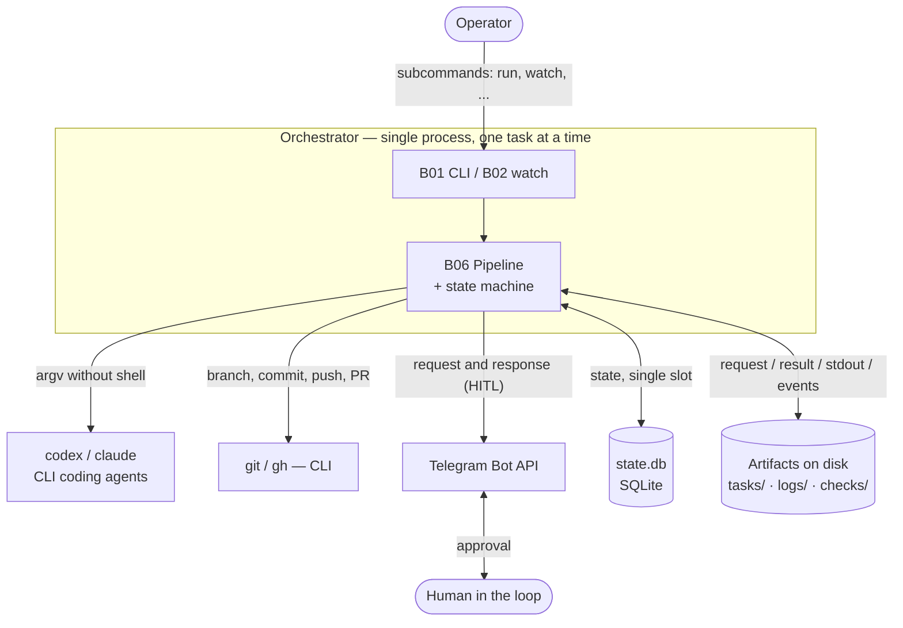
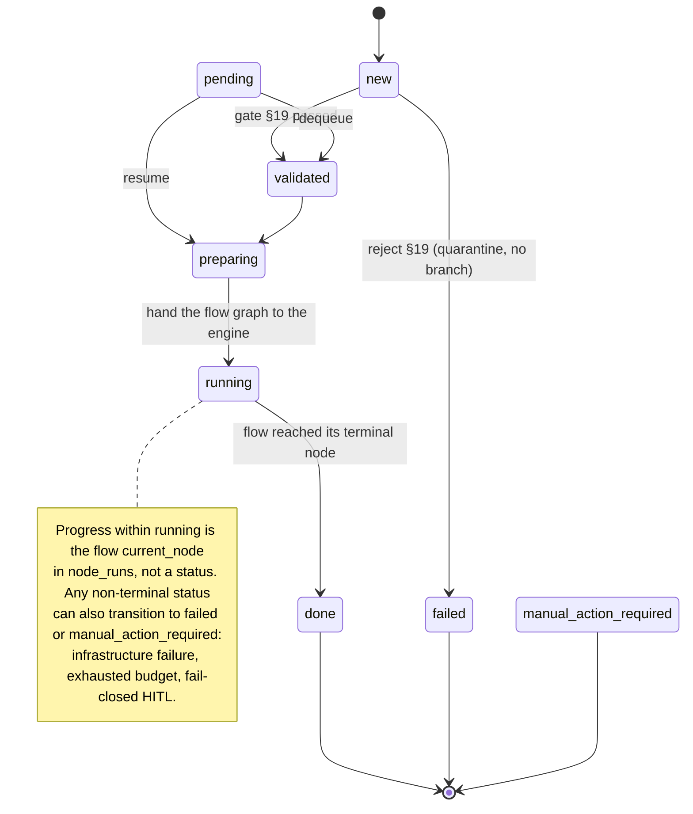
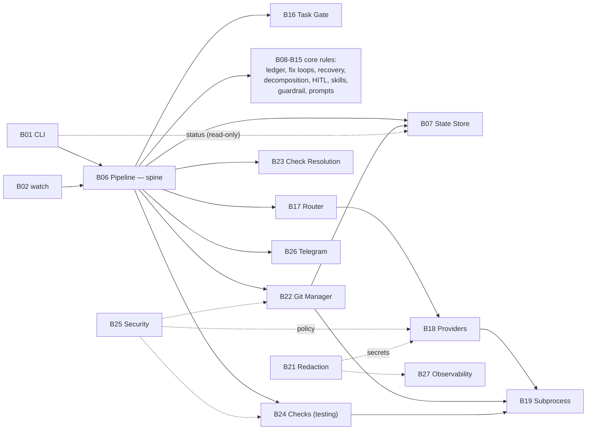

# Functional Map of the System

```yaml
LastDateSync: 2026-06-14
```

> This documentation was reconstructed from executable code and tests (`src/wastech_orchestrator/`, `tests/`). The code is the only source of truth; README files, specifications, comments, and docstrings were not used as sources. Every significant claim in the block documents is accompanied by a reference to the supporting code location (`file:line`).

## System Purpose (confirmed by code)

The system is an orchestrator that runs **one task at a time** through a deterministic pipeline, launching external CLI coding agents (`codex`, `claude`) as child processes and publishing the result to Git (branch → commit → push → Pull Request via `gh`).

Confirmed by:

- the CLI entry point and set of subcommands ([cli.py:114-376](../../src/wastech_orchestrator/cli.py#L114));
- the pipeline class [Orchestrator](../../src/wastech_orchestrator/core/orchestrator.py#L294) and its `run_task` method ([orchestrator.py:350](../../src/wastech_orchestrator/core/orchestrator.py#L350));
- the provider contract [AgentProvider](../../src/wastech_orchestrator/providers/base.py#L155) with two adapters `codex` and `claude`;
- the task state machine ([state_machine.py:18-107](../../src/wastech_orchestrator/core/state_machine.py#L18));
- all external commands being launched **as an argument list without shell interpolation** ([process.py](../../src/wastech_orchestrator/providers/process.py), [git_manager.py](../../src/wastech_orchestrator/git_manager.py)).

Key properties visible in the code:

- **Single processing slot.** Only one task can be active at a time; the slot is checked by a database query (`acquire_slot` / `find_active_tasks`, [orchestrator.py:383-385](../../src/wastech_orchestrator/core/orchestrator.py#L383)).
- **Resumability.** All state is persisted in SQLite (`state.db`) and in file artifacts, allowing an interrupted task to be continued (`resume`, [orchestrator.py:655](../../src/wastech_orchestrator/core/orchestrator.py#L655)).
- **Separation of concerns (invariant).** The core never builds a CLI command itself: it only calls the Router (agent stages), Check Runner (the `testing` stage), and Git Manager (everything git-related). Context is passed to agents **only as paths to artifact files** in `AgentRunRequest`.
- **Fallback only for infrastructure errors.** Quality failures (tests/review) go to the `fixing` stage, not to another provider (Router, [router.py](../../src/wastech_orchestrator/routing/router.py)).
- **Non-weakening security policy.** Forbidden flags, environment variable allowlist, isolation, and injection scanning ([security/](../../src/wastech_orchestrator/security/)).
- **Human in the loop (HITL).** Durable interactions via Telegram for approving plans, "dangerous" diffs, and changed check sets ([core/hitl.py](../../src/wastech_orchestrator/core/hitl.py), [notify/telegram.py](../../src/wastech_orchestrator/notify/telegram.py)).

## System Context

The orchestrator is a single process that handles one task at a time. Externally it communicates only with files, the local repository, and a few external programs; all of these are launched **as an argument list without shell interpolation**.



What confirms each external interaction: launching `codex`/`claude` as child processes — [B18](./blocks/B18-agent-providers.md); `git`/`gh` — [B22](./blocks/B22-git-manager.md); both process classes go through the single safe launcher [B19](./blocks/B19-subprocess-runner.md); Telegram — [B26](./blocks/B26-notifications-telegram.md); SQLite — [B07](./blocks/B07-state-machine-and-store.md); file artifacts — [B20](./blocks/B20-artifact-layout.md).

A navigable version of these relationships as **architecture-as-code** (C4 model: context → containers → components, with clickable links to block documents) is in [docs/likec4/](../likec4/README.md) (LikeC4). This functional map remains the source of detail and code bindings.

## Entry Points (confirmed)

- **Console scripts `wastech-orchestrator` and `worc`** ([pyproject.toml:29-32](../../pyproject.toml#L29) → `cli:main`) — argument parsing and subcommand dispatch.
- **`python -m wastech_orchestrator`** ([\_\_main\_\_.py](../../src/wastech_orchestrator/__main__.py) → `cli:main`) — same as the console scripts.
- **CLI subcommands** ([cli.py build_parser](../../src/wastech_orchestrator/cli.py#L86), dispatcher [main](../../src/wastech_orchestrator/cli.py#L1248)) — `install`, `run`, `watch`, `stop`, `restart`, `preflight`, `telegram-test`, `status`, `upgrade-config`, `upgrade-docs`, `rerun`, `finalize`.

Internal triggers (not user commands), confirmed by code:

- **`watch` loop** periodically scans the `tasks/pending` folder and submits tasks to the orchestrator one at a time ([cli.py watch_loop/watch_once](../../src/wastech_orchestrator/cli.py#L778)).
- **`SIGTERM` handler** of the `watch` daemon (graceful stop between ticks) — [process_control.py](../../src/wastech_orchestrator/process_control.py).
- **Telegram polling** while waiting for a human response (`wait_for_answer`) — [notify/telegram.py](../../src/wastech_orchestrator/notify/telegram.py).
- **Heartbeat threads** during long-running operations (provider/checks/git) — [observability/progress.py](../../src/wastech_orchestrator/observability/progress.py).

## Main Cross-Cutting Flows (overview)

Detailed step-by-step scenarios are in [system-flows.md](./system-flows.md); a frame-by-frame breakdown of pipeline stages (one document per stage, S01–S08) is in [flows/coding/index.md](./flows/coding/index.md). In brief:

1. **Single task processing (`run` / `watch`).** Read and validate task → acquire slot → prepare branch → (opt.) refinement → planning (+ opt. decomposition) → for each work unit the loop `implementation → testing → review → fixing` → publish (commit/push/PR, opt. auto-merge) → terminal cleanup → write to ledger. The summary is no longer a pipeline node: a constant supervisor layer above the flow (flow-engine P2.1) observes each completed step read-only and writes the summary at whole-task close (before publish).
2. **`watch` daemon.** Between ticks: fetch/pull base branch, resume interrupted task, pick next pending task (one at a time; back-to-back only with `auto_mode`).
3. **Resume (`resume`).** On startup, compare persistent state and continue the single unfinished task or complete interrupted cleanup.
4. **`rerun` / `rerun --continue`.** Retry a terminal task — "from scratch from base" or "continue from the flow checkpoint node where it stopped".
5. **`finalize`.** The operator records the outcome of a task completed manually (without the pipeline and without commit/push/PR).
6. **`install` / `preflight`.** Set up the orchestrator in a repository under `<repo>/.worc/`, generate and validate configuration, diagnose provider and isolation readiness, and fatally validate every flow file (packaged + operator flows in `.worc/flows/`) before any task runs.

## Pipeline as a State Machine

Each task moves through a small, generic set of statuses with allowed transitions; progress _within_ `running` (which flow node is executing) is the `current_node` in `node_runs`, not a status. Transitions are defined by an explicit `ALLOWED_TRANSITIONS` table ([core/state_machine.py:48-76](../../src/wastech_orchestrator/core/state_machine.py#L48)); the core validates each transition (`assert_transition`) and atomically persists the new status.



Terminal statuses (no outgoing transitions) — `done`, `failed`, `manual_action_required`. The `pending` status (§8.2) is waiting in the queue: the task has been accepted but does not yet own the single processing slot; the table has `pending → validated` and `pending → preparing` (dequeue or resume), while the normal pipeline entry status is `new`. Progress within `running` is the flow `current_node` (in `node_runs`), not a status. The decomposition loop does not introduce new statuses either: each subtask re-runs the flow's `sub_flow` region (the `implementation → testing → review → fixing` nodes), and its number (`k` of `n`) is stored in the State Store ([state_machine.py:26-76](../../src/wastech_orchestrator/core/state_machine.py#L26)).

## Functional Block Map

The full list with entry points, dependencies, and status is in [block-registry.md](./block-registry.md). Blocks are grouped by role:

### Interface and Launch Control

- [B01 — CLI and Operator Commands](./blocks/B01-cli-and-operator-commands.md)
- [B02 — Watch Daemon and Task Scheduling](./blocks/B02-watch-daemon-and-scheduling.md)
- [B03 — Installer and Project Scaffolding](./blocks/B03-installer-and-scaffolding.md)
- [B04 — Config Discovery](./blocks/B04-install-registry-and-config-discovery.md)
- [B05 — Configuration: Schema, Loading, Validation, Upgrade](./blocks/B05-configuration.md)

### Orchestration Core

- [B06 — Orchestrator Pipeline](./blocks/B06-orchestrator-pipeline.md) — central block
- [B07 — State Machine and State Store](./blocks/B07-state-machine-and-store.md)
- [B08 — Ledger and Failure Reports](./blocks/B08-ledger-and-failure-reports.md)
- [B09 — Fix Loop Control](./blocks/B09-fix-loop-control.md)
- [B10 — Recovery and Resume](./blocks/B10-recovery-and-resume.md)
- [B11 — Task Decomposition](./blocks/B11-task-decomposition.md)
- [B12 — HITL and Typed Stage Output](./blocks/B12-hitl-and-typed-output.md)
- [B13 — Skill Inventory and Selection](./blocks/B13-skill-selection.md)
- [B14 — Dangerous Diff Classification](./blocks/B14-dangerous-diff-guardrail.md)
- [B15 — Prompt Templates and Rendering](./blocks/B15-prompt-templates.md)

### Task Ingestion

- [B16 — Task Model, Parsing, and Validation Gate](./blocks/B16-task-parsing-and-validation-gate.md)

### Execution and Providers

- [B17 — Agent Router and Fallback Policy](./blocks/B17-agent-router-and-fallback.md)
- [B18 — Provider Adapters and Contract (Codex/Claude)](./blocks/B18-agent-providers.md)
- [B19 — Safe Subprocess Launcher](./blocks/B19-subprocess-runner.md)
- [B20 — Run Artifact File Layout](./blocks/B20-artifact-layout.md)
- [B21 — Secret Redaction](./blocks/B21-secret-redaction.md)

### Git

- [B22 — Git and GitHub Operations (Git Manager)](./blocks/B22-git-manager.md)

### Checks (quality gate)

- [B23 — Check Discovery and Resolution](./blocks/B23-check-discovery.md)
- [B24 — Check Execution (testing stage)](./blocks/B24-check-execution.md)

### Security

- [B25 — Security Policy Enforcement](./blocks/B25-security-policy.md)

### Integrations and Cross-Cutting Services

- [B26 — Notifications and HITL Transport (Telegram)](./blocks/B26-notifications-telegram.md)
- [B27 — Observability: Logging and Heartbeat](./blocks/B27-observability.md)

### Block Dependency Map

A simplified map of the main relationships (full list below and in [block-registry.md](./block-registry.md)). B06 is the spine: it coordinates the core and tooling but never builds a CLI command itself.



Key: [B17 Router](./blocks/B17-agent-router-and-fallback.md) is the sole caller of [B18 Providers](./blocks/B18-agent-providers.md); all external processes go through [B19](./blocks/B19-subprocess-runner.md); [B21](./blocks/B21-secret-redaction.md) (redaction) and [B25](./blocks/B25-security-policy.md) (security) are cross-cutting and are also used by B06, B26, B27, and others.

### Top-Level Relationships (confirmed by code)

- [B06 Pipeline](./blocks/B06-orchestrator-pipeline.md) — spine: calls B07, B08, B09, B10, B11, B12, B13, B14, B15, B16, B17, B22, B24, B26 and reads B23 (check profile). Dependency assembly — `build_orchestrator` ([orchestrator.py:2594](../../src/wastech_orchestrator/core/orchestrator.py#L2594)).
- [B17 Router](./blocks/B17-agent-router-and-fallback.md) — sole caller of [B18 Providers](./blocks/B18-agent-providers.md); the core does not call providers directly.
- [B18](./blocks/B18-agent-providers.md), [B22](./blocks/B22-git-manager.md), [B24](./blocks/B24-check-execution.md), [B03/B04](./blocks/B03-installer-and-scaffolding.md) — all launch external processes through [B19](./blocks/B19-subprocess-runner.md).
- [B21 Redaction](./blocks/B21-secret-redaction.md) and [B25 Security](./blocks/B25-security-policy.md) — cross-cutting: used by B18, B22, B24, B27, B06, B26.
- [B07 State Store](./blocks/B07-state-machine-and-store.md) — read/written by B06 and B22 (publish idempotency); read by B01 (`status`) in read-only mode.

## Data Sources and State (confirmed)

The `<artifacts_root>` is the gitignored `<repo>/.worc/` home (`worc_home_for(config)`); the task lifecycle dirs are the exception — they sit at the repo root and carry the committed audit trail.

- **`state.db`** — `<artifacts_root>/state.db`; SQLite (tasks, node_runs, provider_attempts, check_runs, artifacts, publish_operations, subtasks, evaluations, editing_lineage); owner [B07](./blocks/B07-state-machine-and-store.md).
- **`completed.jsonl`** — `<artifacts_root>/logs/completed.jsonl`; JSONL (append-only); owner [B08](./blocks/B08-ledger-and-failure-reports.md).
- **`resolved-profile.json`** — `<artifacts_root>/checks/`; JSON (check profile cache); owner [B23](./blocks/B23-check-discovery.md).
- **Run artifacts** — `<artifacts_root>/logs/<task-id>/...`; directories with request/result/stdout/stderr/events; owner [B20](./blocks/B20-artifact-layout.md).
- **HITL interactions** — `<artifacts_root>/logs/<task-id>/...`; JSON; owner [B12](./blocks/B12-hitl-and-typed-output.md).
- **`config.yaml`** — `<artifacts_root>/config.yaml`; discovered by walking up to the Git root; owner [B04](./blocks/B04-install-registry-and-config-discovery.md)/[B05](./blocks/B05-configuration.md).
- **Task lifecycle folders** — `tasks/{pending,processing,done,failed}` at the repo root (git-tracked; the task file + `<id>.summary.md` are audit-committed) and `tasks/rejected` under `.worc/` (quarantine); `.md`/`.json` files; owners [B06](./blocks/B06-orchestrator-pipeline.md), [B16](./blocks/B16-task-parsing-and-validation-gate.md).

## External Integrations (confirmed)

- **Git CLI (`git`)** and **GitHub CLI (`gh`)** — subprocesses from [B22](./blocks/B22-git-manager.md).
- **CLI coding agents `codex` / `claude`** — subprocesses from [B18](./blocks/B18-agent-providers.md).
- **Telegram Bot API** via `python-telegram-bot` — [B26](./blocks/B26-notifications-telegram.md).
- **SQLite** (stdlib `sqlite3`) — [B07](./blocks/B07-state-machine-and-store.md).
- **File system** — the `<repo>/.worc/` home (artifacts, check profile cache, config) and the repo-root `tasks/` lifecycle folders.

## Documentation Status

All 27 blocks (B01–B27) have been investigated from source code and tests and have status `documented` (see [block-registry.md](./block-registry.md)). Cross-cutting scenarios are in [system-flows.md](./system-flows.md). Each module under `src/wastech_orchestrator/*` is assigned to one block; auxiliary modules that are not standalone blocks are listed in the registry under the `excluded` section.

Rules for maintaining and keeping this documentation up to date, as well as the language rule (Russian — only for `docs/functional/`) are in [CONVENTIONS.md](./CONVENTIONS.md).

## Uncertainties

System behavior was reconstructed from code; below are remaining caveats about the evidence base (behavior confirmed by reading the code, but with a nuance in test coverage):

- **The "dangerous" diff classifier** ([core/dangerous_diff.py](../../src/wastech_orchestrator/core/dangerous_diff.py), B14) has no dedicated unit test; its behavior is confirmed by reading the pure function and indirectly through pipeline guardrail scenarios ([tests/core/test_orchestrator.py](../../tests/core/test_orchestrator.py), [tests/core/test_hitl.py](../../tests/core/test_hitl.py)).
- **The real Telegram network path** (`_HttpTelegramClient` in [notify/telegram.py](../../src/wastech_orchestrator/notify/telegram.py), B26) is replaced by a fake client in tests; it is not run against the live Telegram API (by design). The contract and error handling are confirmed by reading the code and by tests against the fake.
