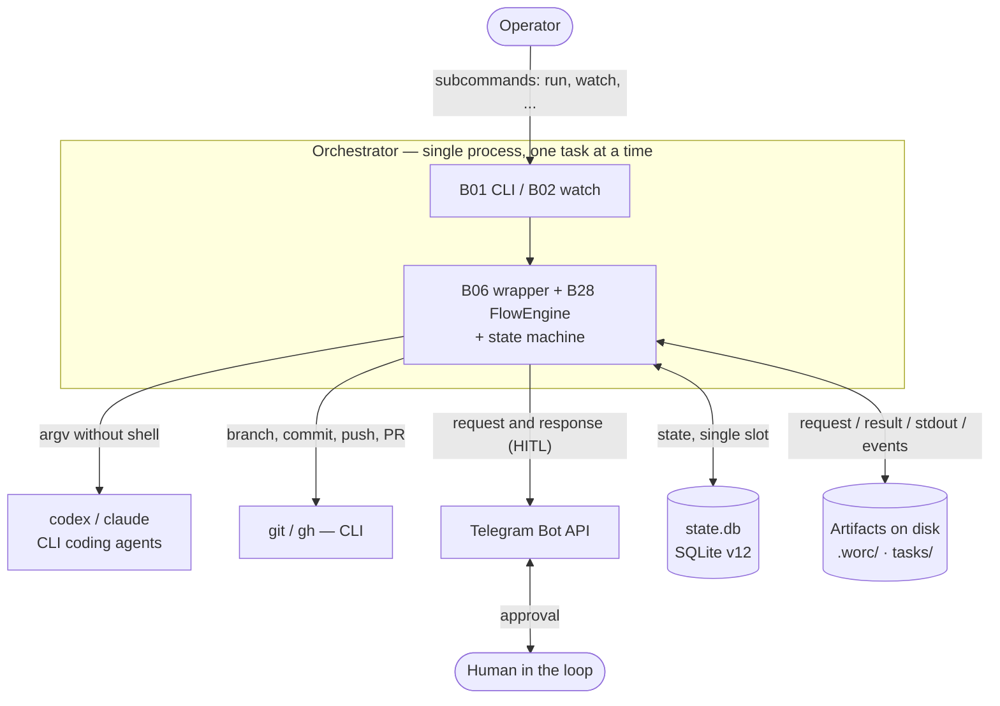
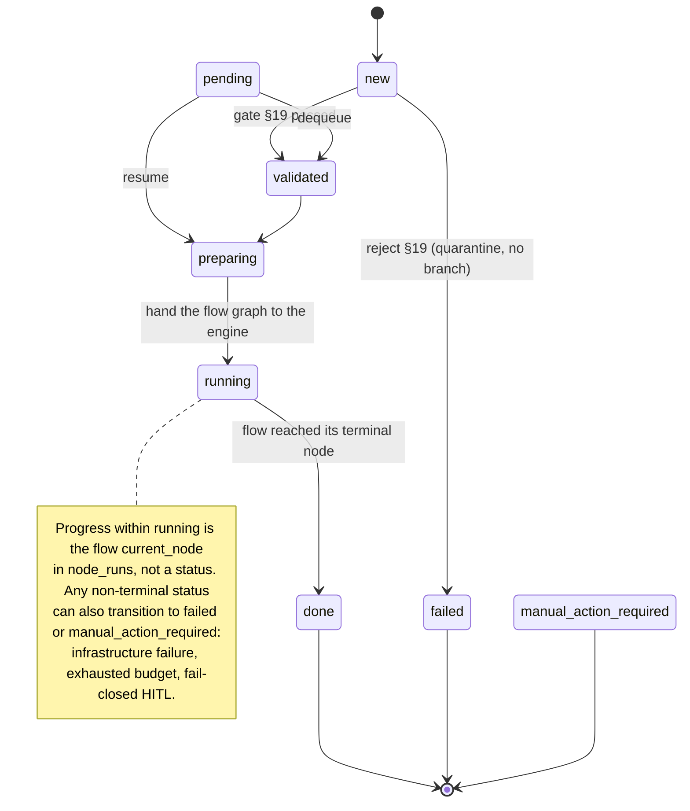
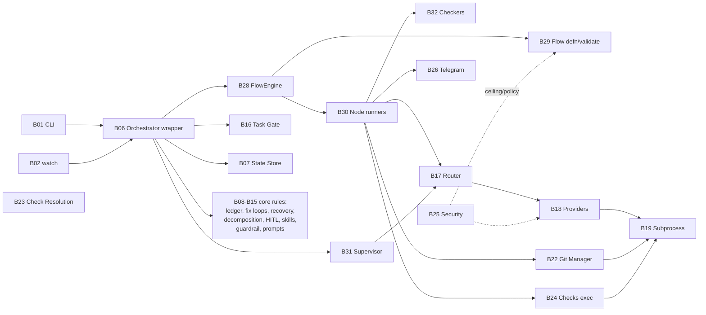

# Functional Map of the System

```yaml
LastDateSync: 2026-06-21
```

> This documentation was reconstructed from executable code and tests (`src/wastech_orchestrator/`, `tests/`). The code is the only source of truth; README files, specifications, comments, and docstrings were not used as sources. Every significant claim in the block documents is accompanied by a reference to the supporting code location (`file:line`). Code problems found during the reconstruction are recorded in [docs/backlog/2026-06-21-audit.md](../backlog/2026-06-21-audit.md).

## System Purpose (confirmed by code)

The system is an orchestrator that runs **one task at a time** through a deterministic flow graph, launching external CLI coding agents (`codex`, `claude`) as child processes and publishing the result to Git (branch → commit → push → Pull Request via `gh`).

Confirmed by:

- the CLI entry point and set of subcommands ([cli.py build_parser](../../src/wastech_orchestrator/cli.py#L87));
- the pipeline class [Orchestrator](../../src/wastech_orchestrator/core/orchestrator.py#L281) and its `run_task` method ([orchestrator.py:342](../../src/wastech_orchestrator/core/orchestrator.py#L342)), which delegates the pipeline body to the [FlowEngine](../../src/wastech_orchestrator/core/flow/engine.py#L195);
- the provider contract [AgentProvider](../../src/wastech_orchestrator/providers/base.py) with two adapters `codex` and `claude`;
- the task state machine ([state_machine.py:18](../../src/wastech_orchestrator/core/state_machine.py#L18));
- all external commands being launched **as an argument list without shell interpolation** ([process.py](../../src/wastech_orchestrator/providers/process.py), [git_manager.py](../../src/wastech_orchestrator/git_manager.py)).

Key properties visible in the code:

- **The pipeline is data, not a fixed stage loop.** Each `task_type` resolves to a flow — a validated YAML graph of typed nodes — driven by the FlowEngine ([B28](./blocks/B28-flow-engine.md)); the orchestrator ([B06](./blocks/B06-orchestrator-pipeline.md)) is a thin wrapper that owns the gate, slot, preamble, wiring, and terminal handling.
- **Single processing slot.** Only one task can be active at a time; the slot is checked by a database query (`acquire_slot` / `find_active_tasks`, [orchestrator.py:377](../../src/wastech_orchestrator/core/orchestrator.py#L377)).
- **Resumability.** All state is persisted in SQLite (`state.db`, schema v12) and in file artifacts, with a per-task flow checkpoint, so an interrupted task can be continued (`resume`, [orchestrator.py:643](../../src/wastech_orchestrator/core/orchestrator.py#L643)).
- **Separation of concerns (invariant).** The core never builds a CLI command itself: it only calls the Router (agent nodes), the Check Runner (checks nodes), and the Git Manager (publish). Context is passed to agents **only as paths to artifact files** in `AgentRunRequest`.
- **Fallback only for infrastructure errors.** Quality failures (checks/review) loop back to a fixing node, not to another provider (Router, [router.py](../../src/wastech_orchestrator/routing/router.py)).
- **Non-weakening security policy.** Forbidden flags, environment-variable allowlist, isolation, injection scanning, and the flow ceilings (`permission_ceiling` / `output_policy` / `network_policy`) ([security/](../../src/wastech_orchestrator/security/), [core/flow/validator.py](../../src/wastech_orchestrator/core/flow/validator.py)).
- **Constant supervisor layer.** A per-task oversight layer above any flow observes each completed step read-only and writes the whole-task summary at close ([core/supervisor.py](../../src/wastech_orchestrator/core/supervisor.py)) — the summary is not a node or a stage.
- **Human in the loop (HITL).** Durable interactions via Telegram for approving plans and "dangerous" diffs ([core/hitl.py](../../src/wastech_orchestrator/core/hitl.py), [notify/telegram.py](../../src/wastech_orchestrator/notify/telegram.py)).

## System Context

The orchestrator is a single process that handles one task at a time. Externally it communicates only with files, the local repository, and a few external programs; all of these are launched **as an argument list without shell interpolation**.



What confirms each external interaction: launching `codex`/`claude` as child processes — [B18](./blocks/B18-agent-providers.md); `git`/`gh` — [B22](./blocks/B22-git-manager.md); both process classes go through the single safe launcher [B19](./blocks/B19-subprocess-runner.md); Telegram — [B26](./blocks/B26-notifications-telegram.md); SQLite — [B07](./blocks/B07-state-machine-and-store.md); file artifacts — [B20](./blocks/B20-artifact-layout.md).

A navigable version of these relationships as **architecture-as-code** (C4 model) is in [docs/likec4/](../likec4/README.md) (LikeC4; maintained separately and may lag the flow-engine reconstruction). This functional map remains the source of detail and code bindings.

## Entry Points (confirmed)

- **Console scripts `wastech-orchestrator` and `worc`** ([pyproject.toml](../../pyproject.toml) → `cli:main`) — argument parsing and subcommand dispatch.
- **`python -m wastech_orchestrator`** ([\_\_main\_\_.py](../../src/wastech_orchestrator/__main__.py) → `cli:main`) — same as the console scripts.
- **CLI subcommands** ([cli.py build_parser](../../src/wastech_orchestrator/cli.py#L87), dispatcher [main](../../src/wastech_orchestrator/cli.py)) — `install`, `run`, `watch`, `stop`, `restart`, `preflight`, `telegram-test`, `status`, `upgrade-config`, `upgrade-docs`, `rerun`, `finalize` (plus `--version`).

Internal triggers (not user commands), confirmed by code:

- **`watch` loop** periodically scans the `tasks/pending` folder and submits tasks to the orchestrator one at a time ([cli.py watch_loop/watch_once](../../src/wastech_orchestrator/cli.py)).
- **`SIGTERM` handler** of the `watch` daemon (graceful stop between ticks) — [process_control.py](../../src/wastech_orchestrator/process_control.py).
- **Telegram polling** while waiting for a human response (`wait_for_answer`) — [notify/telegram.py](../../src/wastech_orchestrator/notify/telegram.py).
- **Heartbeat threads** during long-running operations (provider/checks/git) — [observability/progress.py](../../src/wastech_orchestrator/observability/progress.py).
- **Supervisor observations** — the post-node hook calls the supervisor after each completed step ([orchestrator.py:1120](../../src/wastech_orchestrator/core/orchestrator.py#L1120)).

## Main Cross-Cutting Flows (overview)

Detailed step-by-step scenarios are in [system-flows.md](./system-flows.md); the flow-graph model and the per-flow node graphs are in [flows/index.md](./flows/index.md). In brief:

1. **Single task processing (`run` / `watch`).** Read and validate task → acquire slot → resolve the flow for the `task_type` → isolation + check preflight → prepare branch → hand the validated graph to the FlowEngine, which traverses the nodes (refinement → planning → implementation → testing → review → fixing → publish for the default flow, with fix loops and optional decomposition) → terminal cleanup → ledger. A constant supervisor layer above the flow observes each completed step and writes the summary at whole-task close (before publish).
2. **`watch` daemon.** Between ticks: fetch/pull base branch, resume interrupted task, pick next pending task (one at a time; back-to-back only with `auto_mode`).
3. **Resume (`resume`).** On startup, reconcile persisted state and continue the single unfinished task from its flow checkpoint, or complete interrupted cleanup.
4. **`rerun` / `rerun --continue`.** Retry a terminal task — "from scratch from base" or "continue from the flow checkpoint node where it stopped".
5. **`finalize`.** The operator records the outcome of a task completed manually (without the pipeline and without commit/push/PR).
6. **`install` / `preflight`.** Set up the orchestrator in a repository under `<repo>/.worc/`, generate and validate configuration, seed editable copies of the built-in flows + their per-node prompts into `.worc/flows/`, diagnose provider and isolation readiness, and fatally validate every flow file (packaged + operator flows in `.worc/flows/`) before any task runs.

## Pipeline as a State Machine

Each task moves through a small, generic set of statuses with allowed transitions; progress _within_ `running` (which flow node is executing) is the `current_node` in `node_runs`, not a status. Transitions are defined by an explicit `ALLOWED_TRANSITIONS` table ([core/state_machine.py:48-76](../../src/wastech_orchestrator/core/state_machine.py#L48)); the core validates each transition (`assert_transition`) and atomically persists the new status.



Terminal statuses (no outgoing transitions) — `done`, `failed`, `manual_action_required`. The `pending` status (§8.2) is waiting in the queue: the task has been accepted but does not yet own the single processing slot. Progress within `running` is the flow `current_node` (in `node_runs`), not a status. The decomposition loop does not introduce new statuses either: each subtask re-runs the flow's `sub_flow` region (the `implementation → testing → review → fixing` nodes), and its number (`k` of `n`) is the `active_subtask` counter in the State Store ([state_machine.py:18-44](../../src/wastech_orchestrator/core/state_machine.py#L18)).

## Functional Block Map

The full list with entry points, dependencies, and status is in [block-registry.md](./block-registry.md). Blocks are grouped by role:

### Interface and Launch Control

- [B01 — CLI and Operator Commands](./blocks/B01-cli-and-operator-commands.md)
- [B02 — Watch Daemon and Task Scheduling](./blocks/B02-watch-daemon-and-scheduling.md)
- [B03 — Installer and Project Scaffolding](./blocks/B03-installer-and-scaffolding.md)
- [B04 — Config Discovery](./blocks/B04-install-registry-and-config-discovery.md)
- [B05 — Configuration: Schema, Loading, Validation, Upgrade](./blocks/B05-configuration.md)

### Orchestration Core

- [B06 — Orchestrator Pipeline](./blocks/B06-orchestrator-pipeline.md) — the wrapper/spine
- [B07 — State Machine and State Store](./blocks/B07-state-machine-and-store.md)
- [B08 — Ledger and Failure Reports](./blocks/B08-ledger-and-failure-reports.md)
- [B09 — Fix Loop Control](./blocks/B09-fix-loop-control.md)
- [B10 — Recovery and Resume](./blocks/B10-recovery-and-resume.md)
- [B11 — Task Decomposition](./blocks/B11-task-decomposition.md)
- [B12 — HITL and Typed Node Output](./blocks/B12-hitl-and-typed-output.md)
- [B13 — Skill Inventory and Selection](./blocks/B13-skill-selection.md)
- [B14 — Dangerous Diff Classification](./blocks/B14-dangerous-diff-guardrail.md)
- [B15 — Prompt Templates and Rendering](./blocks/B15-prompt-templates.md)

### The Flow Engine (execution spine)

- [B28 — Flow Engine and Graph Traversal](./blocks/B28-flow-engine.md)
- [B29 — Flow Definition, Registry and Validation](./blocks/B29-flow-definition-and-validation.md)
- [B30 — Flow Node Runners](./blocks/B30-flow-node-runners.md)
- [B31 — Supervisor Oversight Layer](./blocks/B31-supervisor.md)
- [B32 — Flow Checkers (citation, dependency_scan)](./blocks/B32-flow-checkers.md)

### Task Ingestion

- [B16 — Task Model, Parsing, and Validation Gate](./blocks/B16-task-parsing-and-validation-gate.md)

### Execution and Providers

- [B17 — Agent Router and Fallback Policy](./blocks/B17-agent-router-and-fallback.md)
- [B18 — Provider Adapters and Contract (Codex/Claude)](./blocks/B18-agent-providers.md)
- [B19 — Safe Subprocess Launcher](./blocks/B19-subprocess-runner.md)
- [B20 — Run Artifact File Layout](./blocks/B20-artifact-layout.md)
- [B21 — Secret Redaction](./blocks/B21-secret-redaction.md)

### Git

- [B22 — Git and GitHub Operations (Git Manager)](./blocks/B22-git-manager.md)

### Checks (quality gate)

- [B23 — Check Resolution and Selection](./blocks/B23-check-discovery.md)
- [B24 — Check Execution (command-set)](./blocks/B24-check-execution.md)

### Security

- [B25 — Security Policy Enforcement](./blocks/B25-security-policy.md)

### Integrations and Cross-Cutting Services

- [B26 — Notifications and HITL Transport (Telegram)](./blocks/B26-notifications-telegram.md)
- [B27 — Observability: Logging and Heartbeat](./blocks/B27-observability.md)

### Block Dependency Map

A simplified map of the main relationships (full list in [block-registry.md](./block-registry.md)). B06 wraps B28 (the engine), which drives the node runners B30; the supervisor B31 is a layer above any flow.



Key: [B28 FlowEngine](./blocks/B28-flow-engine.md) is the execution spine driven by [B06](./blocks/B06-orchestrator-pipeline.md); [B17 Router](./blocks/B17-agent-router-and-fallback.md) is the sole caller of [B18 Providers](./blocks/B18-agent-providers.md); all external processes go through [B19](./blocks/B19-subprocess-runner.md); [B21](./blocks/B21-secret-redaction.md) (redaction) and [B25](./blocks/B25-security-policy.md) (security) are cross-cutting.

### Top-Level Relationships (confirmed by code)

- [B06 Orchestrator](./blocks/B06-orchestrator-pipeline.md) — wraps the engine: resolves the flow ([B29](./blocks/B29-flow-definition-and-validation.md)), builds the node services/inputs + supervisor, and calls `drive_flow`. Dependency assembly — `build_orchestrator` ([orchestrator.py:1974](../../src/wastech_orchestrator/core/orchestrator.py#L1974)).
- [B28 FlowEngine](./blocks/B28-flow-engine.md) — drives the node graph; [B30](./blocks/B30-flow-node-runners.md) runners are its only executors; transitions are engine-owned.
- [B17 Router](./blocks/B17-agent-router-and-fallback.md) — sole caller of [B18 Providers](./blocks/B18-agent-providers.md).
- [B18](./blocks/B18-agent-providers.md), [B22](./blocks/B22-git-manager.md), [B24](./blocks/B24-check-execution.md), [B32](./blocks/B32-flow-checkers.md) — all launch external processes through [B19](./blocks/B19-subprocess-runner.md).
- [B07 State Store](./blocks/B07-state-machine-and-store.md) — read/written by B06, B28 (checkpoint), B30 (node_runs/evaluations/lineage), B22 (publish idempotency); read by B01 (`status`) read-only.

## Data Sources and State (confirmed)

The `<artifacts_root>` is the gitignored `<repo>/.worc/` home (`worc_home_for(config)`); the task lifecycle dirs are the exception — they sit at the repo root and carry the committed audit trail.

- **`state.db`** — `<artifacts_root>/state.db`; SQLite **schema v12** (tasks, node_runs, provider_attempts, check_runs, artifacts, publish_operations, subtasks, evaluations, editing_lineage, node_lineage); owner [B07](./blocks/B07-state-machine-and-store.md).
- **`completed.jsonl`** — `<artifacts_root>/logs/completed.jsonl`; JSONL (append-only); owner [B08](./blocks/B08-ledger-and-failure-reports.md).
- **Run artifacts** — `<artifacts_root>/logs/<task-id>/...`; per-node attempt dirs (request/result/stdout/stderr/events) + checks logs; owner [B20](./blocks/B20-artifact-layout.md).
- **HITL interactions** — `<artifacts_root>/logs/<task-id>/...`; JSON; owner [B12](./blocks/B12-hitl-and-typed-output.md).
- **`config.yaml`** — `<artifacts_root>/config.yaml`; **schema v15**; discovered by walking up to the Git root; owner [B04](./blocks/B04-install-registry-and-config-discovery.md)/[B05](./blocks/B05-configuration.md).
- **Operator flows** — `<artifacts_root>/flows/<task_type>.yaml`; override packaged built-ins; owner [B29](./blocks/B29-flow-definition-and-validation.md).
- **Task lifecycle folders** — `tasks/{pending,processing,done,failed}` at the repo root (git-tracked; the task file + `<id>.summary.md` are audit-committed) and `tasks/rejected` under `.worc/` (quarantine); owners [B06](./blocks/B06-orchestrator-pipeline.md), [B16](./blocks/B16-task-parsing-and-validation-gate.md).

## External Integrations (confirmed)

- **Git CLI (`git`)** and **GitHub CLI (`gh`)** — subprocesses from [B22](./blocks/B22-git-manager.md).
- **CLI coding agents `codex` / `claude`** — subprocesses from [B18](./blocks/B18-agent-providers.md).
- **Telegram Bot API** — [B26](./blocks/B26-notifications-telegram.md).
- **SQLite** (stdlib `sqlite3`) — [B07](./blocks/B07-state-machine-and-store.md).
- **File system** — the `<repo>/.worc/` home (artifacts, check logs, config, operator flows) and the repo-root `tasks/` lifecycle folders.

## Documentation Status

All 32 blocks (B01–B32) have been (re)investigated from source code and tests for the 2026-06-21 reconstruction and carry status `documented` (see [block-registry.md](./block-registry.md)). B28–B32 are new (the flow engine, definition/validation, node runners, supervisor, and checkers — the subsystem the prior B01–B27 structure had no place for). Cross-cutting scenarios are in [system-flows.md](./system-flows.md); the flow-graph model is in [flows/index.md](./flows/index.md). Each module under `src/wastech_orchestrator/*` is assigned to one block; auxiliary modules are listed in the registry under `excluded`. Rules for maintaining this documentation are in [CONVENTIONS.md](./CONVENTIONS.md).

## Uncertainties

System behavior was reconstructed from code; below are remaining caveats about the evidence base:

- **The "dangerous" diff classifier** ([core/dangerous_diff.py](../../src/wastech_orchestrator/core/dangerous_diff.py), B14) has no dedicated unit test (`tests/core/test_dangerous_diff.py` does not exist); its behavior is confirmed by reading the pure function and indirectly through the HITL/guardrail scenarios ([tests/core/test_hitl.py](../../tests/core/test_hitl.py), and the flow node-runner tests).
- **The real Telegram network path** ([notify/telegram.py](../../src/wastech_orchestrator/notify/telegram.py), B26) is replaced by a fake client in tests; it is not run against the live Telegram API (by design). The contract and error handling are confirmed by reading the code and by tests against the fake.
- **Decorative configuration / flow fields (resolved).** The previously-decorative parsed fields — the flow `decomposition.gate` + `commit_each_subtask`, the config `min_size_signal`/`commit_per_subtask`, and the research/audit `global_revision_iterations` budget — have all been removed or repaired (audit #4/#5/#6); the research/audit global budget now uses the enforced `global_fix_iterations` key. See [the audit](../backlog/2026-06-21-audit.md).
