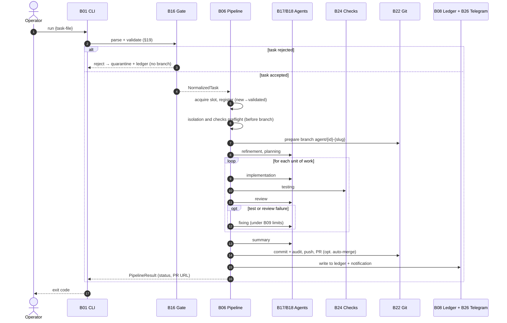
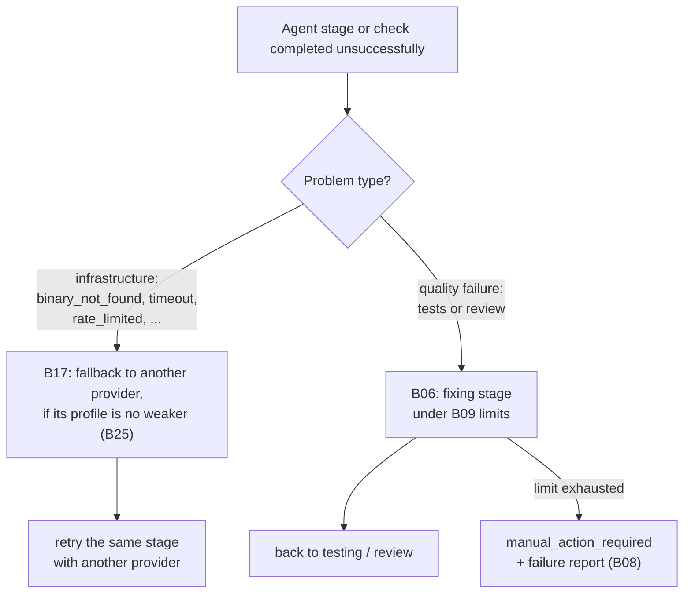

# End-to-End Scenarios

Brief end-to-end flows that span multiple blocks. Details for each block are in its own document (see [block-registry.md](./block-registry.md)); this document covers only the order and connections.

## Single-task processing (`run`, happy path)

1. [B01 CLI](./blocks/B01-cli-and-operator-commands.md) parses `run`, resolves and loads configuration ([B04](./blocks/B04-install-registry-and-config-discovery.md)/[B05](./blocks/B05-configuration.md)), builds the orchestrator, and calls `run_task`.
2. [B16 Gate](./blocks/B16-task-parsing-and-validation-gate.md) parses and validates the task file (§19); on failure — quarantine + write to [B08 Ledger](./blocks/B08-ledger-and-failure-reports.md), no branch created.
3. [B06 Pipeline](./blocks/B06-orchestrator-pipeline.md) acquires the single slot, registers the task in [B07 State Store](./blocks/B07-state-machine-and-store.md), performs the isolation preflight ([B25](./blocks/B25-security-policy.md)) and checks preflight ([B23](./blocks/B23-check-discovery.md)) — both **before** the branch.
4. [B22 Git Manager](./blocks/B22-git-manager.md) prepares the branch `agent/<id>-<slug>`.
5. The refinement → planning stages are executed via [B17 Router](./blocks/B17-agent-router-and-fallback.md) → [B18 Providers](./blocks/B18-agent-providers.md); the prompt is assembled by [B15](./blocks/B15-prompt-templates.md), skills by [B13](./blocks/B13-skill-selection.md), output is validated by [B12](./blocks/B12-hitl-and-typed-output.md), and the decomposition decision is made by [B11](./blocks/B11-task-decomposition.md).
6. For each unit of work: implementation (with guardrail [B14](./blocks/B14-dangerous-diff-guardrail.md)) → testing ([B24](./blocks/B24-check-execution.md)) → review → (opt.) fixing under limits [B09](./blocks/B09-fix-loop-control.md).
7. summary → publishing: [B22](./blocks/B22-git-manager.md) commits (+audit), pushes, creates PR.
8. [B06](./blocks/B06-orchestrator-pipeline.md) performs terminal cleanup, writes an entry to [B08 Ledger](./blocks/B08-ledger-and-failure-reports.md), and sends a notification ([B26](./blocks/B26-notifications-telegram.md)). [B01](./blocks/B01-cli-and-operator-commands.md) maps the status to an exit code.

The same sequence shown as a timeline (happy path):

## Fix loop (testing/review → fixing)

1. [B24](./blocks/B24-check-execution.md) reports a quality failure; [B06](./blocks/B06-orchestrator-pipeline.md) via [B09](./blocks/B09-fix-loop-control.md) decides to enter `fixing` or, when the limit is exhausted, transitions to `manual_action_required` with a failure report ([B08](./blocks/B08-ledger-and-failure-reports.md)).
2. The fixing stage repairs the code ([B17](./blocks/B17-agent-router-and-fallback.md)/[B18](./blocks/B18-agent-providers.md)) and returns to testing (or review if testing was skipped).
3. Passing checks/review resets the respective counters ([B09](./blocks/B09-fix-loop-control.md)).

## Infrastructure provider fallback

1. [B17 Router](./blocks/B17-agent-router-and-fallback.md) launches the primary via [B18](./blocks/B18-agent-providers.md).
2. On a `ProviderError` of infrastructure class (and if the profile policy [B25](./blocks/B25-security-policy.md) permits it), the Router takes a partial diff snapshot ([B22](./blocks/B22-git-manager.md) as `SnapshotHook`) and switches to the fallback, passing the diff.
3. A quality `failed` does **not** trigger the fallback — it goes to `fixing` ([B06](./blocks/B06-orchestrator-pipeline.md)).

Quality vs. infrastructure decision — where a failing stage is routed:

## Human-in-the-loop (refinement/planning) and dangerous-diff guardrail

1. The agent returns a `human_input` signal in the typed output ([B12](./blocks/B12-hitl-and-typed-output.md)).
2. [B06](./blocks/B06-orchestrator-pipeline.md) writes a durable HITL artifact ([B12](./blocks/B12-hitl-and-typed-output.md)) and via [B26 Telegram](./blocks/B26-notifications-telegram.md) sends the request and waits for a response.
3. For editing stages, [B14](./blocks/B14-dangerous-diff-guardrail.md) classifies the diff; a dangerous diff (deletions/dependencies) not covered by a planning approval requires confirmation; rejection allows one "safe" rework.
4. A response failure (timeout/transport/invalid) → `manual_action_required` (fail-closed).

## Task decomposition

1. planning returns a recommendation to split; [B11](./blocks/B11-task-decomposition.md) applies the deterministic acceptance rule (§5.1).
2. On acceptance, subtask artifacts ([B11](./blocks/B11-task-decomposition.md)) and rows in [B07](./blocks/B07-state-machine-and-store.md) are written; each unit goes through implement→test→review→fix with a local commit ([B22](./blocks/B22-git-manager.md)); the global `fix_iterations` counter ([B09](./blocks/B09-fix-loop-control.md)) accumulates across all subtasks.

## Check discovery and execution

1. During preflight, [B06](./blocks/B06-orchestrator-pipeline.md) calls [B23](./blocks/B23-check-discovery.md): resolves the runnable profile (configured / deterministic / opt. agent fallback), caches by fingerprint.
2. A changed set of commands goes through the approval gate (§1.2) via [B12](./blocks/B12-hitl-and-typed-output.md)/[B26](./blocks/B26-notifications-telegram.md).
3. During the testing stage, [B24](./blocks/B24-check-execution.md) runs the profile; a launch failure (not a quality failure) → a single re-resolve ([B23](./blocks/B23-check-discovery.md)) or terminal failure.

## `watch` daemon (periodic discovery)

1. [B02](./blocks/B02-watch-daemon-and-scheduling.md) on each tick: `refresh_repo` (fetch/pull base via [B06](./blocks/B06-orchestrator-pipeline.md)→[B22](./blocks/B22-git-manager.md)), resumes the active task, then picks up pending tasks one at a time (auto-mode governs continuation).
2. A PID file and `SIGTERM` handler ([B02](./blocks/B02-watch-daemon-and-scheduling.md)) provide graceful `stop`/`restart`; the single slot is enforced via `acquire_slot` ([B06](./blocks/B06-orchestrator-pipeline.md)).

## Resume after restart (`resume`)

1. [B06](./blocks/B06-orchestrator-pipeline.md) calls [B10](./blocks/B10-recovery-and-resume.md): reconciles state ([B07](./blocks/B07-state-machine-and-store.md) + branch commits via [B22](./blocks/B22-git-manager.md)).
2. Decision: continue the sole in-flight task from its recorded stage, finish cleanup, mark an ambiguous task as `manual_action_required`, or do nothing (slot is free).
3. Publishing idempotency ([B22](./blocks/B22-git-manager.md), `publish_operations`) prevents duplicate commit/push/PR creation.

## Retry (`rerun` / `rerun --continue`)

1. [B01](./blocks/B01-cli-and-operator-commands.md) calls `plan_rerun` ([B06](./blocks/B06-orchestrator-pipeline.md)), prints the plan or asks for confirmation.
2. **fresh**: archive artifacts ([B20](./blocks/B20-artifact-layout.md)), reset branch to base ([B22](./blocks/B22-git-manager.md)), clear per-attempt state ([B07](./blocks/B07-state-machine-and-store.md)), then `run_task`.
3. **continue**: revive the task at the interrupted stage (reset incomplete HITL [B12](./blocks/B12-hitl-and-typed-output.md)), then `resume`.

## Manual finalization (`finalize`)

1. [B01](./blocks/B01-cli-and-operator-commands.md) calls `plan_finalize` ([B06](./blocks/B06-orchestrator-pipeline.md)) (opt. merge check via read-only `gh pr view` [B22](./blocks/B22-git-manager.md)).
2. After confirmation, [B06](./blocks/B06-orchestrator-pipeline.md): terminal cleanup, declared status **outside** the state machine ([B07](./blocks/B07-state-machine-and-store.md)), file move, `manual` entry in [B08 Ledger](./blocks/B08-ledger-and-failure-reports.md) — no pipeline, no commit/push/PR.

## Installation and subsequent configuration discovery

1. [B01](./blocks/B01-cli-and-operator-commands.md) → `install` → [B03 Installer](./blocks/B03-installer-and-scaffolding.md): wizard (git/provider/check detection), `config.yaml` generation + validation ([B05](./blocks/B05-configuration.md)), scaffold the gitignored `<repo>/.worc/` home + the repo-root `tasks/` lifecycle dirs, gitignore `.worc/` ([B22](./blocks/B22-git-manager.md) `append_runtime_excludes`).
2. Auto-preflight (providers, isolation, checks, telegram).
3. From then on, any command re-discovers `<repo>/.worc/config.yaml` via `resolve_config_path` — walking up from the cwd to the Git root, no binding to maintain ([B04](./blocks/B04-install-registry-and-config-discovery.md)).

## Preflight (readiness diagnostics)

1. [B01 `run_preflight`](./blocks/B01-cli-and-operator-commands.md): `provider.preflight()` for each resolved provider ([B18](./blocks/B18-agent-providers.md)), `check_isolation` ([B25](./blocks/B25-security-policy.md)), checks diagnostics ([B23](./blocks/B23-check-discovery.md)), telegram-preflight ([B26](./blocks/B26-notifications-telegram.md)).
2. Returns readiness and secret-free strings; exit code is determined by [B01](./blocks/B01-cli-and-operator-commands.md).
