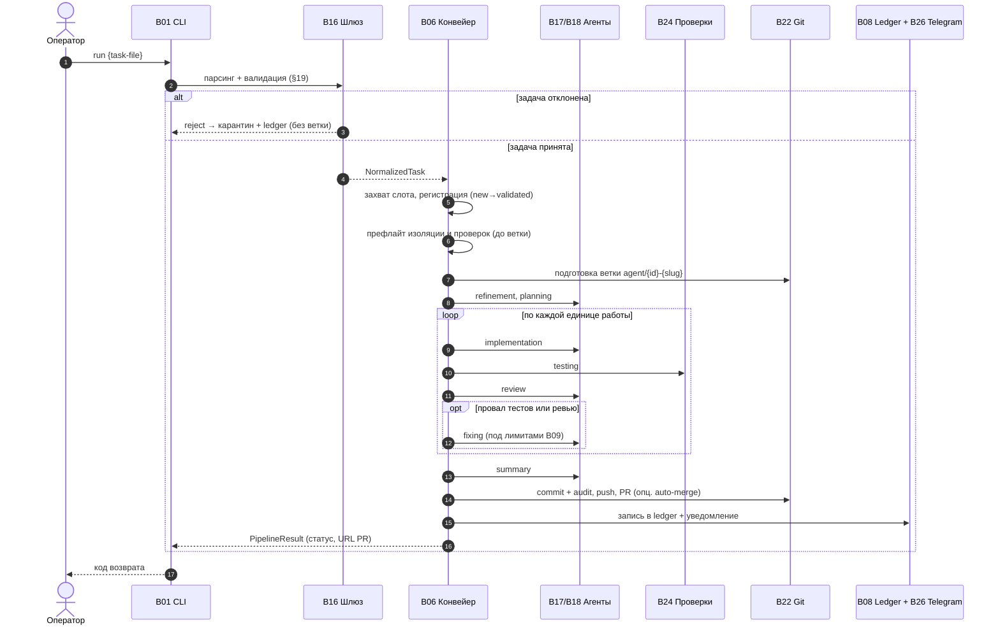
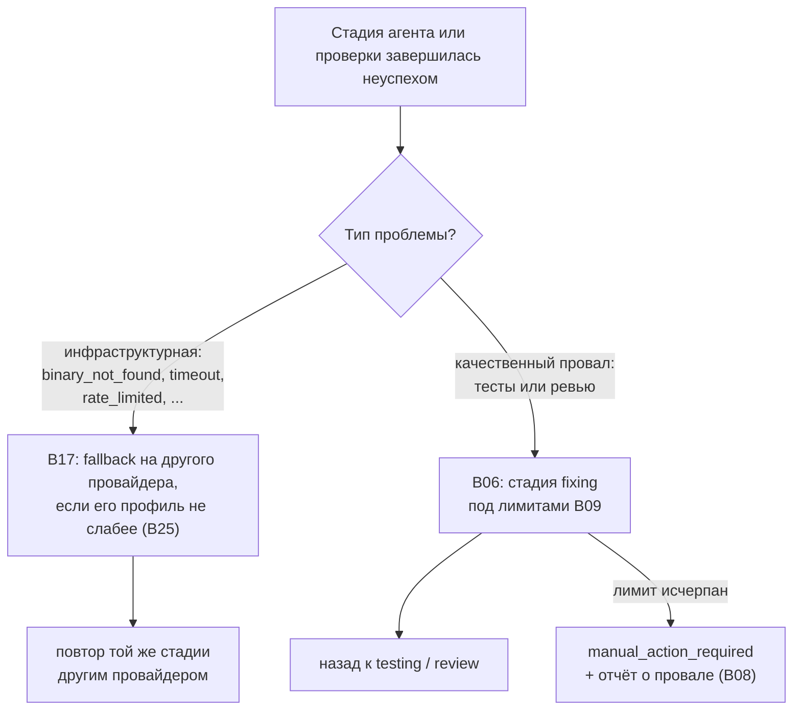

# Сквозные сценарии

Краткие сквозные потоки, проходящие через несколько блоков. Подробности каждого блока — в его документе (см. [block-registry.md](./block-registry.md)); здесь — только порядок и связи.

## Обработка одной задачи (`run`, happy path)

1. [B01 CLI](./blocks/B01-cli-and-operator-commands.md) разбирает `run`, разрешает и загружает конфигурацию ([B04](./blocks/B04-install-registry-and-config-discovery.md)/[B05](./blocks/B05-configuration.md)), строит оркестратор и вызывает `run_task`.
2. [B16 Шлюз](./blocks/B16-task-parsing-and-validation-gate.md) парсит и валидирует файл задачи (§19); при провале — карантин + запись в [B08 Ledger](./blocks/B08-ledger-and-failure-reports.md), без ветки.
3. [B06 Конвейер](./blocks/B06-orchestrator-pipeline.md) захватывает единый слот, регистрирует задачу в [B07 State Store](./blocks/B07-state-machine-and-store.md), делает префлайт изоляции ([B25](./blocks/B25-security-policy.md)) и префлайт проверок ([B23](./blocks/B23-check-discovery.md)) — оба **до** ветки.
4. [B22 Git Manager](./blocks/B22-git-manager.md) готовит ветку `agent/<id>-<slug>`.
5. Стадии refinement → planning исполняются через [B17 Router](./blocks/B17-agent-router-and-fallback.md) → [B18 Провайдеры](./blocks/B18-agent-providers.md); промпт собирает [B15](./blocks/B15-prompt-templates.md), навыки — [B13](./blocks/B13-skill-selection.md), вывод валидирует [B12](./blocks/B12-hitl-and-typed-output.md), решение о декомпозиции — [B11](./blocks/B11-task-decomposition.md).
6. По каждой единице: implementation (с guardrail [B14](./blocks/B14-dangerous-diff-guardrail.md)) → testing ([B24](./blocks/B24-check-execution.md)) → review → (опц.) fixing под лимитами [B09](./blocks/B09-fix-loop-control.md).
7. summary → публикация: [B22](./blocks/B22-git-manager.md) делает commit (+audit), push, PR.
8. [B06](./blocks/B06-orchestrator-pipeline.md) выполняет терминальную очистку, пишет запись в [B08 Ledger](./blocks/B08-ledger-and-failure-reports.md) и шлёт уведомление ([B26](./blocks/B26-notifications-telegram.md)). [B01](./blocks/B01-cli-and-operator-commands.md) отображает статус в код возврата.

Та же последовательность во времени (happy path):

## Цикл исправления (testing/review → fixing)

1. [B24](./blocks/B24-check-execution.md) сообщает качественный провал; [B06](./blocks/B06-orchestrator-pipeline.md) через [B09](./blocks/B09-fix-loop-control.md) решает войти в `fixing` или, при исчерпании лимита, — `manual_action_required` с отчётом о провале ([B08](./blocks/B08-ledger-and-failure-reports.md)).
2. fixing-стадия правит код ([B17](./blocks/B17-agent-router-and-fallback.md)/[B18](./blocks/B18-agent-providers.md)) и возвращается к testing (или review при пропущенном testing).
3. Прохождение проверок/ревью сбрасывает соответствующие счётчики ([B09](./blocks/B09-fix-loop-control.md)).

## Инфраструктурный fallback провайдера

1. [B17 Router](./blocks/B17-agent-router-and-fallback.md) запускает primary через [B18](./blocks/B18-agent-providers.md).
2. При `ProviderError` инфраструктурного класса (и допустимости по политике профиля [B25](./blocks/B25-security-policy.md)) Router снимает частичный дифф ([B22](./blocks/B22-git-manager.md) как `SnapshotHook`) и переключается на fallback, передавая дифф.
3. Качественный `failed` fallback **не** вызывает — он уходит в `fixing` ([B06](./blocks/B06-orchestrator-pipeline.md)).

Развилка «качество против инфраструктуры» — куда уходит проблемная стадия:

## Человек в контуре (refinement/planning) и guardrail опасного диффа

1. Агент возвращает сигнал `human_input` в типизированном выводе ([B12](./blocks/B12-hitl-and-typed-output.md)).
2. [B06](./blocks/B06-orchestrator-pipeline.md) пишет долговечный HITL-артефакт ([B12](./blocks/B12-hitl-and-typed-output.md)) и через [B26 Telegram](./blocks/B26-notifications-telegram.md) шлёт запрос и ждёт ответ.
3. Для редактирующих стадий [B14](./blocks/B14-dangerous-diff-guardrail.md) классифицирует дифф; опасный (удаления/зависимости), не покрытый аппрувом planning, требует согласования; отказ даёт одну «безопасную» переработку.
4. Сбой ответа (timeout/transport/невалидный) → `manual_action_required` (fail-closed).

## Декомпозиция задачи

1. planning возвращает рекомендацию разбить; [B11](./blocks/B11-task-decomposition.md) применяет детерминированное правило приёма (§5.1).
2. При принятии пишутся артефакты сабтасков ([B11](./blocks/B11-task-decomposition.md)) и строки в [B07](./blocks/B07-state-machine-and-store.md); каждая единица проходит implement→test→review→fix с локальным коммитом ([B22](./blocks/B22-git-manager.md)); глобальный счётчик `fix_iterations` ([B09](./blocks/B09-fix-loop-control.md)) копится через все сабтаски.

## Обнаружение и выполнение проверок

1. На префлайте [B06](./blocks/B06-orchestrator-pipeline.md) вызывает [B23](./blocks/B23-check-discovery.md): резолв запускаемого профиля (configured / детерминированно / опц. агентский fallback), кэш по fingerprint.
2. Изменившийся набор команд проходит шлюз согласования (§1.2) через [B12](./blocks/B12-hitl-and-typed-output.md)/[B26](./blocks/B26-notifications-telegram.md).
3. На стадии testing [B24](./blocks/B24-check-execution.md) гоняет профиль; launch-сбой (а не качественный провал) → однократный повторный резолв ([B23](./blocks/B23-check-discovery.md)) или терминальный провал.

## Демон `watch` (периодическое обнаружение)

1. [B02](./blocks/B02-watch-daemon-and-scheduling.md) на каждом тике: `refresh_repo` (fetch/pull base через [B06](./blocks/B06-orchestrator-pipeline.md)→[B22](./blocks/B22-git-manager.md)), возобновляет активную задачу, затем берёт pending по одной (auto-mode правит продолжение).
2. PID-файл и `SIGTERM`-обработчик ([B02](./blocks/B02-watch-daemon-and-scheduling.md)) дают грейсфул `stop`/`restart`; единый слот соблюдается через `acquire_slot` ([B06](./blocks/B06-orchestrator-pipeline.md)).

## Возобновление после рестарта (`resume`)

1. [B06](./blocks/B06-orchestrator-pipeline.md) вызывает [B10](./blocks/B10-recovery-and-resume.md): сверка состояния ([B07](./blocks/B07-state-machine-and-store.md) + коммиты ветки через [B22](./blocks/B22-git-manager.md)).
2. Решение: продолжить единственную задачу с записанной стадии, дозавершить очистку, пометить неоднозначное как `manual_action_required`, или ничего (слот свободен).
3. Идемпотентность публикации ([B22](./blocks/B22-git-manager.md), `publish_operations`) не даёт повторно закоммитить/запушить/создать PR.

## Повторная попытка (`rerun` / `rerun --continue`)

1. [B01](./blocks/B01-cli-and-operator-commands.md) вызывает `plan_rerun` ([B06](./blocks/B06-orchestrator-pipeline.md)), печатает план или просит подтверждение.
2. **fresh**: архив артефактов ([B20](./blocks/B20-artifact-layout.md)), сброс ветки к base ([B22](./blocks/B22-git-manager.md)), очистка per-attempt состояния ([B07](./blocks/B07-state-machine-and-store.md)), затем `run_task`.
3. **continue**: оживить задачу на прерванной стадии (сброс незавершённого HITL [B12](./blocks/B12-hitl-and-typed-output.md)), затем `resume`.

## Финализация вручную (`finalize`)

1. [B01](./blocks/B01-cli-and-operator-commands.md) вызывает `plan_finalize` ([B06](./blocks/B06-orchestrator-pipeline.md)) (опц. проверка merge через read-only `gh pr view` [B22](./blocks/B22-git-manager.md)).
2. После подтверждения [B06](./blocks/B06-orchestrator-pipeline.md): терминальная очистка, заявленный статус **вне** машины состояний ([B07](./blocks/B07-state-machine-and-store.md)), перенос файла, `manual`-запись в [B08 Ledger](./blocks/B08-ledger-and-failure-reports.md) — без конвейера и commit/push/PR.

## Установка и последующее обнаружение конфигурации

1. [B01](./blocks/B01-cli-and-operator-commands.md) → `install` → [B03 Установщик](./blocks/B03-installer-and-scaffolding.md): мастер (детекция git/провайдеров/проверок), генерация+валидация `config.yaml` ([B05](./blocks/B05-configuration.md)), создание каталогов, runtime-excludes ([B22](./blocks/B22-git-manager.md)).
2. Привязка `repo → config` в [B04 Реестр](./blocks/B04-install-registry-and-config-discovery.md); авто-preflight.
3. Дальше любая команда находит конфигурацию через `resolve_config_path` ([B04](./blocks/B04-install-registry-and-config-discovery.md)).

## Preflight (диагностика готовности)

1. [B01 `run_preflight`](./blocks/B01-cli-and-operator-commands.md): `provider.preflight()` по разрешённым провайдерам ([B18](./blocks/B18-agent-providers.md)), `check_isolation` ([B25](./blocks/B25-security-policy.md)), диагностика проверок ([B23](./blocks/B23-check-discovery.md)), telegram-preflight ([B26](./blocks/B26-notifications-telegram.md)).
2. Возвращает готовность и секрет-free строки; код возврата — у [B01](./blocks/B01-cli-and-operator-commands.md).
