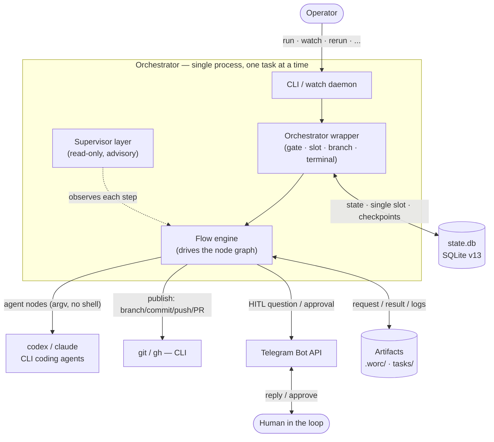
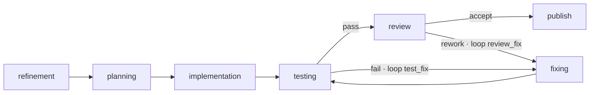
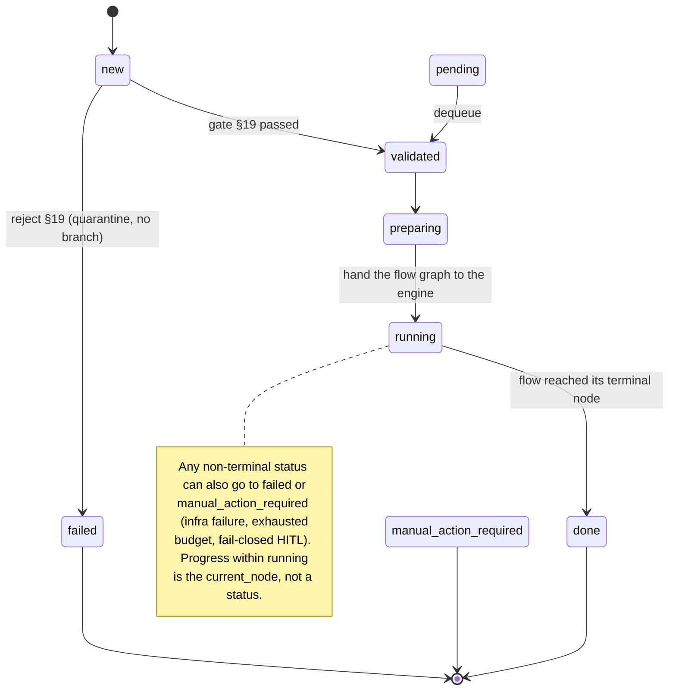

# Lean orchestrator architecture for coding agents (Codex / Claude) + Git

Date: 2026-06-21 (rewritten for the flow-engine architecture). Goal: describe the architecture of a console application that runs on Windows/macOS/Linux, watches a task folder, runs each task through a **deterministic flow** (a validated graph of typed nodes) executed by external coding agents (Codex CLI and/or Claude Code CLI), and publishes the result to a dedicated Git branch.

> This is the high-level **design rationale**. For the exact contracts, state machine, routing, fallback, and security policy, the code is the source of truth on any discrepancy — see `src/wastech_orchestrator/` and [.agents/rules/architecture.md](../.agents/rules/architecture.md).

---

## 1. The idea in one paragraph

The application does not replace the coding agent or Git. It is an **orchestrator**: it watches the task folder, validates and parses a task, prepares a dedicated branch, and runs the task through a deterministic **flow** — a YAML graph of typed nodes (refine → plan → implement → test → review → fix → publish for the default flow) driven by a **flow engine**. The heavy lifting on the code is done by an **external coding agent** (Codex CLI or Claude Code CLI) behind a single `AgentProvider` abstraction; each node runs on its declared provider or the one **global primary**, and a transient infrastructure failure is retried (same provider, backoff) then falls back to the other allowed provider — and if both are unavailable the task soft-pauses and resumes later rather than dying (a quality failure never switches providers — it loops through `fixing`). Above the flow sits a constant, **read-only supervisor** that observes each completed step and writes the plain-language summary that becomes the PR body — but it never decides the route. Only the orchestrator commits, pushes, and opens the PR; the agents only edit files in a dedicated clone. After a task finishes, the working copy returns to the base branch; only then may the next task start, and taking it automatically is an explicit, off-by-default **auto mode**. Git access uses ordinary means (SSH key, credential helper, `gh auth login`); the agent subscription is used only to reach the agent, never as a Git authentication mechanism.

---

## 2. Key architectural principles

1. **The pipeline is data, not code.** Each `task_type` resolves to a flow — a validated YAML graph of typed nodes and edges — driven by the flow engine. There is no hardcoded stage loop; agents do not freely "negotiate." Predictability matters more than autonomy.
2. **The coding agent behind an abstraction.** `Codex CLI` and `Claude Code CLI` are interchangeable implementations of one `AgentProvider` interface. The core never builds a CLI command itself — only provider adapters know CLI syntax.
3. **A thin, advisory supervisor above the flow.** A constant per-task layer observes each completed step read-only and writes the summary at close. It is advisory by construction — it never reworks, reopens, or routes. Blocking is the job of the in-flow `review`/evaluator nodes.
4. **Checkpoints at every step.** After each node the flow checkpoint (`current_node` + counters + fingerprint) and node-run audit are written to SQLite, so an interrupted task continues from where it stopped and publishing is idempotent.
5. **Guardrails in layers.** Sandbox/approval profiles and an environment allowlist before execution; a dangerous-diff classifier and flow-wide ceilings (`permission_ceiling` / `output_policy` / `network_policy`) validated fail-closed before any task runs.
6. **Fresh context per task, durable session within it.** The orchestrator builds the flow, node services, and supervisor anew for each task — no shared state between tasks. _Within_ a task the editing agent keeps a durable session (implementation → fixing, across the test/fix loop), persisted so it survives a restart.
7. **Human-in-the-loop via Telegram.** Clarifying questions and approval of dangerous actions block one checkpoint until an answer or a fail-closed timeout.
8. **Fallback is for infrastructure errors only, and recovery is bounded.** Missing binary, auth error, rate limit, timeout, crash, invalid output → fall back to the **other** allowed provider (symmetric Claude↔Codex). A _transient_ class (`provider_unavailable` / `network_unavailable`) is first retried on the same provider with backoff (`agents.retry`), and if both providers are down the task soft-pauses (resumable) instead of failing. Test failures and review findings go to `fixing`, never to another provider.

---

## 3. Overall diagram



---

## 4. Core components

### 4.1 Orchestrator wrapper (the spine)

A thin wrapper around the flow engine. It owns everything that is _not_ a node: the §19 validation gate, acquiring the single processing slot, registering the task in the State Store, resolving the flow for the task's `task_type`, the isolation and check **preflights** (both before any branch), branch preparation, the terminal cleanup back to the base branch, and the one ledger record at the end. It builds the node services, inputs, and the supervisor, then hands the validated graph to the engine via `drive_flow`.

### 4.2 Flow engine + flow definition

The pipeline expressed as **data**. A flow is a YAML document — a graph of typed nodes plus edges (with named fix loops and inline budgets) and flow-wide ceilings. The engine traverses the graph, routing on each node's emitted outcome to the matching edge, charging rework against the named loop and the single global counter, and writing the durable checkpoint after each step. A `when: {fact: ...}` predicate (`derived.*` / `config.*`) deterministically skips a node (this is how the refinement-skip works); a per-task `nodes.<node-id>.enabled: false` disables a node directly by node id (handed to the engine as the disabled-node set), independent of any `when` fact.

Flows are resolved by `task_type` from **one place** — the operator flow at `<repo>/.worc/flows/<task_type>.yaml`. The built-ins ship inside the package under `packaged/flows/`, but that tree is **delivery-only**: `install` copies it into `.worc/flows/` as editable copies (`implementation`/`deep_research`/`security_audit` plus their shared `roles/` prompts), and the orchestrator never reads the packaged tree at run time. So out of the box every built-in is already an editable operator flow (`install --reconfigure` refreshes them, snapshotting the old dir first), and a `task_type` with no file in `.worc/flows/` fails resolution with a clear "not found" rather than silently loading a bundled copy. Every resolved flow passes a **fatal three-layer validator** at dispatch (`resolve`) before its task runs — and on demand via `worc validate-flow`:

- **Graph integrity** — edges resolve; outcomes are valid per node kind; every `rework`/`fail` edge is bounded by a budget or named loop; exactly one entry node; every node can reach a terminal.
- **Security ceiling** — a node's `permission_profile` may not exceed the flow `permission_ceiling`; evaluators are forced `read-only`; `extra_args` pass the forbidden-args screen; `role_file` paths contain no traversal; unknown fields fail closed.
- **Config consistency** — a node's pinned `provider` is in `agents.allowed`, its `reasoning` is a known level, and the ceiling is reachable by at least one configured provider. On resume the live flow is re-validated against the live config, so a config change can only ever _narrow_ what a task may do.

Node kinds:

| Kind | What it does | Outcomes |
| --- | --- | --- |
| `agent` | runs an author/editor through the router (optional embedded HITL, dangerous-diff guard, editing session) | `done` |
| `evaluator` | a read-only verdict over a produced artifact; a blocking gate, or a non-blocking self-capping reviewer | `accept` / `rework` |
| `checks` | a quality gate: the operator's diff-selected `checks.command_sets`, or the `citation` / `dependency_scan` checkers | `pass` / `fail` |
| `hitl` | a bare durable human gate | approve/deny, or done |
| `publish` | the orchestrator-owned git publish for the flow's publishing policy | `done` |

An evaluator's verdict is schema-enforced: the router requests a structured `findings` array (`severity`/`path`/`what`/`fix`) from the provider, and a run whose result does not carry a parseable one never accepts — it fails closed to `manual_action_required` (preserving the branch) instead of being read as "no findings". A well-formed empty `findings` array is a genuinely clean, accepting verdict.

### 4.3 CodingAgent — provider abstraction + node-based routing

```python
class AgentProvider(Protocol):
    name: str
    def preflight(self) -> PreflightResult: ...
    def run(self, request: AgentRunRequest) -> AgentRunResult: ...
```

`CodexCLI` (wrapping `codex exec`, with `codex exec resume <id>` for durable sessions) and `ClaudeCLI` (wrapping `claude`, with `--resume <id>`) are the two adapters. Routing is **per node**: a node declares its own `provider` (`codex` | `claude`), and a node with no `provider` runs on the **global primary** — the single configured provider with `primary: true`. Infrastructure fallback is **symmetric**: a node whose primary differs from the global primary falls back to it, and a node already on the global primary falls back to the **other** allowed provider (Claude↔Codex). For a _transient_ class (`provider_unavailable` / `network_unavailable`) the Router first retries the **same** provider with bounded exponential backoff (`agents.retry`, a per-provider budget separate from `max_stage_attempts`) before switching; if **every** allowed provider is unavailable the orchestrator parks the task as **resumable** (`tasks.blocked_since`, soft pause) instead of failing, bounded by `agents.retry.max_blocked_s`. The watch daemon wires one cancellation predicate into both Router and FlowEngine: a soft stop parks at the untouched next-node checkpoint, while a hard-killed provider error is classified `CANCELLED` before fallback can respawn an agent. Every provider attempt also crosses a **process-tree quiescence barrier** (WRI-012): `run_process` runs each launch inside an orchestrator-owned platform containment (a POSIX session/group with during-run descendant tracking, or a Windows kill-on-close Job Object) and, on every exit path, terminates it and proves it empty within a bounded budget before the result is trusted — so a background/detached descendant that outlived the CLI cannot keep writing after the attempt returns. An unprovable subtree is a non-fallback `CONTAINMENT_UNVERIFIED` security condition that routes the task to `manual_action_required` (the recorded `(pid, pgid)` children-file handle is kept so a later hard stop/recovery can still reap the survivor). Test failures and review findings are _not_ infrastructure errors — they go to `fixing`.

### 4.4 Supervisor (constant, advisory, read-only)

A per-task oversight layer that exists for every task under any flow shape — **not a graph node, not a stage**. It starts at task start, observes each completed (non-skipped) step through its own continuing read-only session (~1 LLM call/step, recording an immutable advisory row), and at whole-task close synthesizes the plain-language `summary.md` (the PR body) plus advisory caveats. On a revived task whose durable session did not survive the interruption, that same single finalize turn reseeds from the recorded per-step observations (the immutable `supervisor_step` rows in `state.db`) rather than resuming a dead session — so the synthesis stays durable across a restart. If the synthesis call still cannot run, a deterministic minimal-summary fallback writes `summary.md` instead, so the summary is _always_ produced; when a synthesis was expected but failed, that fallback is flagged loud (a WARNING plus a visible "fallback summary" callout in the body) so a stub is never mistaken for the full write-up. Its `permission_profile` is **forced `read-only`** in code; it can never edit or reroute. It replaced both the old summary provider and the removed blocking `supervise_*` nodes — which is why no packaged flow has a `summary` node.

Its prompt **wording** is flow-local: a flow's `supervisor:` block declares `role_file` (observe lens; fallback flow → `config.supervisor.role_file` → built-in) and `finalize_role_file` (finalize lens; fallback flow → built-in), both flow-dir-contained. A flow may also set `supervisor.emit_follow_ups` (default off, code-oriented flows only): the same finalize turn — still one LLM call — then emits an **evidence-gated `follow_ups`** array (technical-debt / refactor signals) into `summary.json` and a "Technical debt / follow-ups" section in `summary.md`. Only wording lives in files; the structured schemas (`memory_delta`, `follow_ups`) stay hardcoded, so an author can never break the machine contract the orchestrator parses.

For a **decomposed** task, at each subtask boundary the orchestrator assembles a two-layer handoff brief for the next subtask — a deterministic factual floor (the `depends_on` predecessors' changed files, commit, acceptance criteria, spec pointer) plus a supervisor-authored three-section brief (`new_surface_area` / `locked_decisions` / `open_edges`) on the warm session — written to `logs/<task-id>/subtasks/NN-slug.handoff.md` (redacted, uncommitted, never a memory tier) and injected as `{predecessor_context}` into the region's `implementation` node. The third supervisor prompt, `handoff_role_file`, is its lens.

### 4.5 Check Runner + command sets

Quality-gate commands are **operator-authored**, never auto-detected or hardcoded: they live in `config.yaml` under `checks.command_sets` (an empty mapping means no gate). A deterministic, diff-based selector picks the **union** of sets whose `paths` globs match the task's changed files (a set with no `paths` always runs; an empty diff runs nothing; a changed path claimed by no set runs no set on its account — cover shared/root files with a no-`paths` catch-all set), and the Check Runner launches each selected command as a bounded subprocess (argv list, no shell, allowlisted env, repo-relative `cwd`) and records redacted logs. All selected checks run, then the verdict aggregates: a **required toolchain absent** (a non-`skip_if_unavailable` set whose binary cannot launch) or every check skipped leaves the gate **incomplete** → `manual_action_required` (the agent cannot install host toolchains); otherwise a launched check that exits non-zero is a **quality failure** that goes to `fixing`, else the gate passes. A `skip_if_unavailable` set whose toolchain is absent is recorded loudly as skipped (never passed) and blocks `git.auto_merge`.

### 4.6 Git Manager

The **only** component that runs commit / push / PR. Before a task it prepares the branch (`worc/<epoch>-<task-id>-<slug>` by default — an epoch prefix makes every fresh run unique, and the full name is capped at 50 chars by truncating the slug — or the task's validated `branch_name`); on publish it makes a **scoped code commit** (an explicit pathspec that excludes `.worc/`, `.worc-io/`, and `tasks/` — never `git add .`/`-A`) plus a separate **task-scoped audit commit** of just that task's `tasks/<state>/<id>.md` + `<id>.summary.md`, pushes, and (when enabled) opens the PR with the summary as its body — all idempotent via `publish_operations` fingerprints. Optional **auto-merge** (off by default) merges the PR; a blocked merge ends `manual_action_required` with the PR left open, never a forced merge. Terminal cleanup returns the working copy to `repo.base_branch`, then `fetch` + `pull --ff-only`.

### 4.7 State Store with checkpoints

SQLite (`state.db`, schema **v15**). It holds the task status, the flow checkpoint (`current_node` + counters + fingerprint), the B-lite soft-pause marker (`blocked_since`), per-node audit (`node_runs`, `provider_attempts`), checks, artifacts (each with a sha256), publish idempotency, subtasks, advisory `evaluations`, and the durable editing/own sessions (`editing_lineage` / `node_lineage` — the only place a raw session id is ever stored). `editing_lineage` is keyed `(task_id, subtask_order, lineage_key)`, so one execution unit can carry more than one durable editing session — one per lineage, keyed `lineage_affinity or <node id>`. Because the orchestrator is **greenfield**, the store does not migrate across destructive versions: a brand-new database is created at the current shape, and an older-versioned one is refused fail-closed (recreate it). A newer one is also refused.

### 4.8 Human-in-the-Loop via Telegram

A transport-neutral `Notifier` provides terminal notifications and one durable question/approval round-trip that blocks a single checkpoint.

- `refinement` and `planning` may emit one typed question or approval. Questions use ForceReply; approvals use inline buttons. Only the configured chat and exact prompt/callback are accepted.
- After an `implementation`/`fixing` edit, tracked-file deletions and dependency manifest/lock changes require approval before tests (an exact planning pre-approval can pre-clear a matching diff).
- A **changed check-command set** is gated, fail-closed, on first use.
- Waiting state is a durable artifact under `logs/<task-id>/hitl/`; a restart resumes the message/deadline. Timeout, transport failure, ambiguous approval, or a repeated request → `manual_action_required`. Routine commit/push/PR is never gated.

### 4.9 Security policy

`argv` only (no shell interpolation of user strings); the agent runs in `workspace-write` sandbox with `on-request` approvals; only allowlisted environment variables reach child processes; `denied_read_paths` and `denied_commands` are enforced; front matter is scanned for injection-shaped tokens (belt-and-braces over the file-path-only context guarantee); `strict_isolation` fails preflight if isolation cannot be enforced. No task and no `extra_args` can weaken any of this; the flow ceilings are validated fatally before any task runs.

---

## 5. Flows: the packaged graphs

| Flow | `task_type` | Output | Distinctive nodes |
| --- | --- | --- | --- |
| `implementation` | default | code → Pull Request | the default coding pipeline + two fix loops + optional decomposition |
| `deep_research` | `deep_research` | a documentation PR (`docs/research/<id>/`) | `external_research` (network-gated), a `citation` checker, two non-blocking evaluators |
| `security_audit` | `security_audit` | a **private** report under `.worc/security-reports/<id>/` | a `dependency_scan` checker; `publishing: none` (no git at all) |

All three use the same engine, the same supervisor, the same HITL machinery — they differ only in nodes, ceilings (`network_policy` grants research/advisory network access), and the publishing policy. Per-flow node graphs are defined in `packaged/flows/`.

### The default `implementation` flow



- `refinement` runs only when the task is incomplete (`derived.needs_refinement`); any other node can be dropped per task via `nodes.<node-id>.enabled: false` (disabled by node id, not a `when` fact).
- Two fix loops feed `fixing` (`test_fix`, `review_fix`, each budget 15) plus a single global counter (`global_fix_iterations: 30`); each cap is clamped to `min(flow, config)` (`agents.max_fix_cycles` / `max_total_fix_iterations`). Exhaustion → `manual_action_required` + a failure report.
- `fixing` resumes `implementation`'s durable editing session (`lineage_affinity`).
- **Decomposition** (off by default): planning may propose a split; a deterministic gate accepts a 2..n linear DAG, and the engine runs the `sub_flow` region (`implementation → testing → review → fixing`) once per subtask — committing each, resetting per-loop budgets between subtasks while the global counter accumulates. A subtask with a verified commit is never re-run.
- There is **no `summary` node**: the supervisor writes the summary at close, before `publish`.

---

## 6. State machine + checkpoints

The lifecycle is generic; per-stage statuses are gone. Progress _within_ `running` is the flow `current_node` (in `node_runs`), and a decomposed task's subtask `k` of `n` is the `active_subtask` counter — neither is a status.



Each transition is asserted against an explicit `ALLOWED_TRANSITIONS` table and persisted atomically. On restart the orchestrator reconciles: more than one active task → `manual_action_required`; one active → resume from the flow checkpoint (a fingerprint mismatch restarts from the entry node); an incomplete terminal cleanup is finished. `publish_operations` idempotency means a resumed run never repeats a commit/push/PR.

---

## 7. Configuration

`config.yaml` is **infrastructure + provider defaults + non-weakenable safety caps** — the flow owns the graph, the config owns the environment. The full reference (every field, default, and validation rule) is [configuration.md](configuration.md); the packaged starting point is [`config.example.yaml`](../src/wastech_orchestrator/packaged/config.example.yaml). The shape, in brief:

```yaml
schema_version: 23

orchestrator:
  auto_mode: { enabled: false } # pick the next pending task after cleanup
  poll_interval_seconds: 300 # watch tick: fetch/pull base, then re-scan (0 = single pass)

repo: { url, local_path, base_branch: main, branch_prefix: worc }

agents:
  allowed: [claude, codex]
  max_stage_attempts: 3
  max_fix_cycles: 15
  max_total_fix_iterations: 30 # >= max_fix_cycles
  decomposition: { enabled: false, max_subtasks: 8, ... }
  providers: # node-based routing: a node declares `provider`, else the global primary below
    claude:
      {
        command: claude,
        model: "",
        reasoning: null,
        permission_profile: workspace-write,
        primary: true,
      }
    codex:
      {
        command: codex,
        sandbox: workspace-write,
        permission_profile: workspace-write,
      }

security:
  {
    strict_isolation: true,
    allowed_environment: [...],
    denied_read_paths: [...],
    denied_commands: [...],
  }
validation: { max_task_bytes, ..., quarantine_folder } # the §19 input-hardening gate
checks: {
    timeout_seconds,
    command_sets:
      {
        <name>:
          {
            paths: [globs],
            skip_if_unavailable?,
            commands: [{ name, argv, cwd? }],
          },
      },
  } # operator-authored, diff-selected; {} = no gate
git:
  {
    create_pull_request: true,
    pr_base: main,
    auto_merge: false,
    footprint: { audit_commit_message, audit_on_branch },
  }
telegram: { enabled: false, bot_token_env, chat_id_env, ask_timeout_s }
skills: { dynamic, strict } # whole-repo discovery + per-node pins + supervisor proposal
supervisor: { role_file, model, reasoning } # the constant read-only oversight layer
prompt_audit: false # record each step's prompt + who
```

Prompt templates are **not** a config block: a node's prompt is the content of its `role_file`. `install` delivers editable copies under `.worc/flows/` (each flow owns its prompts in a `<task_type>/` subdir) — the sole copy the orchestrator reads at run time — so a node's prompt is customized by editing the delivered role file. Role files render only an allowlisted set of path/metadata variables — never task bodies, diffs, env, or secrets.

---

## 8. The `.worc/` home, the `.worc-io/` exchange, and the Git footprint

Everything the orchestrator generates lives under two gitignored roots. The private/control home `<repo>/.worc/` holds `config.yaml`, the agent task-authoring `guide/`, `state.db` (+ `-wal`/`-shm`), `orchestrator.pid`, `logs/` (plan, diffs, stage logs, `summary.json`, validation reports, provider attempts, prompt audit, durable HITL), `workspace/`, operator `flows/`, and the `tasks/rejected` quarantine. `install` appends a `.worc/` and a `.worc-io/` line to the repo's tracked `.gitignore`.

These roots are named in **one** place — the provider-neutral, immutable `RuntimeLayout` (`runtime_layout.py`, a stdlib-only leaf). It is built once at the composition/CLI boundary (`cli.layout_for` → `composition.build_orchestrator`) and injected into every consumer, so each declares the surface it owns rather than rebuilding `repo_root / ".worc"`: `control_home` (operator plane — config/flows/tools/guide), `private_home` (runtime state — DB/logs/memory/reports/HITL/process-control/`.env`), and `exchange_root` (the agent-facing exchange below). `control_home` and `private_home` both resolve to `<repo>/.worc` today; the split is the seam that lets a later change relocate only the private home. A companion `InternalDenyPolicy` (assembled at composition) names the internal read-deny targets — the two homes, the resolved `--env-file`, and each provider's auth/config home (`~/.claude`/`$CLAUDE_CONFIG_DIR`, `$CODEX_HOME`) — kept separate from the public `security.denied_read_paths` list; provider enforcement projects it later.

The second root is the **exchange** `<repo>/.worc-io/<task-id>/` (WRI-001) — the only provider-readable orchestration surface. Everything an agent reads as a context path (the task snapshot, `plan.md`, `current.diff`, the first failing checks log, evaluator `findings.json`, generic `<node>.out.md` / tool `stdout.txt`, subtask specs, handoff briefs, memory packets, a sanitized HITL answer packet, selected skill snapshots) is published there through **one redaction + path-safety boundary** (`providers/exchange.py`): content is scrubbed, the destination is proven a contained single-link regular file (no symlink/junction/reparse/hard-link/NTFS-ADS escape), the write is atomic and LF-stable. Private writers keep writing under `.worc/logs/` unchanged — each routing point is additive (the private copy stays the audit record; only a redacted copy crosses). A pre-launch invariant enforces that `.worc-io/` holds at most the current task's directory, and each provider request is checked so no live/private/control path (only `working_directory`) reaches the agent. Terminal outcomes tear the active exchange down (WRI-007 will replace this with a checksum-verified seal into private audit).

The **only** things outside these two roots are the `tasks/` lifecycle dirs (`pending`/`done`/`failed`) at the repo root, which are git-tracked: the task file plus its `<id>.summary.md` (in `done/` or `failed/`) are the committed audit trail. The code commit excludes `.worc/` (gitignored), `.worc-io/` (gitignored), and `tasks/` (it rides the separate audit commit). Parallel tasks via `git worktree` remain on the roadmap (see [backlog/](backlog/)).

---

## 9. Task processing flow (end to end)

```text
1.  watch finds a new task in tasks/pending/ (promoted there via worc promote, or a teammate pushed one to git) → it is picked up for this run (the file stays in pending/ until terminal; "running" is a state.db status, not a folder)
2.  §19 validation gate parses + hardens the task; a structural reject is terminal `failed` (quarantine, no branch)
3.  acquire the single processing slot; register the task in state.db
4.  resolve the flow for the task's task_type from `.worc/flows/<task_type>.yaml`, validated fail-closed (missing ⇒ terminal `failed`)
5.  isolation + check preflights (both BEFORE any branch)
6.  prepare task branch (default worc/<epoch>-<task-id>-<slug>, capped at 50 chars, or validated task branch_name); build node services + the supervisor; hand the graph to the engine
7.  the engine traverses the flow (default: refine → plan → implement → test → review → fix(loop) → publish):
      - agent nodes run via the router → a provider adapter; the supervisor observes each completed step read-only
      - testing runs the diff-selected command sets; review is a read-only evaluator; edits are guarded by the dangerous-diff classifier
      - HITL: refinement/planning may ask one durable question/approval; dangerous diffs and changed check sets are gated, fail-closed
8.  at close the supervisor synthesizes summary.md; the orchestrator moves the task file → tasks/done/ (or failed/)
9.  publish: scoped code commit + task-scoped audit commit, push, gh pr create (PR body = the summary) — idempotent
10. terminal cleanup → checkout repo.base_branch → fetch + pull --ff-only; write one ledger record; notify via Telegram
11. discovery & auto mode: the watch loop keeps refreshing base every poll_interval_seconds; with auto_mode on, the next
      pending task starts ONLY after cleanup returned to base; otherwise idle (still polling)
12. (resume) on a crash at any step — continue from the flow checkpoint node, or finish an incomplete terminal cleanup
```

A **failed** task with a branch is finalized the same way (moved to `tasks/failed/`, summary written, code + audit committed and pushed) but opens **no PR**; `manual_action_required` stays put for the operator.

---

## 10. CLI surface

```text
install      set up <repo>/.worc/ (config + guide), gitignore .worc/, run preflight
preflight    check each allowed provider, the isolation policy, summarize the configured command sets, and validate every flow
telegram-test send a real correlated Telegram prompt and wait for a reply
run          process exactly one task end to end — arg is a PATH to the task file, not a task id
rerun        re-attempt a terminal task by id (fresh from base, or --continue from the flow checkpoint)
finalize     record + tidy a task you handled by hand (no pipeline / commit / PR)
prs          list open, un-merged orchestrator PRs awaiting merge (read-only)
merge-task   go-ahead to merge a reviewed PR (update branch w/ base, resolve conflicts, merge)
watch        process pending tasks; long-running loop with periodic git sync (Ctrl-C / `stop` to end)
stop / restart  manage the watch daemon via <repo>/.worc/orchestrator.pid
status       read-only snapshot from state.db (no providers / checks / git)
top / shell  live read-only monitor / interactive operator console over the watch daemon
list / tasks / completion  enumerate tasks / list with status + branch / print a shell-completion script
logs clean   reclaim disk: remove per-task dirs under .worc/logs/ (keeps the ledger)
upgrade-config / upgrade-docs  materialize new config keys / refresh the packaged guide
```

Every command is also available under the short alias `worc`. Exit codes: `0` done, `1` failed, `2` `manual_action_required`. Global options (`--config`, `--log-level`, `--log-format`, `--log-file`, `--heartbeat-seconds`) go before the subcommand.

---

## 11. Sources

- OpenAI Codex CLI Reference: https://developers.openai.com/codex/cli/reference
- OpenAI Codex Agent Approvals & Security: https://developers.openai.com/codex/agent-approvals-security
- GitHub CLI `gh pr create`: https://cli.github.com/manual/gh_pr_create
- Telegram Bot API: https://core.telegram.org/bots/api

---

## 12. Short conclusion

The orchestrator is a **deterministic flow engine** with a thin wrapper around it and a constant, **advisory** supervisor on top. Key design choices: the pipeline is _data_ (a validated node graph selected by `task_type`), the coding agent sits behind one provider abstraction with node-based routing and infrastructure-only fallback, every step is checkpointed to SQLite for crash-safe and idempotent publishing, security is enforced by non-weakenable flow ceilings and an environment allowlist, and the human is brought in via Telegram only at the checkpoints that warrant it. The agent does the work on the code, Git stores the changes, CI/PR remain the control layer, and the orchestrator ties it all into a repeatable, crash-resilient process.
