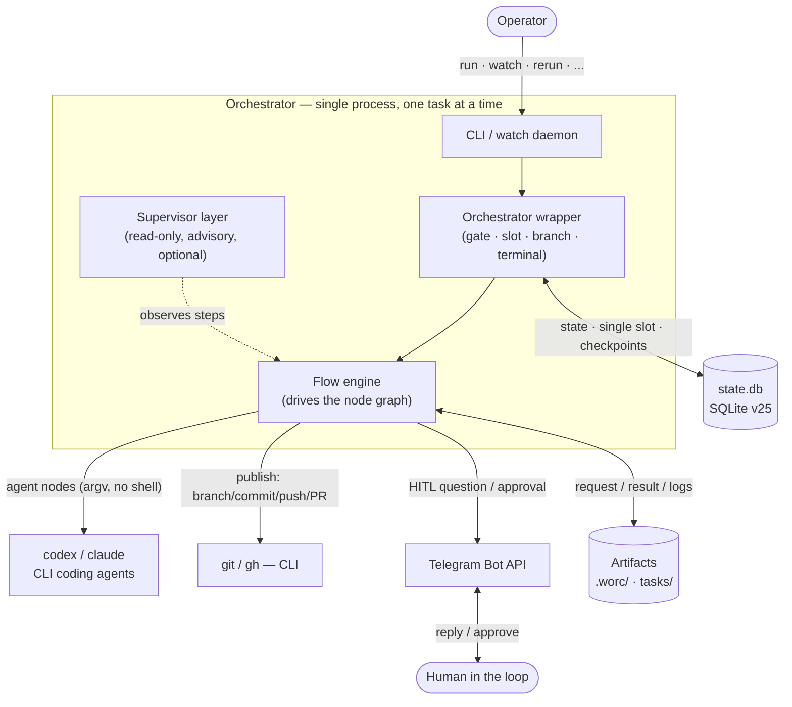
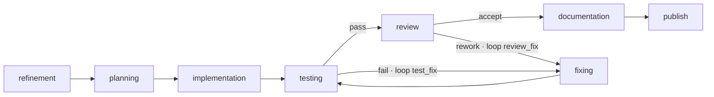
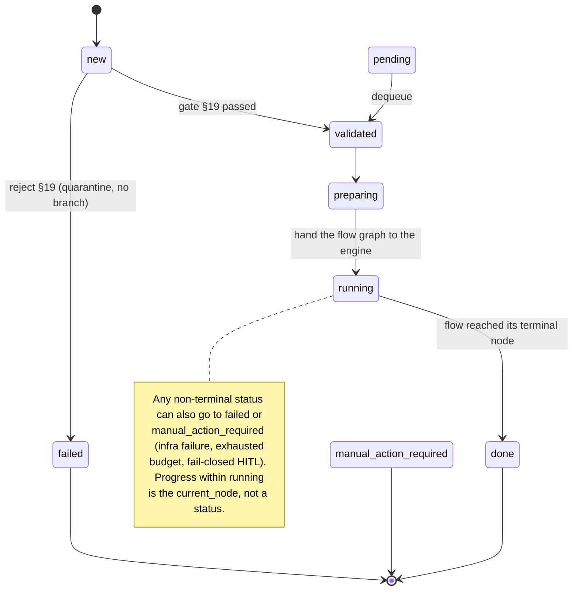

# Lean orchestrator architecture for coding agents (Codex / Claude) + Git

Date: 2026-08-05 (reconstructed from the merged `dev` diff; originally written 2026-06-21 for the flow-engine architecture). Goal: describe the architecture of a console application that runs on Windows/macOS/Linux, watches a task folder, runs each task through a **deterministic flow** (a validated graph of typed nodes) executed by external coding agents (Codex CLI and/or Claude Code CLI), and publishes the result to a dedicated Git branch.

> This is the high-level **design rationale**. For the exact contracts, state machine, routing, fallback, and security policy, the code is the source of truth on any discrepancy — see `src/wastech_orchestrator/` and [.agents/rules/architecture.md](../.agents/rules/architecture.md).

---

## 1. The idea in one paragraph

The application does not replace the coding agent or Git. It is an **orchestrator**: it watches the task folder, validates and parses a task, prepares a dedicated branch, and runs the task through a deterministic **flow** — a YAML graph of typed nodes (refine → plan → implement → test → review → document → publish for the default flow) driven by a **flow engine**. The heavy lifting on the code is done by an **external coding agent** (Codex CLI or Claude Code CLI) behind a single `AgentProvider` abstraction; each node runs on its declared provider or the one **global primary**, and a transient infrastructure failure is retried (same provider, backoff) then falls back to the other allowed provider — and if both are unavailable the task soft-pauses and resumes later rather than dying (a quality failure never switches providers — it loops through `fixing`). Above the flow sits a **read-only supervisor layer** — on by default, removable with `supervisor.enabled: false` — that observes completed steps at a configured cadence and writes the plain-language summary that becomes the PR body; it never decides the route, and with it switched off the PR body is rendered deterministically from the run's own recorded facts. Only the orchestrator commits, pushes, and opens the PR; the agents only edit files in a dedicated clone. After a task finishes, the working copy returns to the base branch (in the default `branch_mode: new`; `existing` / `current` stay on their branch); only then may the next task start, and taking it automatically is an explicit, off-by-default **auto mode**. Git access uses ordinary means (SSH key, credential helper, `gh auth login`); the agent subscription is used only to reach the agent, never as a Git authentication mechanism.

---

## 2. Key architectural principles

1. **The pipeline is data, not code.** Each `task_type` resolves to a flow — a validated YAML graph of typed nodes and edges — driven by the flow engine. There is no hardcoded stage loop; agents do not freely "negotiate." Predictability matters more than autonomy.
2. **The coding agent behind an abstraction.** `Codex CLI` and `Claude Code CLI` are interchangeable implementations of one `AgentProvider` interface. The core never builds a CLI command itself — only provider adapters know CLI syntax.
3. **A thin, advisory supervisor above the flow.** A per-task layer — on by default — observes completed steps read-only at the configured cadence and writes the summary at close. It is advisory by construction — it never reworks, reopens, or routes. Blocking is the job of the in-flow `review`/evaluator nodes. Switch it off (`supervisor.enabled: false`) and the whole layer is never built; the deterministic report takes over the PR body.
4. **Checkpoints at every step.** After each node the flow checkpoint (`current_node` + counters + fingerprint) and node-run audit are written to SQLite, so an interrupted task continues from where it stopped and publishing is idempotent.
5. **Guardrails in layers.** Sandbox/approval profiles and an environment allowlist before execution; a dangerous-diff classifier and flow-wide ceilings (`permission_ceiling` / `output_policy` / `network_policy`) validated fail-closed before any task runs.
6. **Fresh context per task, durable session within it.** The orchestrator builds the flow, node services, and supervisor anew for each task — no shared state between tasks. _Within_ a task the editing agent keeps a durable session (implementation → fixing, across the test/fix loop), persisted so it survives a restart.
7. **Human-in-the-loop via Telegram.** Clarifying questions and approval of dangerous actions block one checkpoint until an answer or a fail-closed timeout.
8. **Fallback is for infrastructure errors only, and recovery is bounded.** Missing binary, unsupported version, auth error, rate limit, timeout, crash, invalid output, no-work → fall back to the **other** allowed provider (symmetric Claude↔Codex). A _transient_ class (`provider_unavailable` / `network_unavailable`) is first retried on the same provider with backoff (`agents.retry`), and once every provider is exhausted a **park-eligible** class (those two plus `rate_limited`) soft-pauses the task (resumable) instead of failing. Test failures and review findings go to `fixing`, never to another provider.

---

## 3. Overall diagram



---

## 4. Core components

### 4.1 Orchestrator wrapper (the spine)

A thin wrapper around the flow engine. It owns everything that is _not_ a node: the §19 validation gate, acquiring the single processing slot, registering the task in the State Store, resolving the flow for the task's `task_type`, the isolation and check **preflights** (both before any branch), branch preparation, the terminal cleanup (§4.6), and the one ledger record at the end. It builds the node services, inputs, and the supervisor, then hands the validated graph to the engine via `drive_flow`.

### 4.2 Flow engine + flow definition

The pipeline expressed as **data**. A flow is a YAML document — a graph of typed nodes plus edges (with named fix loops and inline budgets) and flow-wide ceilings. The engine traverses the graph, routing on each node's emitted outcome to the matching edge, charging rework against the named loop and the single global counter, and writing the durable checkpoint after each step. A `when: {fact: ...}` predicate deterministically skips a node; a per-task `nodes.<node-id>.enabled: false` disables a node directly by node id (handed to the engine as the disabled-node set), independent of any `when` fact. The fact vocabulary is closed to **two** names, and both are worth reading as what they actually resolve rather than as what they sound like (an unknown name resolves `false`, i.e. skip):

- `derived.needs_refinement` — "the task's completeness classification is **not** `COMPLETE`". A non-empty description plus an `## Acceptance criteria` section already counts as complete, so on a well-formed task file this is `false`. That is right for `implementation`'s gap-filling `refinement`, and was wrong for `deep_research`'s _scoping_ pass (a complete task file and a scoped question are different things) — which is why `deep_research`'s `refinement` no longer carries the predicate and is instead skipped per task.
- `config.external_research` — "**this flow declares a `network_policy`**". Despite the `config.` namespace it is neither a config key nor a task field. `deep_research` sets `network_policy: research`, so the predicate is always true there and gates nothing; it is kept as a statement of the node's dependency. Whether a given question needs external evidence is a per-task call (`nodes.external_research.enabled: false`).

Flows are resolved by `task_type` from **one place** — the operator flow at `<repo>/.worc/flows/<task_type>.yaml`, whose own `flow.task_type` must match the lookup key. The built-ins ship inside the package under `packaged/flows/`, but that tree is **delivery-only**: `install` copies it into `.worc/flows/` as editable copies (every flow in §5 plus their per-flow node prompts and the shared `roles/` supervisor lens), and separately into `.worc/tools/` (the executables the packaged `tool` nodes resolve against); the orchestrator never reads the packaged tree at run time. So out of the box every built-in is already an editable operator flow (`install --reconfigure` refreshes them, snapshotting the old dir first), and a `task_type` with no file in `.worc/flows/` fails resolution with a clear "not found" rather than silently loading a bundled copy. Every resolved flow passes a **fatal three-layer validator** at dispatch (`resolve`) before its task runs — and on demand via `worc validate-flow`:

- **Graph integrity** — edges resolve; outcomes are valid per node kind; every `rework`/`fail` edge is bounded by a budget or named loop; exactly one entry node; every node can reach a terminal.
- **Security ceiling** — a node's `permission_profile` may not exceed the flow `permission_ceiling`; evaluators are forced `read-only`; `extra_args` pass the forbidden-args screen; `role_file` paths contain no traversal; unknown fields fail closed.
- **Config consistency** — a node's pinned `provider` is in `agents.allowed`, its `reasoning` is a known level, and the ceiling is reachable by at least one configured provider. On resume the live flow is re-validated against the live config, so a config change can only ever _narrow_ what a task may do.

Node kinds:

| Kind | What it does | Outcomes |
| --- | --- | --- |
| `agent` | runs an author/editor through the router (optional embedded HITL, dangerous-diff guard, editing session) | `done` |
| `evaluator` | a read-only verdict over a produced artifact; a blocking gate, or a non-blocking self-capping reviewer | `accept` / `rework` |
| `checks` | a quality gate; the `checker` picks which: `command_profile` (the operator's diff-selected `checks.command_sets`), `citation`, or `dependency_scan` | `pass` / `fail` |
| `tool` | an operator-owned executable from `.worc/tools/`, run out-of-process under the same launch ceiling as an agent (argv, timeout, env allowlist) | `pass` / `fail` / `route:*` |
| `hitl` | a bare durable human gate | approve/deny, or done |
| `publish` | the orchestrator-owned git publish for the flow's publishing policy | `done` |

A `tool` node's contract is its **exit code** plus an optional JSON object on **stdout**, and that stdout is read as **UTF-8 on every OS** — a tool that falls back to the host locale encoding (`cp1252` for a piped child on Windows) dies on its own `print` the moment a non-ASCII character reaches a message, and the node reports a crashed checker rather than the verdict it had computed. Both shipped tools pin stdin/stdout to UTF-8 for this reason.

An evaluator's verdict is schema-enforced: the router requests a structured `findings` array (`severity`/`path`/`what`/`fix`) from the provider, and a run whose result does not carry a parseable one never accepts — it fails closed to `manual_action_required` (preserving the branch) instead of being read as "no findings". A well-formed empty `findings` array is a genuinely clean, accepting verdict.

When a fix loop cannot make progress — a real environmental blocker (a sandbox/permission wall, a missing host toolchain) leaves the author unable to change the tree — the engine's **no-file-change stall guard** cuts the loop short to `manual_action_required` after a couple of unchanged rework rounds (rather than burning the whole `max_fix_cycles` budget), and the operator-facing terminal reason explains the no-progress stall. This is a deterministic, flow-agnostic backstop that needs nothing in the operator's role prompts. To keep that decision informed, on a rework re-entry the reviewer's context carries the rework-target author node's own last report (`prior_fix`), so it judges "was the finding addressed" with the implementer's account — including any stated blocker described in prose — in hand, not the diff alone.

### 4.3 CodingAgent — provider abstraction + node-based routing

```python
class AgentProvider(Protocol):
    name: str

    def preflight(self) -> PreflightResult: ...
    def run(self, request: AgentRunRequest) -> AgentRunResult: ...
```

`CodexCLI` (wrapping `codex exec`, with `codex exec resume <id>` for durable sessions) and `ClaudeCLI` (wrapping `claude`, with `--resume <id>`) are the two adapters. Routing is **per node**: a node declares its own `provider` (`codex` | `claude`), and a node with no `provider` runs on the **global primary** — the single configured provider with `primary: true`. Infrastructure fallback is **symmetric**: a node whose primary differs from the global primary falls back to it, and a node already on the global primary falls back to the **other** allowed provider (Claude↔Codex). For a _transient_ class (`provider_unavailable` / `network_unavailable`) the Router first retries the **same** provider with bounded exponential backoff (`agents.retry`, a per-provider budget separate from `max_stage_attempts`) before switching; if **every** allowed provider is exhausted on a park-eligible class — those two plus `rate_limited`, whose reset window is a long defer rather than a tight retry — the orchestrator parks the task as **resumable** (`tasks.blocked_since`, soft pause) instead of failing, bounded by `agents.retry.max_blocked_s` (6h by default, so a rate-limited task outlasts a provider's ~5h usage window). The watch daemon wires one cancellation predicate into both Router and FlowEngine: a soft stop parks at the untouched next-node checkpoint, while a hard-killed provider error is classified `CANCELLED` before fallback can respawn an agent. Every provider attempt also crosses a **process-tree quiescence barrier** (WRI-012): `run_process` runs each launch inside an orchestrator-owned platform containment (a POSIX session/group with during-run descendant tracking, or a Windows kill-on-close Job Object) and, on every exit path, terminates it and proves it empty within a bounded budget before the result is trusted — so a background/detached descendant that outlived the CLI cannot keep writing after the attempt returns. An unprovable subtree is a non-fallback `CONTAINMENT_UNVERIFIED` security condition that routes the task to `manual_action_required` (the recorded `(pid, pgid)` children-file handle is kept so a later hard stop/recovery can still reap the survivor). Test failures and review findings are _not_ infrastructure errors — they go to `fixing`.

### 4.4 Supervisor (advisory, read-only, on by default)

A per-task oversight layer that sits above any flow shape — **not a graph node, not a stage**. It starts at task start, observes completed (non-skipped) steps through its own continuing read-only session (recording an immutable advisory row per observation), and at whole-task close synthesizes the plain-language `summary.md` (the PR body) plus advisory caveats. Its `permission_profile` is **forced `read-only`** in code; it can never edit or reroute. It replaced both the old summary provider and the removed blocking `supervise_*` nodes — which is why no packaged flow has a `summary` node.

**Observation is a cadence, not a per-step guarantee.** `supervisor.observe.mode` chooses how often a completed step is worth a call: `events` (the default — only a rework loop, a failed step, or a provider fallback), `all`, `selected` (`include_nodes`), or `none`. `tool`, `checks`, and the terminal `publish` node are never observed under any mode: their result is already a durable fact the finalize packet carries verbatim. A flow may **narrow** the cadence in its own `supervisor.observe.mode` but never widen it — a flow declaring a broader mode than the config fails validation before any node runs.

**Switching the layer off is its own key.** `supervisor.enabled: false` means the layer object is never built: no per-step observation, no finalize turn, no subtask handoff brief — the layer's three phases, all gone at once. Two couplings resolve at config load: the rest of the `supervisor` block becomes inert and is no longer validated (one warning names it), and `memory.enabled: true` is forced to `false` for the run (a second warning names both keys), because that layer's closing turn is the only path that writes anything memory could later read back. The flow-cadence narrowing rule is also skipped when the layer is off — there is no cadence to widen — which is precisely why removing the layer is a separate switch rather than a global `observe.mode: none` (that global setting is _refused_ for a flow that declares `events`, and refused **after** the task is claimed).

**The summary always exists, and is always honest about its provenance.** On a revived task whose durable session did not survive the interruption, the single finalize turn reseeds from a deterministic packet of the run's recorded facts rather than resuming a dead session. When no provider-authored synthesis reaches disk — the layer is off, the terminal has no prose by design (`failed` / `manual_action_required`), the synthesis call could not run, **or the prose came back collapsed** (below a 120-character floor: a one-liner or a bare probe, deliberately not "a real synthesis" length, because replacing honest short prose with a mechanical report would itself be a regression) — the orchestrator's **deterministic report** becomes the PR body instead. A collapsed generation yields _no_ `summary.md`, flags the run `degraded`, and carries the discarded text in a WARNING; the `supervisor_final` audit row records what reached disk, not what the turn returned. Every packaged finalize lens and the built-in fallback state the length expectation, so the contract lives where the model reads it.

The deterministic report is a pure function of `state.db` plus the task's artifacts — two renders of one run are byte-identical — with sections **Changes / Steps / Checks / Gates / Technical debt / follow-ups / Pipeline nodes skipped**. It never inlines the diff: it names the changed paths and points at `logs/<task-id>/current.diff`. A `failed` or `manual_action_required` run therefore gets a real report rather than a stub.

Its prompt **wording** is flow-local: a flow's `supervisor:` block declares `role_file` (observe lens; fallback flow → `config.supervisor.role_file` → built-in) and `finalize_role_file` (finalize lens; fallback flow → built-in), both flow-dir-contained. A flow may also set `supervisor.emit_follow_ups` (default off, code-oriented flows only): the same finalize turn — still one LLM call — then emits an **evidence-gated `follow_ups`** array (technical-debt / refactor signals) into `summary.json` and a `## Technical debt / follow-ups` section in the body. Only wording lives in files; the structured schemas (`memory_delta`, `follow_ups`) stay hardcoded, so an author can never break the machine contract the orchestrator parses.

`summary.json` carries **one key set on every terminal**: `{what, summary, [follow_ups], [supervisor_usage], [degraded]}`. The follow-ups section has two sources merged at close, and the composition rule is gate-aware: every evaluator finding is persisted with a `gating` flag, so only the findings a gate actually **let past** become PR follow-ups — plus a gating finding still open because a _non-blocking_ evaluator spent its rework budget, worded as still open. Each mechanically derived record carries the evaluator's own `fix` as its `action_hint` and a `title` that is the finding's first sentence, with the remainder in `rationale`. The persisted finding shape is `{severity, reason, paths, gating, fix}`; `failure_report.json` findings gain the same additive keys. The finalize turn is told not to restate the accepted findings merged in for it.

For a **decomposed** task, at each subtask boundary the orchestrator assembles a two-layer handoff brief for the next subtask — a deterministic factual floor (the `depends_on` predecessors' changed files, commit, acceptance criteria, spec pointer) plus a supervisor-authored three-section brief (`new_surface_area` / `locked_decisions` / `open_edges`) on the warm session — written to `logs/<task-id>/subtasks/NN-slug.handoff.md` (redacted, uncommitted, never a memory tier) and injected as `{predecessor_context}` into the region's `implementation` node. The third supervisor prompt, `handoff_role_file`, is its lens.

### 4.5 Check Runner + command sets

Quality-gate commands are **operator-authored**, never auto-detected or hardcoded: they live in `config.yaml` under `checks.command_sets` (an empty mapping means no gate). A deterministic, diff-based selector picks the **union** of sets whose `paths` globs match the task's changed files (a set with no `paths` always runs; an empty diff runs nothing; a changed path claimed by no set runs no set on its account — cover shared/root files with a no-`paths` catch-all set), and the Check Runner launches each selected command as a bounded subprocess (argv list, no shell, allowlisted env, repo-relative `cwd`) and records redacted logs. All selected checks run, then the verdict aggregates: a **required toolchain absent** (a non-`skip_if_unavailable` set whose binary cannot launch) or every check skipped leaves the gate **incomplete** → `manual_action_required` (the agent cannot install host toolchains); otherwise a launched check that exits non-zero is a **quality failure** that goes to `fixing`, else the gate passes. A `skip_if_unavailable` set whose toolchain is absent is recorded loudly as skipped (never passed) and blocks `git.auto_merge` — but it is **not an escape hatch**: skipping the only set the diff selected leaves the gate with nothing run, which parks the task exactly as the launch failure would. The escape is disabling the node per task (`nodes.<checks-node-id>.enabled: false`). One more consequence of the selector is easy to misread: the recommended single-root "one catch-all set with no `paths`" fires on a **Markdown-only** diff too, so once a flow in the deployment produces documents rather than code, that catch-all pays the whole code gate on a research run — and a command that _rewrites_ files trips the green-but-dirtying guard. Scope the catch-all's `paths` to code, or keep it and add a documents set running a format **check**.

### 4.6 Git Manager

The **only** component that runs commit / push / PR. Before a task it prepares the branch (`worc/<epoch>-<task-id>-<slug>` by default — an epoch prefix makes every fresh run unique, and the full name is capped at 50 chars by truncating the slug — or the task's validated `branch_name`); on publish it makes a **scoped code commit** (an explicit pathspec that excludes `.worc/`, `.worc-io/`, and `tasks/` — never `git add .`/`-A`) plus a separate **task-scoped audit commit** of just that task's `tasks/<state>/<id>.md` + `<id>.summary.md`, pushes, and (when enabled) opens the PR with the summary as its body — all idempotent via `publish_operations` fingerprints. A per-task `publish` is a **downgrade-only cap** over `commit < push < pull_request`: the effective scope is `min(flow policy, task.publish)`, so a task can stop the sequence early but never manufacture a PR the flow's graph does not publish. Optional **auto-merge** (off by default) merges the PR; a blocked merge ends `manual_action_required` with the PR left open, never a forced merge.

**Publishing recovers; it does not infer provenance.** Every push and PR call returns a structured outcome (`PushOutcome`, plus a `RemoteState` capture around the attempt) rather than a boolean, because "the branch already exists on `origin`" has four different right answers: it matches our commit (nothing sent, recorded done), it is behind us (an ordinary push), it diverged and is exactly the commit we recorded pushing (a lease-guarded force-push of our own stale push), or it diverged from something we never pushed — in which case those commits are merged in **locally**, the quality gate is re-run over the combination, and only a passing gate lets anything reach `origin`. The pull request then names the adopted commits and the run records the adopted commit rather than reporting one it never performed; failing checks or a merge conflict park the task with your remote branch untouched. An open pull request on the task head is adopted, retitled, and appended to.

The design decision underneath is worth stating: an existing branch, a moved branch, and an open PR on the task head are **ordinary working state, never evidence of foreign ownership**. Inferring ownership from them does not hold — a recreated `state.db` has no records at all while the branch and its PR are still the operator's — so provenance is deliberately not inferred and recovery is the mechanism instead. What _is_ checked is the push destination: it is captured when the branch is prepared, kept, and **re-read immediately before sending**; a rewritten remote URL, `insteadOf`/`pushInsteadOf` or `pushurl` refuses the push outright, naming the host and path with credentials stripped. That holds for `worc merge-task` too, which runs later in a different process. Terminal cleanup returns the working copy to `repo.base_branch` and then runs `fetch` + `pull --ff-only` — under `branch_mode: new` by default, with `repo.checkout_base_on_cleanup` (`null` → defer to the mode, `false` → never return, `true` → force `new`+`existing` to) as the explicit override; `current` always stays on the operator's branch.

### 4.7 State Store with checkpoints

SQLite (`state.db`, schema **v25**). It holds the task status, the flow checkpoint (`current_node` + counters + fingerprint), the B-lite soft-pause markers (`blocked_since`, plus `blocked_until` when a provider named its own reset instant), per-node audit (`node_runs`, `provider_attempts`), checks, artifacts (each with a sha256), publish idempotency, subtasks, advisory `evaluations`, and the durable editing/own sessions (`editing_lineage` / `node_lineage` — the only place a raw session id is ever stored). `editing_lineage` is keyed `(task_id, subtask_order, lineage_key)`, so one execution unit can carry more than one durable editing session — one per lineage, keyed `lineage_affinity or <node id>`. Because the orchestrator is **greenfield**, the store does not migrate across destructive versions: a brand-new database is created at the current shape, and an older-versioned one is refused fail-closed (recreate it). A newer one is also refused.

### 4.8 Human-in-the-Loop via Telegram

A transport-neutral `Notifier` provides terminal notifications and one durable question/approval round-trip that blocks a single checkpoint.

- Which nodes may ask is **declared by the flow**, not hardcoded: an `agent` node carries `hitl: {allow_question, allow_approval}`, and each grant is worth one typed round-trip. In the packaged `implementation` flow that is `refinement` (question only) and `planning` (question + approval). Questions use ForceReply; approvals use inline buttons. Only the configured chat and exact prompt/callback are accepted.
- The **dangerous-diff gate** asks in three places, not one, and the third is what makes the promise hold for every flow: at a writing node after its edit, at that node's `hitl` round-trip on the way back, and once more **immediately before the publishing commit**. The last one exists because any node with a shell can commit — a `tool`, an `evaluator`, a read-only agent attempt, and under advanced mode that is every node — and none of them parks over it, so a flow that ends with one (or has no writing node at all, like `security_audit`) would otherwise reach publication with content nobody had been asked about. A denial there is a **stop, not a retry**: the agent is gone by then, so nothing is committed or pushed and the task parks. The gate is what actually holds a commit made inside a run, which is why it is not a second line of defence behind the git-control fingerprint (§8) — that one only reports.
- **What the gate measures from is the last commit the orchestrator itself made** for the task, or the task's base (`base_ref`) until it has made one — deliberately not `HEAD`, because a commit made inside the task would then leave nothing for the gate to see, and the one question asked before publishing would go quiet exactly when something unusual happened. In a decomposed run the reference advances with each subtask commit, so an approval given on one subtask is not requested again on the next, while the reported diff still describes the whole task. Under the default `security.trust_level: auto` the diff-shape gate is off and only a `security.protected_paths` match raises approval; `strict` restores it. `protected_paths` is the always-ask floor under either level, and an exact planning pre-approval can pre-clear a matching diff. The shared implementation is `core/flow/nodes/diff_gate.py` — the classification, the operator signal, the restart-durable interaction, and the never-ask-twice rule live there rather than in either node class.
- A standalone `hitl` node is the bare durable gate; `orchestrator.auto_mode.confirm_next_task` and the Claude `max_turns_gate` are the two other fail-closed prompts, both off by default and both requiring `telegram.enabled`.
- Waiting state is a durable artifact under `logs/<task-id>/hitl/`; a restart resumes the message/deadline. Timeout, transport failure, ambiguous approval, or a repeated request → `manual_action_required`. Routine commit/push/PR is never gated.

### 4.9 Security policy

`argv` only (no shell interpolation of user strings); the agent runs in `workspace-write` sandbox with `on-request` approvals; only allowlisted environment variables reach child processes; `denied_read_paths` and `denied_commands` are enforced; front matter is scanned for injection-shaped tokens (belt-and-braces over the file-path-only context guarantee). No task and no `extra_args` can weaken any of this; the flow ceilings are validated fatally before any task runs.

**Two things about `strict_isolation` are worth stating precisely, because both changed.** First, it is **not** a full-access gate: the provider full-access selectors (Codex `--sandbox danger-full-access`, Claude `--permission-mode bypassPermissions`) are refused at **every** value of it, in both argv spellings, by three independent layers — the config validator, the flow validator's config-independent ceiling, and each adapter's argv builder. There is no `agents.providers.<id>.sandbox` key any more either. Second, what it checks is whether a provider's configured isolation is **legal**, at either value; whether _this host_ can enforce an OS sandbox is a separate, **advisory** verdict — a loud line and the run continues. Under `strict_isolation: true` the refusal happens later and narrower, as a per-node `CAPABILITY_UNAVAILABLE` raised for the attempt that actually needs a sandboxed shell, which a fallback provider can cover.

**`strict_isolation: false` is the advanced mode** — one door, not a matrix. It forwards the parent environment whole to every process run on the agent's behalf, hands every node an unscoped shell and the full tool surface, widens writes to the workspace volume rather than the clone, and puts every node online whatever its flow granted. Under it, four floor levels are what remain, and only the first is mechanical: (1) `.git` and `.worc` stay unwritable wherever this host can sandbox at all; (2) publication to your `origin` is neither held nor detected — it is _recovered_ from, per §4.6; (3) publication anywhere else is held by nothing and is asked for only in the prompt every node receives; (4) publication _as_ the orchestrator is **reported** by detection, never held. `allow_git_evidence` and a node's `permission_profile` / `network_policy` are inert in this mode: there is no capability left for them to hand out or withhold. The mode is recorded in the frozen control bundle's `manifest.json` (the mode the task started in) and in the completed ledger record's `advanced_mode` (a task that finished) — deliberately never in the pull request.

**`read-only` means "cannot write", not "has no shell".** The profile's guarantee is about mutation, and a node may legitimately need to _read_ delivery history to cite it. A flow node declaring `git_evidence: true` may — once the operator sets `security.allow_git_evidence` — run the read-only git verbs (`log`, `show`, `diff`, `blame`, `status`, `rev-list`, `rev-parse`, `ls-files`, `shortlog`, `describe`, `cat-file`, `for-each-ref`) while staying `read-only` on disk: Claude scopes the shell to those verbs and write-denies the whole clone in its OS sandbox — and where it cannot sandbox a shell under `strict_isolation` it never runs one unsandboxed, refusing the node outright on Linux/WSL2 without `bubblewrap`+`socat` (a non-fallback `capability_unavailable` raised before any paid call) and simply dropping `Bash` on native Windows, where the granted shell goes away with it. Codex's `read-only` sandbox already forbids every mutation, `denied_commands` remains the floor under both, and commit/push/PR stay the orchestrator's alone. Both halves are required — a flow can express the need but cannot grant itself the capability. Read the config switch as a **grant** switch, not a kill switch: with it off, a Codex `read-only` node still reads git history (its sandbox permits commands; the mutation ban comes from the workspace being mounted read-only with the network off), so the provider asymmetry persists until the switch is on and the two providers' reach matches.

As **defense in depth** (not enforcement), the orchestrator also prepends a short, fixed, Core-owned **security preamble** to every provider prompt (agent/evaluator/supervisor) — "change only what the task requires and only inside your clone; don't read or write `.worc/`; `.worc-io/` is read-only input; don't touch git control state or `tasks/`; never commit/push/merge or open a PR; never read credential files or provider auth homes" — built once from the layout constants and carried on `AgentRunRequest.security_preamble`, prepended at the single neutral seam `build_effective_prompt` (order `preamble → role prompt → context footer`). The repo's own root instruction files (`AGENTS.md`, `AGENTS.override.md`, `CLAUDE.md`) are deliberately **not** in that deny list — the preamble names them as ordinary repository files to edit when the task calls for it, forbidding only the opportunistic rewriting of the agent's own rules. Together with `.agents/rules/**` they are the fixed governance set: a diff that touches one is not blocked, it is _reported_ to the operator (console, PR summary, ledger, Telegram). It gains a read-restraint reinforcement when read-isolation is off, and is a soft backstop only — the sandbox + deny projection remain the enforcement (VF-7).

---

## 5. Flows: the packaged graphs

| Flow | `task_type` | Output | Distinctive nodes |
| --- | --- | --- | --- |
| `implementation` | default | code → Pull Request | the default coding pipeline + two fix loops + a whole-task `documentation` node + optional decomposition |
| `deep_research` | `deep_research` | a documentation PR (`docs/research/<id>/`) | three disjoint analysis passes behind a `coverage_gate`, `external_research` (network-gated), a `citation` checker, a `command_profile` document gate, two non-blocking evaluators |
| `security_audit` | `security_audit` | a **private** report under `.worc/security-reports/<id>/` | a `dependency_scan` checker; `publishing: none` (no git at all) |
| `merge` | `merge` — never dispatched by a task | a resolved, green base-merge | `conflict_resolution` → `testing` with a bounded `merge_fix` loop (budget 5); terminal `publish` with `policy: none` — the flow itself runs **no** git operation. Selected by `git.merge_flow`, run only when `worc merge-task` hits a conflict |
| `content_chapter` | `content_chapter` | an edited long-form chapter (`code_change`) | the deterministic `check_chapter` `tool` gate + a blocking story critic + a style pass |
| `content_translate` | `content_translate` | an English production chapter (`code_change`) | `check_chapter` with per-page length `args` + an adaptation critic |
| `blog_article` | `blog_article` | one new authorial article (`code_change`) | a networked researcher + the `check_length` `tool` floor + a blocking tone/style critic + a polish pass |
| `blog_article_revise` | `blog_article_revise` | the same article revised in place | the `blog_article` shape, revising instead of writing |

All of them use the same engine, the same supervisor layer, the same HITL machinery — they differ only in nodes, ceilings (`network_policy` grants research/advisory network access), and the publishing policy. Per-flow node graphs are defined in `packaged/flows/`, delivered to `.worc/flows/` by `install`.

### The default `implementation` flow



- `refinement` runs only when the task is incomplete (`derived.needs_refinement`); any other node can be dropped per task via `nodes.<node-id>.enabled: false` (disabled by node id, not a `when` fact).
- Two fix loops feed `fixing` (`test_fix`, `review_fix`, each budget 15) plus a single global counter (`global_fix_iterations: 30`); each cap is clamped to `min(flow, config)` (`agents.max_fix_cycles` / `max_total_fix_iterations`). Exhaustion → `manual_action_required` + a failure report.
- `fixing` resumes `implementation`'s durable editing session (`lineage_affinity`); so does `documentation`, which updates the target project's docs once the code is accepted and joins the same diff the orchestrator commits. It is deliberately **outside** `decomposition.sub_flow`, so it runs once per task rather than once per subtask, and pins `network_access: false` (a hard guarantee under Codex, defense-in-depth under Claude).
- **Decomposition** (off by default): planning may propose a split; a deterministic gate accepts a 2..n linear DAG, and the engine runs the `sub_flow` region (`implementation → testing → review → fixing`) once per subtask — committing each, resetting per-loop budgets between subtasks while the global counter accumulates. A subtask with a verified commit is never re-run.
- There is **no `summary` node**: the supervisor layer writes the summary at close, before `publish` — or, with the layer off, the deterministic report does.

---

## 6. State machine + checkpoints

The lifecycle is generic; per-stage statuses are gone. Progress _within_ `running` is the flow `current_node` (in `node_runs`), and a decomposed task's subtask `k` of `n` is the `active_subtask` counter — neither is a status.



Each transition is asserted against an explicit `ALLOWED_TRANSITIONS` table and persisted atomically. On restart the orchestrator reconciles: more than one active task → `manual_action_required`; one active → resume from the flow checkpoint (a fingerprint mismatch restarts from the entry node); an incomplete terminal cleanup is finished. `publish_operations` idempotency means a resumed run never repeats a commit/push/PR.

---

## 7. Configuration

`config.yaml` is **infrastructure + provider defaults + non-weakenable safety caps** — the flow owns the graph, the config owns the environment. The full reference (every field, default, and validation rule) is [configuration.md](configuration.md); the packaged starting point is [`config.example.yaml`](../src/wastech_orchestrator/packaged/config.example.yaml). The shape, in brief:

```yaml
schema_version: 39

orchestrator:
  auto_mode: { enabled: false } # pick the next pending task after cleanup
  poll_interval_seconds: 300 # watch tick: fetch/pull base, then re-scan (0 = single pass)
  queue: default # this instance's static selector over a shared task pool

repo:
  {
    url,
    local_path,
    base_branch: main,
    branch_prefix: worc,
    branch_mode: new,
    checkout_base_on_cleanup: null,
  }
paths: { tasks_dir: tasks } # the repo-relative task lifecycle root

agents:
  allowed: [claude, codex]
  max_stage_attempts: 3
  max_fix_cycles: 15
  max_total_fix_iterations: 30 # >= max_fix_cycles
  retry: # bounded same-provider transient retry + the soft-pause ceiling
    {
      max_attempts: 2,
      base_delay_s: 2.0,
      max_delay_s: 30.0,
      max_blocked_s: 21600.0,
    }
  decomposition: { enabled: false, max_subtasks: 8, ... }
  providers: # node-based routing: a node declares `provider`, else the global primary below
    claude:
      {
        command: claude,
        model: "",
        reasoning: null,
        permission_profile: workspace-write,
        max_turns: 400,
        primary: true,
      }
    codex:
      # `permission_profile` is the provider-neutral access level for BOTH providers; a legacy
      # `sandbox: read-only|workspace-write` is rejected. `sandbox` survives on codex only as the
      # `danger-full-access` escape, loadable under `strict_isolation: false`.
      {
        command: codex,
        model: "",
        reasoning: null,
        permission_profile: workspace-write,
      }

security: {
    strict_isolation: true,
    disable_read_isolation: true, # read-isolation off out of the box; false keeps it on
    allow_git_evidence: false, # grant switch for a node's `git_evidence: true`
    allowed_environment: [...],
    denied_read_paths: [...],
    denied_commands: [...],
    trust_level: auto,
    protected_paths: [],
  }
validation: { max_task_bytes, ..., quarantine_folder } # the §19 input-hardening gate
checks: {
    timeout_seconds,
    command_sets:
      {
        <name>:
          {
            paths: [globs],
            skip_if_unavailable?,
            commands: [{ name, argv, cwd? }],
          },
      },
  } # operator-authored, diff-selected; {} = no gate
git:
  {
    create_pull_request: true,
    pr_base: main,
    auto_merge: false,
    footprint: { audit_commit_message, audit_on_branch },
  }
telegram:
  { enabled: false, bot_token_env, chat_id_env, ask_timeout_s, trace: false }
supervisor: # the read-only oversight layer; `enabled: false` removes it entirely
  {
    enabled: true,
    role_file,
    provider,
    observe: { mode: events, triggers, include_nodes, model, reasoning },
    finalize: { model, reasoning },
    handoff: { model, reasoning },
  }
logging: { level: info, artifacts: standard, clean_runs_on_success: true }
memory: { enabled, ... } # persistent repo-scoped memory; needs supervisor.enabled
tools: { default_timeout_seconds: 3600 } # `kind: tool` node default timeout
prompt_audit: false # record each step's prompt + who
```

Prompt templates are **not** a config block: a node's prompt is the content of its `role_file`. `install` delivers editable copies under `.worc/flows/` (each flow owns its prompts in a `<task_type>/` subdir) — the sole copy the orchestrator reads at run time — so a node's prompt is customized by editing the delivered role file. Role files render only an allowlisted set of path/metadata variables — never task bodies, diffs, env, or secrets.

---

## 8. The `.worc/` home, the `.worc-io/` exchange, and the Git footprint

Everything the orchestrator generates lives under two gitignored roots. The private/control home `<repo>/.worc/` holds `config.yaml`, the agent task-authoring `guide/`, operator `flows/` and `tools/`, `state.db` (+ `-wal`/`-shm`), `orchestrator.pid`, `logs/` (plan, diffs, stage logs, `summary.json`, validation reports, provider attempts, prompt audit, durable HITL), `memory/`, `security-reports/`, `workspace/`, the per-task `runs/` parent (below), and the `tasks/rejected` quarantine. `install` appends a `.worc/` and a `.worc-io/` line to the repo's tracked `.gitignore`.

These roots are named in **one** place — the provider-neutral, immutable `RuntimeLayout` (`runtime_layout.py`, a stdlib-only leaf). It is built once at the composition/CLI boundary (`cli.layout_for` → `composition.build_orchestrator`) and injected into every consumer, so each declares the surface it owns rather than rebuilding `repo_root / ".worc"`: `control_home` (operator plane — config/flows/tools/guide), `private_home` (runtime state — DB/logs/memory/reports/HITL/process-control/`.env`), and `exchange_root` (the agent-facing exchange below). `control_home` and `private_home` both resolve to `<repo>/.worc` today; the split is the seam that lets a later change relocate only the private home. A companion `InternalDenyPolicy` (assembled at composition) names the internal read-deny targets — the two homes, the resolved `--env-file`, each provider's auth/config home (`~/.claude`/`$CLAUDE_CONFIG_DIR`, `$CODEX_HOME`), and the per-task `runs/` root — kept separate from the public `security.denied_read_paths` list; provider enforcement projects it later.

**Four per-task runtime roots share one parent, `<private_home>/runs/`:** `control-bundles/` (the frozen control snapshot, below), `instruction-bundles/` (the canonical task packet and the root repository instruction files under one manifest digest), `exchange-seals/` (the checksum-verified terminal snapshot of the exchange, written at _every_ terminal, success included), and `exchange-quarantine/` (a mutation-flagged exchange kept as tainted evidence — the one root that exists only when something went wrong, and is therefore never cleaned automatically). They share the defining property that makes grouping right: private state keyed by task id, written by one run, never agent-readable. `runs/` — not the individual roots — is the named entry in the internal read-deny set and the single root retention reasons about. `logging.clean_runs_on_success` (default `true`) evicts a _successful_ task's own `runs/` subtree; failed, parked, and quarantined state never is, and `worc runs clean` is the manual half.

The agent CLIs' **own** config homes — `~/.claude` / `$CLAUDE_CONFIG_DIR` and `$CODEX_HOME` — are a separate matter from these roots, and the honest statement is that they are **outside every deny projection, at every value of every key**. There is no switch that restores one; the `allow_native_memory` key that once governed the write half of a Claude-side deny is gone with the deny. That is deliberate rather than an omission: a whole-home deny protects a directory where the need is per-file, and it breaks the CLI outright — the standalone Codex package keeps the `codex` binary itself inside `$CODEX_HOME`, and denying that home stops its own `apply_patch` sandbox helper from executing, so no patch lands at all. What it costs is real and is stated where an operator decides about it (§4.9): credentials live in those homes, and so does configuration the CLIs load on their own next start. What holds instead is the orchestrator's own private set — `.worc`, the resolved env-file, the frozen `runs/` tree — denied on both providers, plus name-based redaction and the publication mandate.

The `control_home` control plane (`config.yaml`, `flows/` + their `roles/`, `tools/`) is operator-editable but lives under the provider working directory, so a workspace-write agent could rewrite a later role prompt or a tool executable mid-run and a later orchestrator node would then read/execute those provider-chosen bytes with the orchestrator's own authority. **WRI-010** closes that at task start: the orchestrator **freezes** the exact control inputs the task's flow references (the flow YAML, every node `role_file`, the supervisor prompts, each `tool` node's resolved executable) into a private immutable **control bundle** at `<private_home>/runs/control-bundles/<task-id>/` (`core/flow/control_bundle.py`, reusing the exchange's no-follow inspector + containment belt + `sha256_file`; a symlink/hard-link/special/ADS source is refused). The flow runners, supervisor, and a per-task tool registry are then bound to the bundle — no later consumer reopens live `.worc`. After every provider attempt (once the WRI-012 quiescence barrier has proven the tree gone), `_engine_post_node` re-hashes the live inputs against the frozen digest; any drift is a non-fallback `manual_action_required`. `continue` reuses the original bundle (verified against `tasks.control_bundle_digest`) and treats a live edit made while parked as a conflict requiring a fresh `rerun`/restart; fresh/restart re-freezes and adopts the operator's current version.

**WRI-009 — git control state — is reported, and no longer parks anything.** Every attempt **that gets a shell** is bracketed by a fingerprint of Git control state (index, HEAD, the task ref, repo-local config, hooks, merge/rebase/bisect markers), re-checked once the provider tree is proven quiescent. Drift is a loud `WARNING` carrying the redacted aspect summary plus a ⚠️ trace, and **the run continues — on every node class**. The earlier model, in which drift was a non-fallback `manual_action_required` with one bounded exception for a `read-only` node holding the git-evidence grant, is gone.

The reason is that the fingerprint reads "the state moved", never whose hand moved it, and in practice what it catches is the operator committing a neighbouring file in their own repository — parking there costs a finished node's work for nothing. The cost of the change is stated plainly rather than hidden: the drift warning is a **stop-the-run signal for the operator**, not a note, because the orchestrator's own next git command executes in that clone. What actually holds a commit made inside a run is a different mechanism — the pre-publish dangerous-diff gate, which measures from the last commit the orchestrator itself made and therefore sees it (§4.8).

Which attempts get bracketed is asked provider-neutrally, and keyed on **command execution rather than on a profile name**: Codex's `read-only` sandbox permits commands, while Claude's depends on whether the resolved tool set keeps `Bash`. The seam (`security/shell_reach.py`) defines the provider-neutral callable and dispatches by provider id; the concrete answers live in the adapters and the composition root binds the table, so neither the seam nor its callers import a concrete adapter. It is **fail-closed toward bracketing**: an unknown provider or a missing check yields `True`, because the cost of a wrong `True` is one fingerprint and the cost of a wrong `False` is an unwatched attempt.

Three synthetic ⚠️ trace labels carry these events, and two were renamed when the park went away because their old names described a `read-only`-only phenomenon that now applies to every node class:

| Label | Text | Meaning |
| --- | --- | --- |
| `TRACE_UNEXPECTED_WRITE` | `done (node wrote to the workspace unexpectedly)` | a node that gets a shell without write access changed the working tree — a granted read-only agent node, a Codex read-only node, an evaluator, an operator `tool`. (The supervisor's own read-only turn is bracketed the same way but is not a graph node, so its verdict is a log warning with no label.) |
| `TRACE_GIT_CONTROL_DRIFT` | `done (node changed git control state)` | the sharper half: a moved `HEAD`, the index, a hook, `.git/config`. Distinct because the two need different reactions — a stray file can be ignored, a poisoned hook cannot. |
| `TRACE_ADOPTED_COMMITS` | `done (publish adopted commits it did not make)` | the fourth publish case of §4.6. A pull request says this in its body; with `publish: push`/`commit` there is no body, and then the trace is the only place it is said. |

The fingerprint also reads three things that are **not** inside the clone's `.git`: the URL a push resolves to (as a digest, since it can carry a token), content digests of the agent's own CLI configuration and the operator's user git config, and where `gh` points (every call carries `--repo`, pinned from `repo.url` or the clone's `origin` read once before any agent runs). What it deliberately does **not** read is what `origin` holds for the task branch, whether that branch has an open pull request, and where the base branch is — all three are ordinary working state, and publishing recovers from a diverged remote properly anyway (§4.6).

The second root is the **exchange** `<repo>/.worc-io/<task-id>/` (WRI-001) — the only provider-readable orchestration surface. Everything an agent reads as a context path (the task snapshot, `plan.md`, `current.diff`, the first failing checks log, evaluator `findings.json`, generic `<node>.out.md` / tool `stdout.txt`, subtask specs, handoff briefs, memory packets, a sanitized HITL answer packet) is published there through **one redaction + path-safety boundary** (`providers/exchange.py`): content is scrubbed, the destination is proven a contained single-link regular file (no symlink/junction/reparse/hard-link/NTFS-ADS escape), the write is atomic and LF-stable. Private writers keep writing under `.worc/logs/` unchanged — each routing point is additive (the private copy stays the audit record; only a redacted copy crosses). A pre-launch invariant enforces that `.worc-io/` holds at most the current task's directory, and each provider request is checked so no live/private/control path (only `working_directory`) reaches the agent. At every terminal status the orchestrator **seals** a checksum-verified copy into `<private_home>/runs/exchange-seals/<task-id>/seal-<NNNNNN>/` and then removes the active `.worc-io/<task-id>/` (WRI-007), so a terminal task never leaves an agent-readable exchange behind; `rerun --continue` restores the latest verified snapshot. A tree that mutation detection flags is **quarantined** to `runs/exchange-quarantine/<task-id>/<NNNNNN>/` instead, and `--continue` is refused.

The **only** things outside these two roots are the `tasks/` lifecycle dirs (`preparing`/`pending`/`done`/`failed`) at the repo root, which are git-tracked: the task file plus its `<id>.summary.md` (in `done/` or `failed/`) are the committed audit trail. The code commit excludes `.worc/` (gitignored), `.worc-io/` (gitignored), and `tasks/` (it rides the separate audit commit). Parallel tasks via `git worktree` remain on the roadmap (see [backlog/](backlog/)).

---

## 9. Task processing flow (end to end)

```text
1.  watch finds a new task in tasks/pending/ (promoted there via worc promote, or a teammate pushed one to git) → it is picked up for this run (the file stays in pending/ until terminal; "running" is a state.db status, not a folder)
2.  §19 validation gate parses + hardens the task; a structural reject is terminal `failed` (quarantine, no branch)
3.  acquire the single processing slot; register the task in state.db
4.  resolve the flow for the task's task_type from `.worc/flows/<task_type>.yaml`, validated fail-closed (missing ⇒ terminal `failed`)
5.  isolation + check preflights (both BEFORE any branch)
6.  prepare task branch (default worc/<epoch>-<task-id>-<slug>, capped at 50 chars, or validated task branch_name); build node services + the supervisor; hand the graph to the engine
7.  the engine traverses the flow (default: refine → plan → implement → test → review → fix(loop) → document → publish):
      - agent nodes run via the router → a provider adapter; the supervisor layer observes completed steps read-only at its configured cadence
      - testing runs the diff-selected command sets; review is a read-only evaluator; edits are guarded by the dangerous-diff classifier
      - HITL: a node the flow granted `hitl:` may ask one durable question/approval; a dangerous diff is gated fail-closed (protected_paths always; every deletion/dependency edit under trust_level: strict)
8.  at close the supervisor layer synthesizes summary.md (or, absent/collapsed, the deterministic report becomes the PR body); the orchestrator moves the task file → tasks/done/ (or failed/)
9.  publish: scoped code commit + task-scoped audit commit, push, gh pr create (PR body = the summary) — idempotent
10. terminal cleanup → checkout repo.base_branch (when the branch mode / checkout_base_on_cleanup says to) → fetch + pull --ff-only; write one ledger record; notify via Telegram
11. discovery & auto mode: the watch loop keeps refreshing base every poll_interval_seconds; with auto_mode on, the next
      pending task starts ONLY after cleanup returned to base; otherwise idle (still polling)
12. (resume) on a crash at any step — continue from the flow checkpoint node, or finish an incomplete terminal cleanup
```

A **failed** task with a branch is finalized the same way (moved to `tasks/failed/`, summary written, code + audit committed and pushed) but opens **no PR**; `manual_action_required` stays put for the operator.

---

## 10. CLI surface

```text
install       set up <repo>/.worc/ (config + guide + flows + tools), gitignore .worc/ and .worc-io/, run preflight
preflight     check each allowed provider, the isolation policy and its host capability, the environment
              expansion and assigned paths, and the configured command sets (it does NOT validate flows)
              --paid-isolation-probe spends ONE real model call per supporting provider to prove the write denies
validate-flow validate operator flow(s) in .worc/flows/, config-aware and read-only (NAME or --all)
telegram-test send a real correlated Telegram prompt and wait for a reply
run           process exactly one task end to end — arg is a PATH to the task file, not a task id
promote       move a staged task from tasks/preparing/ into tasks/pending/ (atomic; --all)
rerun         re-attempt a terminal task by id (fresh from base, or --continue from the flow checkpoint)
finalize      record + tidy a task you handled by hand (no pipeline / commit / PR)
prs           list open, un-merged orchestrator PRs awaiting merge (read-only; --check / --sync)
merge-task    go-ahead to merge a reviewed PR (update branch w/ base, resolve conflicts, merge)
watch         process pending tasks; long-running loop with periodic git sync (Ctrl-C / `stop` to end)
stop / restart  manage the watch daemon via <repo>/.worc/orchestrator.pid (the stop ladder)
status        read-only snapshot from state.db (no providers / checks / git)
top / shell   live read-only monitor / interactive operator console over the watch daemon
list / tasks / completion  enumerate tasks / list with status + branch / print a shell-completion script
clear         wipe the terminal screen and scrollback (a visual wipe; no files are deleted)
logs clean    sweep .worc/logs/: per-task dirs + the daemon logs (the ledger is kept unless --all)
runs clean    reclaim per-task frozen bundles + sealed exchanges under .worc/runs/
memory        inspect and curate the persistent store (show / validate / compact / restore / clear)
upgrade-config / upgrade-docs  materialize new config keys (confirms first; -y skips) / refresh the packaged guide
```

The canonical entry point is `wastech-orchestrator`; `worc` is the short alias for the same command. Exit codes: `0` done, `1` failed, `2` `manual_action_required`, `3` **soft-paused** (the resumable B-lite park — not a terminal failure, so CI can tell "provider down, still resumable" from "failed"). Global options (`--config`, `--env-file`, `--log-level`, `--log-format`, `--log-file`, `--heartbeat-seconds`) go before the subcommand.

---

## 11. Sources

- OpenAI Codex CLI Reference: https://developers.openai.com/codex/cli/reference
- OpenAI Codex Agent Approvals & Security: https://developers.openai.com/codex/agent-approvals-security
- GitHub CLI `gh pr create`: https://cli.github.com/manual/gh_pr_create
- Telegram Bot API: https://core.telegram.org/bots/api

---

## 12. Short conclusion

The orchestrator is a **deterministic flow engine** with a thin wrapper around it and an **advisory** supervisor on top (on by default, removable). Key design choices: the pipeline is _data_ (a validated node graph selected by `task_type`), the coding agent sits behind one provider abstraction with node-based routing and infrastructure-only fallback, every step is checkpointed to SQLite for crash-safe and idempotent publishing, security is enforced by non-weakenable flow ceilings and an environment allowlist, and the human is brought in via Telegram only at the checkpoints that warrant it. The agent does the work on the code, Git stores the changes, CI/PR remain the control layer, and the orchestrator ties it all into a repeatable, crash-resilient process.
